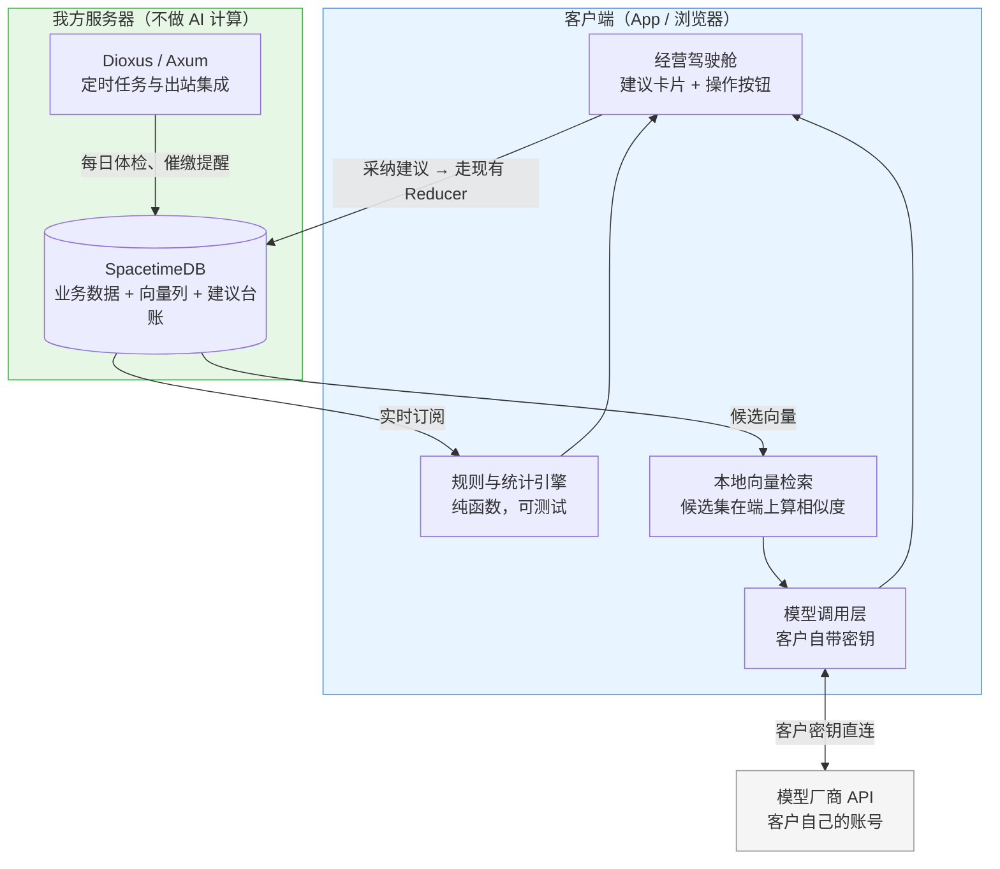

# 云园慧控 AI 经营参谋技术方案

**作者**：周茂森

**文档定位**：`docs/` 系统设计文档系列第九篇，**技术方案——尚未实施**。本篇回应三份产品构想文档（《AI功能》《AI园区经营参谋》《园区AI经营操作系统》）提出的能力清单，并在一条硬约束下给出落地路径：**我方服务器最多放一个向量数据库，不承担任何 AI 计算，AI 能力放在客户端（App / 浏览器）实现**。技术底座见 [server/ARCHITECTURE.md](../server/ARCHITECTURE.md) §2.10，交付形态见 [交付与部署方案.md](交付与部署方案.md)。

---

## 第一章　先说三个判断

在展开方案之前，有三个判断决定了整体走向。它们可能与直觉相反，但直接关系到成本与可行性。

### 1.1 产品文档里的「AI 功能」，多数不需要 AI

把三份文档列出的能力逐条过一遍，按**它到底需要什么计算**分类：

| 类别 | 能力举例 | 真正需要的技术 |
| --- | --- | --- |
| **确定性计算**（约占七成） | 租金催缴分阶段动作、经营日报、合同到期提醒、能耗异常、重复报销检测、空置损失、利润地图、租金收缴率 | SQL 聚合 + 规则 + 阈值统计。**不需要任何模型** |
| **需要模型推理** | 票据与合同的字段抽取、自然语言问答、沟通话术生成、纠纷材料包摘要 | 大模型或 OCR |
| **需要预测模型** | 续租/退租概率、租金评估定价、现金流预测 | 机器学习，且需要历史数据积累 |

《AI功能》建议第一版上线的六项里，**五项属于第一类**：

- AI 自动催缴 = 账期日期计算 + 分阶段动作表；
- AI 票据与费用告警 = 同发票号/同金额同商户同日期的确定性比对，加超预算阈值；
- AI 经营日报 = 现有数据的聚合查询；
- AI 租户风险提示 = 用电量环比、通行次数、逾期天数、合同剩余天数几个指标的加权打分；
- AI 能耗异常转工单 = 环比阈值 + 现有工单 Reducer。

只有「AI 合同识别」（从合同 PDF 抽字段）真的需要模型。

**这个判断值得认真对待，理由有三**：

1. **可解释**：租户风险提示如果是规则算出来的，可以逐条列出「用电环比 −62%、逾期 8 天、合同剩余 27 天」；如果是模型给的，只能说「模型认为有风险」——后者在园区经理面前站不住；
2. **可测试**：规则可通过单元测试固化（本仓库全部业务规则均如此处理），模型则不能；
3. **零成本零延迟**：不调用外部服务，不产生调用费，不受网络影响，也不涉及数据出境。

所以路线是：**先把七成用确定性计算做扎实，剩下三成才谈模型**。这不是保守，恰恰相反——先做完这七成，产品已经能兑现《园区AI经营操作系统》里「每天自动体检、主动预警」的承诺。

### 1.2 「AI 放到前端」有两种含义，成本差一个数量级

既定约束为「服务器不承担 AI 功能」，但该表述在技术上对应两种完全不同的实现方式：

| 做法 | 算力在哪 | 能跑多大模型 | 成本 |
| --- | --- | --- | --- |
| **(a) 客户端直连模型厂商 API** | 模型厂商的服务器 | 任意大模型 | 按调用付费（谁的密钥谁付） |
| **(b) 端侧模型** | 用户的手机 / 电脑 | 小模型（几百 MB 内） | 零调用费，但受设备限制 |

两者都满足「我方服务器不做 AI 计算」，但能力天差地别：(a) 能做合同抽取、问答、话术生成；(b) 在手机上只能做嵌入向量生成、简单分类这类轻任务，让它读一份 20 页的租赁合同并抽出违约条款是不现实的。

**本方案的选择是以 (a) 为主、(b) 为辅**——理由在下一节。

### 1.3 客户端直连模型的死穴是密钥，解法是「客户自带密钥」

App 直连模型 API，密钥就必须放在客户端。**放在客户端的密钥必然泄露**——反编译、抓包、越狱设备，没有例外。这是安全铁律，没有巧妙的规避方法。

解法不是藏得更好，而是**换一个密钥所有者**：

> **BYOK（客户自带密钥）**：每个客户在系统里填自己的模型 API Key，App 用客户自己的密钥直连模型厂商。泄露的是客户自己的密钥，风险由密钥所有者承担并可自行轮换；调用费由客户直接付给模型厂商，我方不经手、不加价、不垫付。

该模式与我方的私有化定位**高度契合**（见[交付与部署方案.md](交付与部署方案.md)）：客户既已为「数据由本方掌管」付费，则「AI 亦使用自有账号、数据自客户设备直达模型厂商、我方全程不予接触」正是同一主张的延伸。

---

## 第二章　总体架构



三条原则：

1. **服务器只存不算**——业务数据、向量、建议台账都存在 SpacetimeDB，但任何模型推理都不在我方服务器发生；
2. **确定性计算在客户端跑**——规则与统计写成纯函数，与现有业务规则同一套写法（`#[pure_function::pure]` 标注 + 中文命名测试），数据本来就实时订阅在客户端；
3. **模型调用由客户端发起**，用客户自己的密钥直连厂商。

---

## 第三章　向量数据库：先别急着装

既定设想为「服务器至多部署一个向量数据库」。此项预留是恰当的，但**第一阶段建议暂不部署**，理由如下。

### 3.1 装独立向量库要付的代价

当前系统严格保持**两个部署组件**（`.wasm` 模块 + Dioxus/Axum 二进制），这是 ARCHITECTURE §2.10 的明确决策。装 Qdrant 或 Milvus 意味着：

- 部署组件从 2 个变 3 个，三种私有化方案（国内云/国外云/本地一体机）每一种的交付脚本、备份策略、升级流程都要跟着改；
- 本地一体机方案尤其吃亏——多一个需要维护的服务，客户 IT 负担直接上升；
- 向量库自己也要备份、也会崩、也有版本兼容问题。

### 3.2 有个更省的做法：向量存业务库，检索在客户端做

园区场景的**语料量非常小**。粗算一个中等园区：

| 语料 | 量级 |
| --- | --- |
| 租赁合同 | 几百份 |
| 工单与巡检记录 | 几千条 |
| 报销单据 | 几千条 |
| 公告与制度文档 | 几十份 |

即便按每份文档切 10 个片段、每段一个 384 维向量算，也就**几万条向量、几十 MB**——这个量级完全在浏览器和手机的内存里做暴力余弦相似度检索，几十毫秒出结果，**不需要任何向量索引，也不需要向量数据库**。

具体做法：

- SpacetimeDB 加一张 `doc_embedding` 表，向量存成 `Vec<f32>` 普通列（它只是一串浮点数，数据库不需要理解它）；
- 客户端按现有的订阅机制把本运营方的向量拉到本地；
- 检索时在客户端算相似度，取 Top-K 送给模型。

**服务器全程仅存储一组浮点数，未执行任何运算**——此方式较部署向量库更为彻底地满足了上述约束。

### 3.3 什么时候才真的需要向量库

当出现下面任一情况时再装，届时它作为第三个部署组件独立引入：

- 单个运营方的向量条数超过**十万量级**（跨园区文档库、多年历史工单全量索引）；
- 需要服务端做检索（例如将来上线小程序，而小程序端不适合拉全量向量）；
- 需要向量与结构化条件的复合过滤（按园区+时间范围+文档类型过滤后再检索）。

### 3.4 一个不能忽略的环节：向量是谁生成的

**文本转成向量本身就需要模型推理**。既然服务器不做 AI，这一步只能在客户端完成，两条路：

| 方案 | 说明 | 取舍 |
| --- | --- | --- |
| **端侧嵌入模型** | 打包一个小型嵌入模型（如 bge-small 量化版，约 100 MB）到 App，本地生成向量 | 零调用费、完全离线；但 App 体积增加，首次加载慢 |
| **调用厂商嵌入 API** | 用客户自己的密钥调 embedding 接口 | App 轻量；但每次入库都产生调用费，且文本会出本地 |

**建议选端侧嵌入模型**——这正是 §1.2 里「端侧模型」(b) 的合理用武之地：嵌入模型小、跑得动、且它处理的是最敏感的原文，留在本地最稳妥。

---

## 第四章　分阶段落地

### 4.1 第一阶段：零模型，纯规则（建议先做完这一整阶段）

**这一阶段不引入任何 AI 组件，不改部署架构，全部在现有能力内完成。**

| 能力 | 实现方式 |
| --- | --- |
| **经营日报 / 驾驶舱** | 聚合查询 + 现有实时订阅。「今天要收多少钱、哪些逾期、哪些合同到期、哪些设备异常」全部是已有数据 |
| **租金催缴分阶段动作** | 账期日期计算 + 动作表（到期前 7/3 天、当天、逾期 1–3/7 天、长期逾期），配合 Dioxus/Axum 侧的定时任务 |
| **票据重复与异常告警** | 同发票号、同金额同商户同日期、拆分报销、金额与合同不符——全是确定性比对 |
| **能耗异常** | 环比/同比阈值 + 简单离群判定，超阈值自动生成工单（现有工单 Reducer） |
| **租户风险提示** | 加权打分：用电环比、通行次数变化、逾期天数、合同剩余天数、报修频次。**输出必须列出每项依据的原始数值** |
| **利润地图** | 已有公式：租金 + 物业费 + 服务收入 − 能耗差额 − 维修费用 − 催缴成本 − 空置损失 |
| **AI 价值账本** | 记录每条建议 → 是否采纳 → 结果金额。**这一项要在第一阶段就埋点**，否则数据补不回来 |

> **价值账本是本方案中价值最高的部分，且完全不依赖 AI。**《园区AI经营操作系统》的判断是成立的：客户续费困难，源于无法说明系统所创造的价值。一条建议自产生、被采纳至产生结果，全过程均可记录——但**唯有自第一日起即行记录，一年之后方有账可算**。

### 4.2 第二阶段：引入模型，客户自带密钥

| 能力 | 说明 |
| --- | --- |
| **合同与票据字段抽取** | 上传 PDF/照片 → 客户端调模型 → 抽出租金、账期、免租期、违约责任、递增条款 → **人工确认后**写入合同表 |
| **纠纷材料包** | 把合同、账单、催缴记录、工单、门禁日志按时间线整理成文档。检索靠结构化查询，模型只负责组织与摘要 |
| **沟通文稿生成** | 催缴、续租谈判的文稿草案，经人工修改后使用 |
| **自然语言问答** | 「上个月哪几家逾期超过 7 天」——先以规则解析为查询，模型仅作为回退方案 |

配套要建的机制：

- **密钥管理**：客户在系统里配置模型厂商与密钥，密钥**只存在客户端本地安全存储**（Keychain / IndexedDB 加密），不上传我方服务器；
- **模型可替换**：抽象一层调用接口，支持通义、豆包、文心、DeepSeek 等，客户选谁用谁；
- **降级路径**：没配密钥 / 调用失败时，功能优雅退化到规则版本，而不是整页报错。

### 4.3 第三阶段：预测模型（数据够了再说）

续租概率、租金评估、现金流预测——**现在做不了，因为没有数据**。三份文档自己也承认这点（「等积累足够的合同、成交、欠费和空置数据后，再上线」）。

第一阶段的价值账本与结构化记录，正是在为这一阶段攒燃料。届时这类模型**不适合放端侧**（需要全量历史训练），可行路径是：我方或客户离线训练出模型，把**模型文件**下发到客户端做推理——训练不在生产服务器上跑，推理在端上，约束依然成立。

---

## 第五章　四条必须固化的约束

这几条建议直接写进产品规范，而不是留给实现时临场决定。

### 5.1 AI 只出建议，执行必须走人工与现有权限

《AI功能》已经点明：

> AI 可以生成催缴内容和处置建议，但不宜因为欠费自动断电、封门禁或采取强制措施，相关动作必须经过合同规则和人工审批。

**架构层面的保障方式**：AI 的全部产出仅写入「建议」表，**不直接调用任何业务 Reducer**。用户点击「采纳」时，所经路径与手工操作完全相同，包括同一套 Reducer 与权限校验（见[权限模型设计.md](权限模型设计.md)）。如此，即便模型输出错误内容，亦不会产生业务后果。

### 5.2 个人信息出境是红线

租户姓名电话、员工档案、考勤记录都是**个人信息**。客户端直连模型 API 时，这些内容会离开本地到达模型厂商：

- **默认只允许境内模型厂商**；
- 送进模型前**做脱敏**（姓名替换为「租户 A」、电话打码），返回后再映射回来；
- 境外部署的客户若要用境外模型，合规责任写进合同（同[交付与部署方案.md](交付与部署方案.md)第四章的口径）。

三份文档里也提到了《个人信息保护合规审计管理办法》，方向一致。

### 5.3 每条建议必须能说清依据

《园区AI经营操作系统》要求的输出格式是对的，应当固化为**建议卡片的统一结构**：

```text
发现了什么 → 数据依据 → 可能影响 → 建议怎么处理 → 谁来处理 → 截止时间
```

其中「数据依据」必须是**可点击回溯到原始记录**的——用电量哪几天降的、逾期哪几笔、合同哪一条。做不到这一点的建议不要上线：园区经理不会为一个说不出理由的红色警告去打电话给租户。

### 5.4 发票真伪必须查验，不能靠模型识别判断

《AI功能》特别强调了这条：模型只负责**识别与比对**，真伪查验要走税务总局的查验接口。这个边界不能模糊——把模型的图像识别结果当成查验结论，是会出事的。

---

## 第六章　这个约束的代价，说在前面

该架构选择（服务器不承担 AI 功能）具有明确收益：无须承担模型调用成本、无须承担数据出境责任、不因 AI 而提高服务器规格、私有化交付的复杂度不增加。以上均成立。但有三项代价须予正视：

1. **小程序基本用不上这套 AI**。小程序无法打包端侧模型、本地存储受限，拉全量向量也不现实。所以 AI 能力在小程序上只能做成「看结果」而非「跑推理」——而结果又需要有人先算出来。若将来小程序成为主要入口，这条约束需要重新评估；
2. **多设备之间不共享推理结果**。老板手机上跑出来的合同抽取结果，如果不回写服务器，园区经理的电脑上看不到。所以**推理结果必须回写**（写入建议表），只有推理过程在端上——这一点在架构图里已经体现；
3. **端侧模型受设备差异影响**。较早期的安卓机型无法运行嵌入模型，须提供降级路径（回退至关键词检索）。

这三条都不构成否决理由，但要在产品设计时正视，而不是上线后才发现。

---

## 第七章　技术选型：现成框架能不能用

调研过两个方向，结论都是**第一阶段不引入**，但理由不同，记录在此以免重复评估。

### 7.1 Python LangChain：生产运行时不合适，离线工具链可以

LangChain 是 Python 生态里最成熟的大模型编排框架，但它进不了本项目的生产运行时，三个位置都不行：

| 位置 | 为什么不行 |
| --- | --- |
| SpacetimeDB 模块 | WASM 沙箱，没有 Python 解释器 |
| Dioxus / Axum 二进制 | 或以 PyO3 嵌入 CPython，或启动 Python 子进程。部署形态将由「一个自包含的 `server` 二进制」变为「二进制 + Python 运行时 + 数百个 pip 包」。**对一体机离线交付尤为不利**——依赖树、版本冲突与离线安装均存在大量问题 |
| 客户端 | 浏览器不跑 Python（Pyodide 那条路要拖几百 MB） |

更根本的原因是**用不上它的核心价值**：LangChain 的长处在多步 Agent 编排与工具调用循环，而本方案第二阶段的功能——合同抽字段、生成话术、材料包摘要——都是**单次调用加一个好 prompt**。为此绑定一个以 API 频繁变动著称、且会把「实际发给模型的内容」藏在抽象层背后的框架，不划算。

**但 Python 在离线侧完全合适**，项目里已有先例（`logos/tools/gen_seal.py` 生成品牌印章）。适合放 Python 的活：

- 历史合同批量抽取（一次性把几百份 PDF 处理成结构化数据）；
- prompt 调试与效果评测；
- 第三阶段的预测模型训练（续租概率、租金评估）——这块绕不开 Python 的机器学习生态。

共同点是：**跑在开发机或离线环境，产出的是数据或模型文件，不是生产运行时依赖**。生产环境永远只有那两个二进制。

### 7.2 Rust 的 aisdk（aisdk.rs）：方向对，但跑不了 WASM

[aisdk](https://github.com/lazy-hq/aisdk) 是参照 Vercel AI SDK 设计的 Rust 大模型调用库，可编入现有 Rust 二进制、不引入 Python，在方向上较 LangChain 简洁得多。核实到的事实（2026-08 查证）：

**优点**：

- **国产模型支持很全**——官网首页只列了 OpenAI/Anthropic/Google，但 `Cargo.toml` 的 feature 列表里有 `deepseek`、`alibaba` / `alibaba-cn`（通义）、`zhipuai`、`moonshotai` / `moonshotai-cn`、`siliconflow-cn`、`modelscope`、`stepfun`、`xiaomi` 等，另有通用的 `openaicompatible`。这对 §5.2 的境内模型红线是加分项；
- 流式输出、工具调用（`#[tool]` 宏）、结构化输出（Rust 类型转 JSON Schema）、嵌入向量都有；
- 一个聪明的设计：**编译期校验模型能力**，给不支持工具调用的模型挂工具会直接编译报错。

**为什么第一阶段仍不用**：

1. **跑不了 WASM，而这正是本方案的要害**。它依赖 `tokio`（`rt-multi-thread`）、`reqwest`（`stream` 特性）与 `reqwest-eventsource`，这几个在 `wasm32-unknown-unknown` 上都编译不过。README 全文未提 WASM 或浏览器，只说「兼容 Vercel AI SDK UI（React/Vue/Svelte）」，并带一个 `axum` feature——**它的预设用法是 Rust 写服务端、JS 写前端**，与「AI 放客户端、服务器不碰」的方向相反；
2. **成熟度不足**：v0.5.2，2025-09 首发，总下载约 1 万次（近 90 天约 5 千次）。pre-1.0 意味着破坏性变更仍在发生——两个月内从 0.3 跳到 0.5；
3. **第一个模型功能用不着框架**：合同抽字段是一次单发请求，在 Dioxus 前端用 `gloo-net` 直接发 HTTP 就是几十行代码。

**什么情况下重新评估**：若将来改为服务端承担 AI（推翻本方案的前提约束），或做原生桌面/移动客户端（native target，不受 WASM 限制），它是首选——届时它也更成熟了。

---

## 第八章　建议的下一步

按投入产出排序：

1. **先做第一阶段的经营日报与催缴分阶段动作**——零新技术、零成本，且直接兑现「每天告诉园区负责人今天要收多少钱」这个核心承诺；
2. **同时埋好价值账本的数据点**——它不能补录，晚一天就少一天数据；
3. **合同字段抽取做第一个模型功能**——它是唯一真正需要模型、且价值明确的第一版功能（省下逐份合同手工录入的工作量），也是验证 BYOK 模式跑不跑得通的最小试验；
4. **向量检索押后**，等第一阶段跑顺、语料真正积累起来再评估 §3.2 的轻量方案。
