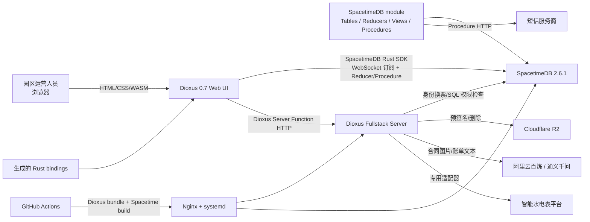
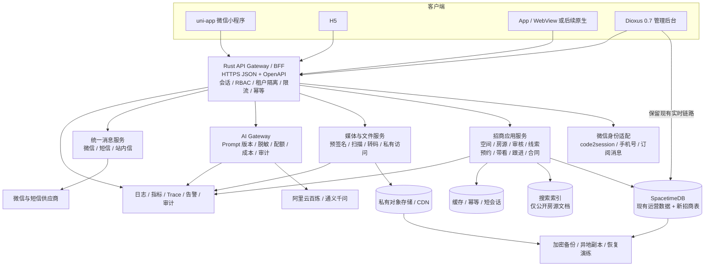

# AI 工业空间招商小程序：现有系统架构审计

> 审计日期：2026-08-07
> 审计分支：`feature/ai-industrial-space-mvp`（仅本地，未推送）
> 审计方法：以 Rust 源码、Cargo 清单、Dioxus 路由、SpacetimeDB 表/Reducer/View/Procedure 和 CI/部署配置为准；README 仅作辅助，不作为能力存在的唯一依据。
> 安全边界：本次只做本地静态审计，未连接生产数据库、第三方业务平台或线上服务；报告不记录任何密码、Token、密钥或真实客户数据。

## 1. 执行摘要

当前项目不是招商小程序后端，而是一套面向园区内部运营人员的 Web 工作台：Dioxus 0.7 Web/WASM 负责界面，浏览器通过 SpacetimeDB Rust SDK 的 WebSocket 订阅与 Reducer 调用直接访问 SpacetimeDB；少量需要服务端密钥或文件处理的功能使用 Dioxus Server Function，已接入 R2、短信、智能水电表和阿里云百炼。

现有资产、租赁、租户、账单、权限和实时数据能力可复用，但与“工业空间招商小程序”的核心差距很大：没有通用楼栋/房间/空间单元模型，没有仓库和写字楼类型，没有正式房源、发布审核、上下架、公开搜索、推荐、预约、带看、跟进闭环，也没有微信登录、企业认证或身份核验。已有 `CompanyLead`、`Investment` 等招商表，但未接入当前 Dioxus 页面，且不足以替代完整招商 CRM。

**总体结论：不能让 uni-app 微信小程序直接复用现有客户端访问方式上线。** 应保留 SpacetimeDB 作为现有运营域和实时数据层，在其前面新增面向小程序的 Rust API/BFF，并补齐空间单元、房源工作流、微信身份、招商 CRM、媒体文档、通知、AI 治理和运维保障。Dioxus Web 可继续作为管理后台；不建议把现有 Dioxus UI 直接改造成原生微信小程序。

关键证据：`Cargo.toml`、`Dioxus.toml`、`src/main.rs`、`src/services/spacetime.rs`、`src/pages/mod.rs`、`src/router.rs`、`server/spacetimedb/src/tables/`、`server/spacetimedb/src/reducers/`、`server/spacetimedb/src/views/`。

## 2. 分支与审计基线

- 切分支前 `main` 工作区干净。
- 本地 `main`、本地跟踪引用 `origin/main` 与远程 `origin/main` 均指向同一提交，ahead/behind 为 `0/0`。
- 当前分支为本地 `feature/ai-industrial-space-mvp`，未推送。
- 本次唯一允许的源码树变更是新增本报告；未修改业务源码、数据库结构或部署配置。

证据：本地 Git 引用与状态；仓库配置 `.git/config`。

## 3. 实际技术栈与系统架构

### 3.1 技术栈

| 层次 | 实际技术 | 结论 | 代码证据 |
|---|---|---|---|
| 前端 | Rust 2021、Dioxus 0.7、Dioxus Router/Fullstack、WASM、`web-sys` | 当前默认且唯一正式构建目标是 Web | `Cargo.toml`、`Dioxus.toml`、`src/main.rs`、`src/app.rs` |
| 实时客户端 | SpacetimeDB Rust SDK 2.6.1、生成 bindings、WebSocket 订阅 | 浏览器直接订阅 View/Table 并调用 Reducer/Procedure | `src/services/spacetime.rs`、`src/spacetime_bindings/` |
| 业务后端 | Rust 2024、SpacetimeDB module 2.6.1 | 表、事务写入、按身份 View、外部 HTTP Procedure 集中在一个模块 | `server/spacetimedb/Cargo.toml`、`server/spacetimedb/src/lib.rs` |
| 服务端适配 | Dioxus Server Function、Reqwest、Calamine、rust_xlsxwriter | 仅有若干专用 HTTP 端点，不是通用业务 REST API | `src/services/contract/ai.rs`、`src/services/billing/`、`src/services/storage/`、`src/services/smart_meter/` |
| 对象存储 | Cloudflare R2/S3 SDK、浏览器预签名直传 | 仅形成图片上传能力 | `src/services/storage/r2.rs`、`src/services/storage/upload.rs` |
| AI | 阿里云百炼/DashScope OpenAI 兼容接口 | 已有合同图片识别和账单 Excel 识别两个点状能力 | `src/services/contract/ai.rs`、`src/services/billing/ai_import.rs` |
| 外部通信 | 短信 Procedure、智能水电表供应商适配器 | 短信催缴/合同提醒可复用；表计适配需补权限隔离 | `server/spacetimedb/src/procedures/`、`server/spacetimedb/src/sms/`、`src/services/smart_meter/` |
| 构建部署 | Cargo workspace、Dioxus CLI、SpacetimeDB CLI、GitHub Actions、Nginx、systemd | 自动构建并直接部署生产；质量门禁与恢复链路不足 | `.github/workflows/deploy-production.yml`、`deploy/` |

Cargo workspace 包含主应用、`pure` 过程宏和 `server/spacetimedb`；现场 ONVIF 工具被显式排除在 workspace 外。证据：`Cargo.toml`、`pure/`、`tools/onvif-discover/`。

### 3.2 当前实际架构图

架构证据：`src/services/spacetime.rs`、`src/spacetime_bindings/`、`server/spacetimedb/src/lib.rs`、`src/services/storage/r2.rs`、`src/services/contract/ai.rs`、`src/services/billing/ai_import.rs`、`src/services/smart_meter/server.rs`、`.github/workflows/deploy-production.yml`、`deploy/nginx/yizu-furong.org.conf`。

## 4. 现有模块清单

| 模块 | 当前能力 | 招商小程序适用性 | 代码证据 |
|---|---|---|---|
| 登录与会话 | 用户名/手机号+密码、短信验证码、会话过期、刷新令牌哈希 | 部分复用；缺微信身份和小程序会话 | `server/spacetimedb/src/tables/platform/center/auth/`、`server/spacetimedb/src/reducers/platform/center/auth/`、`server/spacetimedb/src/procedures/center/auth/sms.rs` |
| 客户/组织/用户 | 客户、中心用户、租户用户映射、组织及成员映射 | 可作为运营方账户与租户基础 | `server/spacetimedb/src/tables/platform/center/customer.rs`、`server/spacetimedb/src/tables/platform/center/user.rs`、`server/spacetimedb/src/tables/platform/center/organization.rs` |
| 角色权限 | 用户、角色、权限码、菜单、园区范围和直接授权 | 可复用，但要补小程序角色与 API 授权测试 | `server/spacetimedb/src/tables/hr/`、`server/spacetimedb/src/tables/platform/permissions/`、`server/spacetimedb/src/access.rs` |
| 园区资产 | 园区、厂房、厂房楼层、宿舍、宿舍楼层、水电表 | 可复用基础数据；空间模型不完整 | `server/spacetimedb/src/tables/rental/park.rs`、`server/spacetimedb/src/tables/rental/assets/` |
| 租户/租赁 | 租户主档、租赁记录、楼层/宿舍楼层/费用/表计关联、合同图片 | 可复用存量合同运营；不等于房源招商流程 | `server/spacetimedb/src/tables/rental/contract/`、`server/spacetimedb/src/reducers/rental/contract/` |
| 空置清单 | 前端按总面积减有效租赁面积计算空置面积并本地筛选 | 仅供内部看板；不能作为公开房源 | `src/pages/rental_list/vacant.rs`、`src/pages/rental_list/vacant_detail.rs`、`src/pages/rental_management/model.rs` |
| 招商线索数据 | 企业线索、企业画像/标签、证据、信号、评分、爬虫任务、招商记录 | 数据基础可部分复用；当前 UI 未接入，流程不闭环 | `server/spacetimedb/src/tables/investment/`、`server/spacetimedb/src/reducers/investment/`、`server/spacetimedb/src/views/investment/`、`src/pages/mod.rs` |
| 账单与收款 | 租金/水电/管理等费用、实收、结转、收缴确认、财务流水 | 可复用合同履约后能力 | `server/spacetimedb/src/tables/finance/`、`server/spacetimedb/src/reducers/finance/`、`server/spacetimedb/src/procedures/billing/collection.rs` |
| 图片与文件 | 通用图片元数据/绑定、R2 图片直传、合同/工资/财务等图片 | 图片链路可改造；视频、语音、通用文档缺失 | `server/spacetimedb/src/tables/platform/media/`、`src/services/storage/`、`src/pages/contract/attachments.rs` |
| Excel | 账单 `.xlsx` AI 导入与 Excel 导出 | 可复用处理框架；不是通用需求文档导入 | `src/services/billing/ai_import.rs`、`src/services/billing/excel.rs` |
| 消息 | 短信登录、催缴、合同提醒及发送日志；另有外部公告采集表 | 缺小程序订阅消息、站内信、推送偏好和可靠投递 | `server/spacetimedb/src/procedures/center/auth/sms.rs`、`server/spacetimedb/src/procedures/rental/reminder_sms.rs`、`server/spacetimedb/src/procedures/billing/collection.rs`、`server/spacetimedb/src/tables/platform/notices/notice.rs` |
| 园区运营 UI | 仪表盘、数据地图、租赁、合同、租户、账单、财务、人事、设备、维护、门禁、权限 | 继续用作管理后台，不直接作为小程序 UI | `src/pages/mod.rs`、`src/router.rs` |

## 5. 核心数据表与业务能力映射

| 数据表/关系 | 已表达的业务 | 缺口或注意事项 | 代码证据 |
|---|---|---|---|
| `Park` | 园区基础资料、联系人、经理、状态、软删除、客户归属 | 缺经纬度、公开展示配置、招商品牌信息等标准化字段 | `server/spacetimedb/src/tables/rental/park.rs` |
| `Factory` | 园区下厂房，记录名称、建成年份、自有属性 | 本质是厂房实体，不能无损表达通用楼栋 | `server/spacetimedb/src/tables/rental/assets/factory.rs` |
| `FactoryFloor` | 厂房楼层、高度、承重、租价、总面积 | 没有可租空间单元、房号、分割/合并、用途/配套/产权等 | `server/spacetimedb/src/tables/rental/assets/floor.rs` |
| `Dormitory`、`DormitoryFloor` | 宿舍及楼层，楼层仅聚合房间数和房间面积 | 不存在独立 `Room`；不能逐房管理状态与媒体 | `server/spacetimedb/src/tables/rental/assets/dormitory.rs`、`server/spacetimedb/src/tables/rental/assets/dormitory_floor.rs` |
| `Meter` | 园区/厂房楼层/宿舍楼层表计 | 与招商展示关系弱，可用于租后运营 | `server/spacetimedb/src/tables/rental/assets/meter.rs` |
| `TenantProfile` | 企业/个人租户主档、信用代码、法人、联系方式、来源、风险 | 只是录入，不包含真实性核验结果、材料和审核轨迹 | `server/spacetimedb/src/tables/rental/contract/tenant.rs` |
| `RentalTenant` | 合同起止、租金、面积、递增、违约、园区与状态 | 表名仍是租户，合同与版本/签署/审核未独立建模 | `server/spacetimedb/src/tables/rental/contract/tenant.rs` |
| `RentalTenantFloor` 等关系表 | 合同关联厂房楼层、宿舍楼层、费用和表计 | 可复用租后占用关系；粒度仍到楼层 | `server/spacetimedb/src/tables/rental/contract/` |
| `CompanyLead`、`EnterpriseProfile`、`EnterpriseTag` | 企业线索、画像、负责人、评分和标签 | 可作为招商线索起点；没有客户互动时间线和转化工作流 | `server/spacetimedb/src/tables/investment/lead/company.rs`、`server/spacetimedb/src/tables/investment/profile.rs`、`server/spacetimedb/src/tables/investment/tag.rs` |
| `LeadEvidence`、`SignalEvent`、评分/爬虫表 | 线索来源证据、信号、评分和采集任务 | 偏线索发现，不是小程序留资/预约/带看闭环 | `server/spacetimedb/src/tables/investment/` |
| `Investment` | 经办人名称、意向企业、意向面积、进度、电话、会面时间和备注 | 可迁移为一次招商记录，但经纪人只是字符串，也没有预约状态、带看对象和跟进历史 | `server/spacetimedb/src/tables/investment/record.rs` |
| `AmountBill`、`EleBill`、`WaterBill` | 多费用应收、实收时间、租户/园区关联、水电读数 | 可复用租后计费；公开招商阶段不应直接暴露 | `server/spacetimedb/src/tables/finance/billing/` |
| `BillCollectionConfirmation` | 收齐或差额的不可变确认记录 | 是收款登记/对账证据，不是支付网关或电子回单 | `server/spacetimedb/src/tables/finance/billing/reconciliation.rs` |
| `Finance`、`FinanceImage` | 收支记录和凭证图片 | 可复用后台财务，不应成为小程序直接数据面 | `server/spacetimedb/src/tables/finance/record/` |
| `Image`、`ImageBinding` | 通用对象存储元数据及业务绑定 | 只覆盖图片语义，缺文件版本、处理状态、安全扫描和访问策略 | `server/spacetimedb/src/tables/platform/media/` |
| `Customer`、`CenterUser`、`SystemUser` | 平台客户、身份账号、租户内用户 | 可承载运营方；企业租户/潜客尚未与登录账号建立明确关系 | `server/spacetimedb/src/tables/platform/center/`、`server/spacetimedb/src/tables/hr/user.rs` |
| `Role`、`Code` 及关系表 | 角色、权限码、菜单、园区范围 | 具备 RBAC/园区范围基础；新增 API 必须复用统一授权入口 | `server/spacetimedb/src/tables/hr/role.rs`、`server/spacetimedb/src/tables/platform/permissions/`、`server/spacetimedb/src/tables/hr/relations/` |

代码注册表、路由和全表扫描未发现独立的 `Building`、`Room`、`Warehouse`、`Office`、`PropertyListing`、预约、带看或跟进实体。负向结论证据：`server/spacetimedb/src/tables/mod.rs`、`server/spacetimedb/src/tables/`、`src/pages/mod.rs`、`src/router.rs`。

## 6. 十二项重点能力核验

### 6.1 空间资产模型

**现状：部分具备。** 层级是 `Park -> Factory -> FactoryFloor`，另有 `Park -> Dormitory -> DormitoryFloor`。没有通用楼栋，没有独立房间，也没有仓库、写字楼实体；宿舍楼层仅记录房间数量与面积聚合。若把仓库/写字楼继续塞入 `Factory`，会造成类型语义、展示字段和搜索条件失真。

建议新建通用 `Building`/`SpaceUnit`（或等价模型），用受控枚举表达厂房、仓库、写字楼、房间、整层、整栋及可分割组合，并保留与现有 `FactoryFloor` 的迁移映射。

证据：`server/spacetimedb/src/tables/rental/park.rs`、`server/spacetimedb/src/tables/rental/assets/factory.rs`、`server/spacetimedb/src/tables/rental/assets/floor.rs`、`server/spacetimedb/src/tables/rental/assets/dormitory_floor.rs`。

### 6.2 主体、角色、权限与多租户

**现状：基础较强，但主体语义未闭环。** 系统有平台客户、中心用户、租户映射、组织、租户内用户、角色、权限码、角色/用户园区范围。`ReadScope` 综合当前身份、客户、角色、权限码和园区范围；租赁及招商 View 使用当前读取范围过滤，Reducer 共享访问函数检查资源归属。

不足：没有经纪人和业主独立实体；“负责人/经办人”部分只是用户 ID 或姓名字符串；企业租户、潜客与认证登录账号没有稳定绑定。所有租户共处一个 SpacetimeDB module，隔离依赖每个 View/Reducer 正确调用守卫，新增接口时存在漏检风险，需要自动化越权测试。

证据：`server/spacetimedb/src/access.rs`、`server/spacetimedb/src/reducers/shared/access.rs`、`server/spacetimedb/src/views/shared/identity.rs`、`server/spacetimedb/src/views/rental/`、`server/spacetimedb/src/views/investment/`、`server/spacetimedb/src/tables/platform/center/`、`server/spacetimedb/src/tables/hr/`。

### 6.3 房源、搜索、推荐、线索、预约与跟进

**现状：房源闭环缺失。** `VacantFactoryPage` 依据楼层总面积减有效合同占用面积，在浏览器内计算并筛选空置数据；这不是持久化房源，也没有发布版本、审核、上下架、渠道、公开可见性或搜索索引。没有推荐、预约、带看、跟进时间线。`CompanyLead`/`Investment` 能部分支撑企业线索发现与一次会面记录，但当前 Dioxus 路由未暴露招商模块，且字段不足以形成 CRM 状态机。

必须新增：`PropertyListing`、房源媒体/标签、发布版本与审核记录、渠道状态、公开搜索文档、收藏/行为事件、推荐结果、`Lead`、`Appointment`、`Showing`、`FollowUp`、负责人分配和状态变更历史。

证据：`src/pages/rental_list/vacant.rs`、`src/pages/rental_list/vacant_detail.rs`、`src/pages/rental_management/model.rs`、`server/spacetimedb/src/tables/investment/`、`src/pages/mod.rs`、`src/router.rs`。

### 6.4 合同、租金、账单、收款、上传与通知

**现状：租后运营较完整，招商前台不足。** `RentalTenant` 承载大量合同字段并关联空间、费用和表计；账单覆盖租金、水电、管理费、结转和实收；收缴确认是只增不改的审计记录；财务及合同图片已有关系表。短信支持登录、催缴和合同提醒。

不足：合同没有独立主表/版本/签署/审核状态机；没有电子签、支付、发票、通用文件中心；通知没有站内信、微信订阅消息、投递重试和用户偏好。现有公告表是外部公告采集数据，不是业务消息中心。

证据：`server/spacetimedb/src/tables/rental/contract/`、`server/spacetimedb/src/reducers/rental/contract/`、`server/spacetimedb/src/tables/finance/`、`server/spacetimedb/src/reducers/finance/`、`server/spacetimedb/src/procedures/billing/collection.rs`、`server/spacetimedb/src/procedures/rental/reminder_sms.rs`、`server/spacetimedb/src/tables/platform/notices/notice.rs`。

### 6.5 登录、手机、微信与认证核验

**现状：密码和短信具备，微信与实名能力缺失。** 密码凭据使用 bcrypt；刷新令牌只保存哈希；短信验证码保存摘要并有限时、重发间隔和尝试次数；会话有过期清理。代码注册表中未发现微信 `openid/unionid`、OAuth/OIDC、企业认证、营业执照核验或个人身份核验模型/流程。

必须新增微信 `code2session` 服务端交换、微信身份绑定、账号合并/解绑、小程序会话、手机号授权处理，以及按业务要求新增企业材料、核验供应商、审核记录和最小化存储策略。微信密钥只能存入服务端密钥管理，不得下发客户端或写入数据库普通配置。

证据：`server/spacetimedb/src/tables/platform/center/auth/`、`server/spacetimedb/src/reducers/platform/center/auth/password.rs`、`server/spacetimedb/src/reducers/platform/center/auth/refresh_token.rs`、`server/spacetimedb/src/procedures/center/auth/sms.rs`、`src/services/credentials.rs`。

### 6.6 当前对外接口

当前存在三类接口：

1. **SpacetimeDB WebSocket/SDK**：主业务路径；生成 Rust bindings，订阅 View/Table，调用 Reducer/Procedure。证据：`src/services/spacetime.rs`、`src/spacetime_bindings/`。
2. **SpacetimeDB HTTP**：服务端用于 WebSocket token 换票和 SQL 权限/引用检查。证据：`src/services/storage/r2.rs`、`src/services/smart_meter/common.rs`。
3. **Dioxus Server Function HTTP**：现有专用端点如下，不构成通用 REST CRUD：
   - `/api/contract/images/analyze`
   - `/api/billing/excel/analyze`
   - `/api/billing/excel/export`
   - `/api/storage/r2/presign`
   - `/api/storage/r2/delete-salary-images`
   - `/api/smart-meter/catalog`
   - `/api/smart-meter/readings`
   - `/api/smart-meter/snapshot`

端点证据：`src/services/contract/ai.rs`、`src/services/billing/ai_import.rs`、`src/services/billing/excel.rs`、`src/services/storage/r2.rs`、`src/services/storage/r2_cleanup.rs`、`src/services/smart_meter/server.rs`。

没有发现 Axum/Actix/Rocket、OpenAPI、统一 CORS/CSRF、限流、幂等或分页中间件。证据：`Cargo.toml`、`src/services/`、`server/spacetimedb/src/`。

### 6.7 uni-app 微信小程序能否直接调用

**结论：不能直接、可靠地复用现有后端访问方式。**

- 现有业务客户端依赖 Rust/WASM 版 SpacetimeDB SDK、Web 标准 WebSocket、浏览器 LocalStorage 和生成 bindings；uni-app 原生小程序运行时不是浏览器 WASM 环境。
- Dioxus Server Function 是 Dioxus 生成的 RPC/序列化契约，当前仅覆盖八个专用场景，也没有公开业务 API 版本、OpenAPI、统一错误和小程序鉴权。
- 小程序不能安全持有 SpacetimeDB 长期凭据并绕过服务端直接执行业务写入。

需要新增 API/BFF：提供 HTTPS JSON REST（必要时增加受控 WebSocket/SSE）、微信登录换票、统一会话与 RBAC、多租户/园区授权、房源查询、留资预约、幂等、分页、上传签名、错误码、审计和限流。BFF 在服务端使用 SpacetimeDB SDK 或受控内部接口调用现有业务模块。

证据：`Cargo.toml` 的 wasm 目标依赖、`src/services/spacetime.rs`、`src/services/credentials.rs`、`src/components/image_editor.rs`、`src/services/storage/upload.rs`、上述 Server Function 路径。

### 6.8 Dioxus 前端的平台适用性

| 目标 | 结论 | 限制 | 代码证据 |
|---|---|---|---|
| 微信原生小程序 | **不能直接使用** | RSX/WASM、`web-sys`、浏览器文件/LocalStorage/WebSocket 与小程序组件和 `wx.*` API 不兼容；可临时用 `<web-view>` 嵌 H5，但不是原生体验，且受业务域名、登录、支付/分享能力限制 | `Cargo.toml`、`src/services/credentials.rs`、`src/services/reconnect.rs`、`src/components/image_editor.rs` |
| H5 | **可以继续使用** | 当前正式目标就是 Web；仍需验证移动端适配、微信内置浏览器、HTTPS/WSS、合法域名、上传与授权交互 | `Dioxus.toml`、`src/main.rs`、`src/app.rs`、`assets/styles/` |
| App | **当前未具备原生构建链路** | 项目没有启用 Dioxus desktop/mobile/Android/iOS feature，CI 仅执行 Web bundle；可用 WebView/PWA 包装，但相机、定位、推送、文件和安全存储要做平台桥接 | `Cargo.toml`、`.github/workflows/deploy-production.yml` |

### 6.9 图片、视频、语音、Excel和需求文档

| 类型 | 当前能力 | 结论 | 代码证据 |
|---|---|---|---|
| 图片 | JPG/PNG/WebP、单文件最大 10MB、SHA-256、R2 预签名直传；合同 AI 可处理 1–8 张、总源数据约 20MB | 可改造复用；当前上传接口要求系统管理员，且仅信任声明 MIME，缺文件魔数、病毒扫描、内容审核和细粒度访问 | `src/services/storage/upload.rs`、`src/services/storage/r2.rs`、`src/services/contract/ai.rs` |
| 视频 | 无 | 必须新增分片/直传、转码、封面、时长/分辨率校验、内容审核和 CDN | `src/services/storage/`、`server/spacetimedb/src/tables/platform/media/` |
| 语音 | 无 | 必须新增录音格式、转码、时长、ASR、审核和隐私授权 | 同上 |
| Excel | `.xlsx` 账单导入（最大 20MB）与导出 | 处理框架可复用；需隔离业务模板、异步任务、失败报告 | `src/services/billing/ai_import.rs`、`src/services/billing/excel.rs` |
| PDF/Word/需求文档 | 无通用上传/解析/版本能力 | 必须新建文件中心、元数据、版本、访问控制、预览、解析和保留策略 | `server/spacetimedb/src/tables/platform/media/`、`src/services/storage/` |

### 6.10 阿里云百炼/通义千问接入

**已有可复用点：** AI 请求位于 Dioxus 服务端；服务端从环境读取访问凭据；调用前要求管理权限；设置模型、超时与输入规模限制；客户端未包含供应商密钥。

**必须改造：** 新建统一 AI Gateway/Service，禁止小程序直连模型；按租户、用户、场景设置 QPS、并发、日/月额度和单次 token 上限；记录 request ID、模型、prompt 版本、token 用量、费用、耗时、结果状态和人工反馈，但不得记录明文密钥或不必要的隐私正文；增加脱敏/授权、内容安全、超时重试、熔断、缓存、结构化输出校验和供应商切换。当前两个端点直接内嵌 prompt 和供应商 URL，没有用量/成本台账与集中治理。

合同图片和账单内容可能包含个人或企业敏感信息，发送第三方模型前必须完成数据分类、用户告知/授权、最小化传输、地域与留存评估。

证据：`src/services/contract/ai.rs`、`src/services/billing/ai_import.rs`、`src/services/storage/r2.rs`、`.github/workflows/deploy-production.yml`。

### 6.11 测试、CI/CD、部署、监控、日志与备份

- **测试：** 非生成 Rust 源码中识别到 347 个 `#[test]`/`#[tokio::test]` 函数，分布于 84 个文件，覆盖部分权限、校验、纯函数、计费、设备和认证逻辑；未发现独立 `tests/` 集成测试、端到端或小程序契约测试。证据：`src/`、`server/spacetimedb/src/`、`pure/`、`tools/onvif-discover/src/`。
- **CI/CD：** 只有一个生产部署 workflow；main push 会打包 Dioxus Web、构建 SpacetimeDB WASM、上传主机并发布。workflow 未执行 `cargo fmt --check`、`cargo clippy`、`cargo check`、`cargo test`、依赖/密钥/供应链扫描。证据：`.github/workflows/deploy-production.yml`。
- **部署：** Nginx 同时代理 Dioxus 和 SpacetimeDB；systemd 服务以 root 运行；脚本按 release 目录部署并重启。没有代码化蓝绿/金丝雀和自动应用回滚。证据：`deploy/nginx/yizu-furong.org.conf`、`deploy/systemd/yizu-app.service`、`deploy/scripts/remote_deploy.sh`。
- **高危发布开关：** workflow 支持强制发布，并允许通过配置开启删除 SpacetimeDB 全部数据后重建；源码注释已提示风险，但未看到发布前自动备份、恢复演练或双人审批。证据：`.github/workflows/deploy-production.yml`、`deploy/scripts/remote_deploy.sh`。
- **监控：** 部署后只检查 systemd active、主页 HTTP 与 Spacetime ping；项目业务代码未实现统一 tracing、指标、APM、错误聚合、SLO 或告警。依赖树中的 tracing/prometheus 不等于应用已接入。证据：`.github/workflows/deploy-production.yml`、`server/spacetimedb/src/lifecycle.rs`、`src/services/spacetime.rs`、`Cargo.lock`。
- **审计日志：** `ApiLog`/`CenterApiLog` 记录方法、路径、用户和时间，但缺统一 request ID、响应状态、耗时、来源 IP、资源 ID、前后值摘要及不可抵赖保护；写入依赖业务主动调用。证据：`server/spacetimedb/src/tables/platform/system/api_log.rs`、`server/spacetimedb/src/reducers/platform/system/api_log.rs`、`server/spacetimedb/src/tables/platform/center/system/api_log.rs`。
- **备份：** 文档提出快照/异地备份原则，但仓库未发现实际定时任务、加密、保留期、恢复脚本或恢复演练记录。证据：`docs/交付与部署方案.md`；部署实现证据 `.github/workflows/deploy-production.yml`、`deploy/`。

### 6.12 技术债、阻塞与安全风险摘要

1. 业务客户端直连数据库协议，缺面向外部小程序的稳定 API 边界。证据：`src/services/spacetime.rs`。
2. 房源是浏览器派生视图，不是可审核、可发布、可检索的业务实体。证据：`src/pages/rental_list/vacant.rs`、`src/pages/rental_management/model.rs`。
3. 智能水电表 Server Function 只验证凭据有效性，没有继续检查角色、租户或园区范围；供应商配置来自共享服务端环境，存在越权读取风险。证据：`src/services/smart_meter/common.rs`、`src/services/smart_meter/provider.rs`、`src/services/smart_meter/hezhong.rs`。
4. 浏览器 LocalStorage 保存长期 SpacetimeDB 凭据，发生 XSS 时可被窃取。证据：`src/services/credentials.rs`。
5. R2 管理权限通过 HTTP SQL 结果文本包含关系判断，耦合内部 View 和字符串格式，授权方式脆弱。证据：`src/services/storage/r2.rs`。
6. 上传只按客户端 MIME、扩展名、大小和哈希校验，缺内容魔数、恶意文件扫描、媒体处理与对象级授权。证据：`src/services/storage/upload.rs`、`src/services/storage/r2.rs`。
7. 多租户隔离依赖每个 View/Reducer 手工正确套用访问守卫，缺系统性越权集成测试。证据：`server/spacetimedb/src/access.rs`、`server/spacetimedb/src/reducers/shared/access.rs`、`server/spacetimedb/src/views/`。
8. `RentalTenant` 混合租户和合同语义，状态及部分复杂字段使用字符串/JSON，长期演进和数据约束成本高。证据：`server/spacetimedb/src/tables/rental/contract/tenant.rs`、`src/pages/contract/model.rs`。
9. 633 个生成 bindings 被提交并与 module schema 强耦合，生成/校验未进入 CI，存在 schema 漂移。证据：`src/spacetime_bindings/`、`.github/workflows/deploy-production.yml`。
10. CI 直接面向生产部署且无测试、安全扫描、备份/恢复门禁；SpacetimeDB 清库发布开关具有灾难性误操作半径。证据：`.github/workflows/deploy-production.yml`、`deploy/scripts/remote_deploy.sh`。

## 7. 可直接复用、需要改造、必须新建

### 7.1 可直接复用

| 能力 | 复用范围 | 证据 |
|---|---|---|
| 园区、厂房、楼层基础数据 | 作为新空间模型的存量来源和运营后台数据 | `server/spacetimedb/src/tables/rental/` |
| 租户主档和租赁占用关系 | 作为签约后租户/合同迁移基础 | `server/spacetimedb/src/tables/rental/contract/` |
| 账单、结转、收款确认、财务记录 | 作为租后履约能力，继续只向授权角色开放 | `server/spacetimedb/src/tables/finance/` |
| 客户、用户、角色、权限码、园区范围 | 作为运营后台 RBAC 和 BFF 授权源 | `server/spacetimedb/src/access.rs`、`server/spacetimedb/src/tables/platform/`、`server/spacetimedb/src/tables/hr/` |
| SpacetimeDB 事务、实时订阅和按身份 View | 继续服务运营后台及内部事件同步 | `server/spacetimedb/src/reducers/`、`server/spacetimedb/src/views/` |
| 短信供应商适配及催缴/合同提醒 | 经统一消息服务封装后复用 | `server/spacetimedb/src/sms/`、`server/spacetimedb/src/procedures/` |
| R2 预签名上传技术框架 | 扩展为通用媒体服务后复用 | `src/services/storage/` |
| 百炼服务端调用经验 | 迁移到统一 AI Gateway | `src/services/contract/ai.rs`、`src/services/billing/ai_import.rs` |
| Dioxus 管理后台 | 继续承载审核、房源维护、线索分配和租后运营 | `src/pages/`、`src/router.rs` |

“直接复用”是指保留核心实现或数据，不代表可以原样公开给小程序。

### 7.2 需要改造

| 能力 | 改造内容 | 证据 |
|---|---|---|
| 资产模型 | 在现有园区/厂房/楼层旁增加通用空间单元及迁移映射，避免直接破坏存量表 | `server/spacetimedb/src/tables/rental/assets/` |
| 租赁合同 | 拆分企业/联系人、合同主表、版本、状态历史、签署材料和空间占用 | `server/spacetimedb/src/tables/rental/contract/tenant.rs` |
| 投资/招商表 | 统一线索来源、负责人、阶段、互动时间线，并接入管理 UI | `server/spacetimedb/src/tables/investment/`、`src/pages/mod.rs` |
| 身份与权限 | 增加小程序主体角色、API scope、对象级权限及越权测试 | `server/spacetimedb/src/access.rs`、`server/spacetimedb/src/tables/platform/permissions/` |
| 图片/R2 | 普通用户范围授权、通用对象前缀、文件魔数/扫描、私有访问、生命周期与引用计数 | `src/services/storage/r2.rs`、`server/spacetimedb/src/tables/platform/media/` |
| 消息 | 封装短信并加入微信订阅消息、站内信、模板、重试、回执和偏好 | `server/spacetimedb/src/procedures/` |
| AI | 集中网关、成本/配额/日志/脱敏/审核/结构化校验 | `src/services/contract/ai.rs`、`src/services/billing/ai_import.rs` |
| CI/CD/运维 | 先质量门禁和备份，再部署；非 root；分环境；回滚与可观测性 | `.github/workflows/deploy-production.yml`、`deploy/` |

### 7.3 必须新建

- 小程序 API/BFF 与 OpenAPI 契约。
- 微信登录、身份绑定、手机号授权及企业/个人核验工作流。
- 通用楼栋/空间单元、仓库/写字楼/厂房分类与分割组合模型。
- 房源、版本、审核、上下架、渠道、搜索索引、收藏/浏览和推荐。
- 小程序留资、预约、带看、跟进时间线、分配、SLA 和转化漏斗。
- 通用文件/媒体中心：图片、视频、语音、Excel、PDF/Word、需求文档及处理任务。
- 微信订阅消息/站内信及统一消息中心。
- AI Gateway、知识库/检索（若业务确认需要）、prompt 注册、用量成本和安全审计。
- 集中日志、指标、错误追踪、告警、审计事件与数据保留。
- 自动备份、加密、异地副本、恢复脚本和定期恢复演练。

负向能力扫描证据：`server/spacetimedb/src/tables/mod.rs`、`server/spacetimedb/src/tables/`、`server/spacetimedb/src/reducers/`、`src/services/`、`src/pages/mod.rs`、`src/router.rs`、`.github/workflows/`、`deploy/`。

## 8. 微信小程序兼容性结论

| 问题 | 结论 |
|---|---|
| uni-app 能否直接使用现有 SpacetimeDB Rust SDK/bindings？ | 否。运行时、WebSocket API、凭据存储和生成代码目标均不匹配。 |
| 能否把现有 Dioxus Server Function 当成完整后端？ | 否。只有八个专用端点，契约与 Dioxus 客户端耦合，缺通用业务 API 和微信鉴权。 |
| 能否使用 H5 `<web-view>` 快速验证？ | 可以作为受限原型，但应明确不是原生小程序方案；微信登录、分享、订阅消息、上传和审核体验仍需桥接。 |
| 推荐方式 | uni-app 原生小程序调用新增 Rust API/BFF；BFF 统一访问 SpacetimeDB、对象存储、微信、消息和 AI。Dioxus 保留为运营后台。 |

兼容性证据：`Cargo.toml`、`Dioxus.toml`、`src/services/spacetime.rs`、`src/services/credentials.rs`、`src/services/reconnect.rs`、`src/components/image_editor.rs`、`src/services/storage/upload.rs`。

## 9. 推荐的目标技术架构

### 9.1 实施原则

1. **双入口而非重写：** Dioxus 管理后台保留实时 SDK；外部客户端一律经 BFF，避免把数据库凭据和内部表结构暴露给小程序。
2. **加法式数据演进：** 优先新增表和映射，避免直接改列/删列触发 SpacetimeDB 破坏性重建。证据：`.github/workflows/deploy-production.yml`、`deploy/scripts/remote_deploy.sh`。
3. **公开读模型隔离：** 搜索索引只接收审核通过且已上架字段，合同、账单、联系方式和内部评分不进入公开索引。
4. **统一鉴权：** BFF 从微信/现有账号建立服务端会话，再将主体、租户、角色和园区范围转换为同一授权上下文；不得只判断“Token 有效”。
5. **异步媒体与 AI：** 上传、扫描、转码、解析、向量化和 AI 任务均用任务状态机，前台轮询或受控推送结果，避免长时间 Server Function 阻塞。
6. **先恢复能力后自动部署：** 任何生产 schema 发布前必须有可验证备份、恢复点、审批与回滚方案。

## 10. P0 / P1 / P2 风险清单

### P0：进入第一阶段开发或上线前必须消除

| 风险 | 影响 | 处置 | 证据 |
|---|---|---|---|
| 无原生小程序 API 与微信身份 | uni-app 无法安全稳定接入，无法形成用户体系 | 先定 BFF/OpenAPI、微信登录和服务端会话 | `src/services/spacetime.rs`、`src/services/credentials.rs`、`src/services/` |
| 缺通用空间单元、房源及招商流程模型 | 无法准确发布厂房/仓库/写字楼，也无法审核、预约、带看、跟进 | 先冻结领域模型和状态机，再开发页面 | `server/spacetimedb/src/tables/rental/assets/`、`server/spacetimedb/src/tables/investment/` |
| 智能表接口仅验证登录态 | 任意有效工作台凭据可能读取共享供应商配置对应数据，形成跨租户/园区暴露 | 立即加入角色、租户、园区和资源级鉴权；上线前做越权测试 | `src/services/smart_meter/common.rs`、`src/services/smart_meter/provider.rs`、`src/services/smart_meter/hezhong.rs` |
| 生产发布存在清库开关且无自动备份恢复门禁 | 配置误操作可清空生产数据 | 默认技术上禁用；建立备份、恢复演练、审批和保护规则 | `.github/workflows/deploy-production.yml`、`deploy/scripts/remote_deploy.sh` |
| 无可执行备份/恢复方案 | 数据损坏或发布失败时无法证明可恢复 | 在任何新数据上线前完成加密备份和恢复演练 | `.github/workflows/deploy-production.yml`、`deploy/`、`docs/交付与部署方案.md` |
| 若首发要求企业认证，当前完全缺失 | 无法满足企业准入、可信房源/客户身份要求 | 明确核验等级并接入合规供应商/人工审核 | `server/spacetimedb/src/tables/platform/center/auth/`、`server/spacetimedb/src/tables/rental/contract/tenant.rs` |

### P1：MVP 上线前应完成

| 风险 | 影响 | 处置 | 证据 |
|---|---|---|---|
| 长期凭据存 LocalStorage | XSS 可窃取跨会话凭据 | 小程序/BFF 使用短会话；Web 评估 HttpOnly/SameSite 或更短令牌与 CSP | `src/services/credentials.rs` |
| 多租户隔离依赖手工守卫 | 新表/接口容易漏掉 customer/park 检查 | 统一授权服务与 deny-by-default；增加跨租户集成测试 | `server/spacetimedb/src/access.rs`、`server/spacetimedb/src/views/`、`server/spacetimedb/src/reducers/shared/access.rs` |
| R2 权限判断脆弱且上传仅管理员可用 | 新用户无法上传或可能因字符串判断误授权 | 改为结构化授权结果和对象级 upload policy | `src/services/storage/r2.rs` |
| 媒体无扫描、转码、审核、私有访问模型 | 恶意文件、违规内容、泄露与不可播放 | 建统一文件服务和异步处理链 | `src/services/storage/`、`server/spacetimedb/src/tables/platform/media/` |
| AI 无配额、成本、审计和隐私治理 | 费用失控、敏感数据外发、结果不可追踪 | 统一 AI Gateway、脱敏/授权、用量成本账本 | `src/services/contract/ai.rs`、`src/services/billing/ai_import.rs` |
| CI 无 check/test/lint/security 门禁却直发生产 | 缺陷直接进入生产 | 拆 PR CI 与部署 CD；增加检查、测试、扫描、环境审批 | `.github/workflows/deploy-production.yml` |
| systemd 以 root 运行 | 应用漏洞扩大为主机权限 | 使用专用低权限账户和最小文件/网络权限 | `deploy/systemd/yizu-app.service` |
| 无集中可观测性和完整审计事件 | 事故难定位，AI/招商关键操作不可追溯 | 统一日志、trace、指标、告警和不可变审计事件 | `server/spacetimedb/src/tables/platform/system/api_log.rs`、`server/spacetimedb/src/lifecycle.rs` |
| 没有集成/E2E/契约/越权测试 | 单元测试无法证明跨层流程与隔离 | 建 API 契约、授权矩阵、核心转化流程测试 | `src/`、`server/spacetimedb/src/`、`.github/workflows/` |

### P2：MVP 后持续治理

| 风险 | 影响 | 处置 | 证据 |
|---|---|---|---|
| 合同/租户混模及字符串/JSON 状态 | 查询、迁移和约束逐渐复杂 | 演进为明确实体、受控枚举和状态历史 | `server/spacetimedb/src/tables/rental/contract/tenant.rs`、`src/pages/contract/model.rs` |
| 空置面积在前端派生 | 多客户端口径和并发时点不一致 | 建服务端可测试的房源库存读模型 | `src/pages/rental_list/vacant.rs`、`src/pages/rental_management/model.rs` |
| 生成 bindings 未进 CI 校验 | schema 与客户端漂移，到 generate 才暴露问题 | 固化 CLI 2.6.1，CI 重生成并检查 diff | `src/spacetime_bindings/`、`.github/workflows/deploy-production.yml` |
| 招商后端表未接管理 UI | 既有能力闲置、出现双轨数据 | 在统一领域模型后接入 Dioxus 审核/CRM 页面 | `server/spacetimedb/src/tables/investment/`、`src/pages/mod.rs` |
| 缺公开检索引擎和行为分析 | 搜索/推荐扩展性有限 | 先规则检索，规模和效果证明后再引入搜索/向量组件 | `src/pages/rental_list/vacant.rs`、`server/spacetimedb/src/tables/investment/` |

## 11. 第一阶段开发前置条件

1. 冻结“园区—楼栋—楼层—空间单元”层级、厂房/仓库/写字楼分类、整租/分租规则和面积口径。
2. 冻结房源状态机：草稿、待审、驳回、待上架、已上架、已下架、已成交、已失效，以及每一步角色和 SLA。
3. 明确小程序首发角色：访客、企业客户、业主、经纪人、招商主管、审核员、平台管理员；给出数据范围矩阵。
4. 明确线索、预约、带看、跟进和转合同的唯一流程、必填字段、去重规则、负责人分配及转化口径。
5. 决定企业认证/个人实名是否首发必需、核验强度、供应商、失败处理、材料保留期和人工复核责任。
6. 确定微信小程序主体、类目、隐私协议、合法域名、订阅消息模板和审核时间；敏感配置仅通过密钥管理交付。
7. 评审 BFF/OpenAPI、会话模型、错误码、分页、幂等、版本策略和 tenant/park/object 授权规范。
8. 设计加法式 SpacetimeDB schema 与存量 `FactoryFloor`/`RentalTenant` 数据映射，禁止用清库发布代替迁移。
9. 建立开发/测试/预发布环境、匿名化种子数据、PR CI、越权测试和核心 E2E，再接真实外部服务。
10. 在写入首批新数据前完成数据库与对象存储的自动备份、恢复脚本、恢复演练和负责人确认。
11. 明确图片/视频/语音/文档格式、大小、数量、保留期、内容审核、版权和隐私规则。
12. 明确 AI 场景、允许发送的数据、人工确认点、准确率验收集、单租户成本预算和停用开关。

前置条件依据：模型缺口见 `server/spacetimedb/src/tables/rental/`、`server/spacetimedb/src/tables/investment/`；接口缺口见 `src/services/`；部署风险见 `.github/workflows/deploy-production.yml`、`deploy/`。

## 12. 仍需要业务方提供的资料

| 资料 | 用途 |
|---|---|
| 工业空间字段字典与脱敏样例 | 冻结厂房、仓库、写字楼、房间、可分割空间模型 |
| 园区/楼栋/楼层/房号编码规则及存量映射 | 迁移现有 `Factory`/`FactoryFloor` 数据 |
| 房源发布、审核、上下架和失效规则 | 设计状态机、权限和审计 |
| 搜索筛选项、排序权重、推荐规则和零结果策略 | 设计公开读模型和第一版规则推荐 |
| 角色权限及数据可见范围矩阵 | 落实租户、园区和对象级授权 |
| 线索来源、阶段、去重、分配、SLA、预约/带看/跟进模板 | 建招商 CRM 闭环 |
| 合同、账单、收款、发票与支付业务边界及脱敏模板 | 确定复用范围和新接口 |
| 企业认证/实名要求、供应商与合规意见 | 决定核验流程和数据留存 |
| 微信小程序主体、类目、AppID、合法域名、隐私协议和消息模板 | 完成微信接入；任何密钥须通过密钥管理传递，不得写入需求文档或聊天 |
| 图片/视频/语音/Excel/PDF/Word 的脱敏样例和容量预估 | 设计媒体处理、存储、CDN 和成本 |
| AI 用例优先级、知识资料、允许外发的数据范围、标注验收集 | 设计百炼接入、RAG 与安全边界 |
| 通知触发条件、渠道、频率、免打扰和退订规则 | 设计统一消息中心 |
| DAU、房源量、查询峰值、上传量、响应时间、可用性与 RPO/RTO | 容量、缓存、监控和灾备设计 |
| 数据保留、删除、导出、审计和隐私合规要求 | 制定生命周期和审计策略 |
| 当前生产数据量、版本与迁移窗口的非敏感统计 | 制定无清库迁移和回滚计划 |

## 13. 结论—代码证据索引

| 结论 | 关键代码路径 |
|---|---|
| 当前是 Web/WASM 管理工作台 | `Cargo.toml`、`Dioxus.toml`、`src/main.rs`、`src/app.rs`、`src/router.rs` |
| 主数据链路是 SpacetimeDB SDK/WebSocket | `src/services/spacetime.rs`、`src/spacetime_bindings/` |
| 后端业务由表/Reducer/View/Procedure 组成 | `server/spacetimedb/src/lib.rs`、`server/spacetimedb/src/tables/`、`server/spacetimedb/src/reducers/`、`server/spacetimedb/src/views/`、`server/spacetimedb/src/procedures/` |
| 空间模型缺通用楼栋/房间/仓库/写字楼 | `server/spacetimedb/src/tables/rental/assets/`、`server/spacetimedb/src/tables/mod.rs` |
| 空置房源是前端计算，不是发布实体 | `src/pages/rental_list/vacant.rs`、`src/pages/rental_management/model.rs` |
| 招商线索基础存在但未形成当前 UI 闭环 | `server/spacetimedb/src/tables/investment/`、`server/spacetimedb/src/reducers/investment/`、`server/spacetimedb/src/views/investment/`、`src/pages/mod.rs` |
| RBAC、客户和园区隔离基础存在 | `server/spacetimedb/src/access.rs`、`server/spacetimedb/src/reducers/shared/access.rs`、`server/spacetimedb/src/views/shared/identity.rs` |
| 有密码/手机短信，无微信/实名核验 | `server/spacetimedb/src/tables/platform/center/auth/`、`server/spacetimedb/src/reducers/platform/center/auth/`、`server/spacetimedb/src/procedures/center/auth/` |
| 有账单/收款确认/财务能力 | `server/spacetimedb/src/tables/finance/`、`server/spacetimedb/src/reducers/finance/`、`server/spacetimedb/src/procedures/billing/` |
| 上传仅覆盖有限图片和账单 Excel | `src/services/storage/`、`src/services/billing/ai_import.rs`、`src/services/billing/excel.rs` |
| 百炼仅有两个点状服务端调用 | `src/services/contract/ai.rs`、`src/services/billing/ai_import.rs` |
| uni-app 需要 BFF，现有 Server Function 不足 | `src/services/spacetime.rs`、`src/services/credentials.rs`、`src/services/` |
| Dioxus 可继续做 H5/后台，但非原生小程序/App | `Cargo.toml`、`Dioxus.toml`、`.github/workflows/deploy-production.yml` |
| CI 只有生产部署且没有质量门禁 | `.github/workflows/deploy-production.yml` |
| 监控、审计、备份恢复不完整 | `server/spacetimedb/src/tables/platform/system/api_log.rs`、`server/spacetimedb/src/lifecycle.rs`、`.github/workflows/deploy-production.yml`、`deploy/` |

## 14. 最终建议

第一阶段不要从“小程序页面”开工，而应先完成四个设计基线：通用空间/房源领域模型、招商状态机、微信+BFF 身份与 API 契约、不可清库的数据迁移与恢复方案。之后以一个最小闭环交付：**已审核上架房源浏览/搜索 → 微信登录 → 留资/预约 → 管理后台分配 → 带看与跟进 → 转合同**。账单、收款、设备、人事等现有租后模块保持隔离，仅在签约后按最小权限复用。

该路线最大限度保留现有 Rust、Dioxus、SpacetimeDB、R2、短信和百炼投入，同时避免把内部数据库协议、长期凭据和后台数据面直接暴露给微信小程序。
