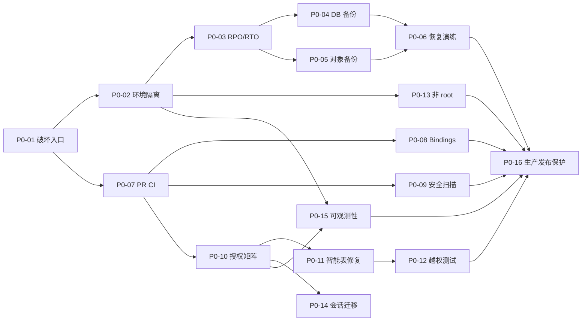

# AI 工业空间招商小程序 Phase 0 安全加固实施设计

> 文档状态：实施基线已确认；除单独留证的任务外，不代表已实施
> 基线分支：`feature/ai-industrial-space-mvp`
> 依据：`docs/ai-miniapp/current-system-audit.md` 及本地源码静态核验
> 任务总数：16
> 预计工作量：33 人日；在关键角色并行且审批及时的情况下，预计 4 个工作周

## 已确认实施基线

本章记录业务方最新确认的 Phase 0 决策。与本文其他章节冲突之处，均以本章为准，并在原位置标注“已由最新决策替代”。以下内容属于实施和验收硬约束，不得通过删减任务、放宽保护或把未知生产事实写成已确认状态来压缩工期。

### 1. 工期与启动门槛

- Phase 0 固定为 4 个工作周，必须完整完成 P0-01～P0-16，不得为赶工删除任务；预计总工作量继续按约 33 人日管理。
- 当前技术人员数量尚未确定，技术人员和每项任务负责人必须在正式启动前全部确定。
- 四周倒计时仅在以下条件同时满足后开始：技术人员与任务负责人到位；测试、生产服务器可信 SSH 访问就绪；独立阿里云账户及异地 OSS 就绪。
- 独立阿里云账户和异地 OSS 的采购、权限开通与配置必须在 Phase 0 第 1 周完成。为消除与启动门槛的表述歧义，启动前“就绪”至少指采购主体、预算、责任人和可配置权限已落实；资源的最终策略配置与验收属于第 1 周交付物。

### 2. 备份与恢复

- 已确认目标为 `RPO ≤ 1 小时`、`RTO ≤ 4 小时`。
- 保留周期固定为：小时备份 48 小时、每日备份 35 天、每周备份 12 周、每月备份 12 个月。
- 运维负责人执行备份和恢复；业务数据负责人审批恢复动作及数据完整性结果。
- 异地副本存放在中国大陆不同区域、独立云账户的阿里云 OSS；独立账户和 OSS 在 Phase 0 第 1 周完成采购与配置。
- 本地代码只发现 Cloudflare R2 专用实现，底层使用 AWS S3 SDK 的兼容协议。生产运行时实际对象存储仍未确认，必须在第 1 周由运维进行只读确认；不得把它推断为 R2 或 OSS。
- 任何聊天、文档、日志和验收证据均不得输出 R2/OSS 配置值。
- 测试服务器与生产服务器位于阿里云同一地域、不同可用区；生产故障时，测试服务器可在审批后切换为临时生产恢复节点。DNS 使用阿里云云解析 DNS。
- 完整恢复演练每季度至少一次，重大架构变更后追加一次；必须先在测试服务器完成成功的恢复演练，才能修改生产发布流程。

### 3. 文件删除保护

- 图片、合同和附件删除后保留 30 天恢复期；普通房源图片到期可按生命周期规则自动清理。
- 合同、发票、收款凭证及财务附件在永久删除前必须由业务数据负责人审批。
- 永久删除必须审计操作人、审批人、对象、时间、原因和结果。
- 在 P0-05 完成延迟删除、版本和恢复能力前，生产对象物理删除应失败关闭，宁可暂留孤儿对象，也不得执行不可恢复硬删除。

### 4. 密钥管理

- 当前没有统一生产密钥管理服务；Phase 0 新建阿里云 KMS/凭据管家能力。
- 生产与测试密钥必须完全隔离；GitHub Environment 只保留部署所需的最小权限凭据，密钥不得进入代码库。
- 当前生产密钥来源尚不明确。第 1 周由运维只读确认配置来源类型、是否存在明文文件、文件权限是否合规及凭据类别，只返回状态和风险，不返回任何配置值。

### 5. SSH、部署与审批

- 测试和生产服务器均在第 1 周配置并验证 SSH 别名和主机指纹；不得关闭或绕过 SSH 主机校验。
- 每周安排一次夜间 2 小时生产维护窗口。
- 所有改动合并到 `main` 前原则上至少 1 人评审。
- **已由最新决策替代：**技术负责人允许直接推送 `main`，该例外作为已接受残余风险记录；直推后仍必须自动运行全部 CI。CI 失败不得部署测试或生产。
- CI 通过后自动部署完全独立的测试环境；生产环境不得因推送代码自动部署。
- 生产部署必须人工审批：普通发布由技术负责人审批；数据结构变更、数据迁移或批量数据修复还必须增加业务数据负责人审批。
- 测试与生产使用完全独立的密钥和数据；测试环境只允许使用少量且彻底脱敏的生产数据。

### 6. 监控与审计

- 告警渠道包括手机短信、电子邮件、钉钉机器人和电话语音；最高级故障同时触发四种渠道，一般故障使用钉钉和邮件，故障恢复后自动发送恢复通知。
- 安全审计日志在线保留 180 天，归档总保留 1 年。
- 审计范围包括登录、权限变更、敏感数据访问、发布、备份、恢复和管理操作。

### 7. 身份与高风险操作

- 内部后台会话最长 8 小时；禁止在浏览器 LocalStorage 保存长期敏感凭据。
- 敏感操作必须重新输入密码并验证手机短信验证码。
- 智能电表只允许已分配到对应园区的园区经理和电工访问；同一客户主体的人员也不得跨未授权园区访问。
- 远程停送电由电工发起申请，园区经理审批后系统才允许下发；发起人与审批人不得为同一账号。
- 申请、审批、指令下发、设备响应和最终状态必须完整审计。

### 8. 最终验收

Phase 0 全部 16 项任务由技术负责人、运维负责人和业务数据负责人联合验收。任何一方未通过，不得宣布 Phase 0 完成，也不得开始宜租网小程序业务开发。

## 1. 目标、范围与安全原则

Phase 0 的目标不是开发招商业务，而是建立一条“不会误删数据、越权默认拒绝、改动先经过质量门禁、可恢复、可审计”的安全基线。完成 Phase 0 之前，不应向小程序开放智能水电表、租赁、账单或对象存储等内部能力，也不应允许新仓库触发任何生产发布。

本设计遵循以下原则：

1. **默认拒绝（fail closed）**：配置缺失、身份不完整、租户/园区/资源不匹配或无法确认权限时一律拒绝，不使用“有登录态即可”的降级路径。
2. **恢复先于变更**：必须先在隔离测试服务器完成真实备份的恢复演练并通过验收，才能修改生产发布流程；“备份任务成功”不等于“可恢复”。
3. **生产不可自动触发**：生产发布只允许显式手动发起，使用受保护环境和独立审批，不允许 push 触发，不允许 force、清库或任意自定义命令。
4. **环境和故障域隔离**：测试与生产使用不同账户、配置、凭据、数据库/模块和对象存储；备份副本使用独立权限与故障域。
5. **最小权限**：运行账户、CI 权限、供应商凭据、对象存储和授权上下文均只授予完成当前动作所需权限。
6. **可验证而非口头约定**：每个控制必须有自动测试、机器可读证据或审批记录；禁止仅依靠注释和人工记忆。
7. **不泄露敏感信息**：日志、CI 输出、备份清单和演练证据不得包含凭据值、个人数据、客户业务正文或内部网络信息。

## 2. Phase 0 明确范围

### 2.1 本阶段包含

- 清库、重建、强制发布、任意发布命令和业务/对象硬删除入口的分级清单与自动检测。
- 彻底移除生产默认清库能力，拆分 PR CI、构建与生产发布，并建立受保护环境审批。
- SpacetimeDB 与对象存储的加密备份、异地副本、校验和、保留策略和测试恢复演练设计。
- 智能水电表接口的角色、客户、当前租户、园区和具体表计授权。
- tenant/park/object 权限矩阵、统一授权入口和系统性越权集成测试。
- Rust、SpacetimeDB bindings、安全扫描和构建产物的 PR 质量门禁。
- 非 root 运行、测试/生产凭据隔离，以及浏览器长期凭据的风险缓解和迁移路线。
- request_id、主体/租户/园区/资源、结果、耗时、授权失败、发布、备份和恢复事件的最小可观测性。

### 2.2 本阶段明确不做

- 不开发房源、搜索、推荐、预约、带看、跟进、微信登录或 AI 招商功能。
- 不新增或修改招商业务表，不重构现有租赁、合同、账单等业务模型。
- 不通过清库、改列、删列或重建生产库解决任何 schema 问题。
- 不把现有 Dioxus/SpacetimeDB 内部接口直接公开给小程序。
- 不更换云厂商，不迁移生产数据，不把备份恢复演练直接放在生产环境执行。
- 不在 Phase 0 引入完整 SIEM、全量零信任平台或复杂多集群编排；仅建立可扩展的最小基线。
- 本文编写阶段不连接测试/生产服务器，不执行部署、备份、恢复、清库或外部服务调用。

## 3. 当前风险与代码路径

### 3.1 破坏性入口清单

| 类别 | 当前入口 | 风险 | 证据路径 |
|---|---|---|---|
| 自动生产触发 | workflow 同时监听 `main` push 和手动触发 | 合并即进入生产构建/部署链路，新仓库若误配环境即可产生外部变更 | `.github/workflows/deploy-production.yml` |
| 强制发布 | workflow 固定打开 SpacetimeDB 强制发布条件 | 普通应用发布与数据库发布绑定，扩大故障半径 | `.github/workflows/deploy-production.yml` |
| 可变清库开关 | 仓库变量可传入远端部署脚本 | “默认 false”仍可被一次配置变更变成生产清库 | `.github/workflows/deploy-production.yml`、`deploy/scripts/remote_deploy.sh` |
| 数据删除参数 | 远端脚本可向 publish 参数追加全库删除选项 | 绕过兼容迁移并清空整个模块数据 | `deploy/scripts/remote_deploy.sh` |
| 任意发布命令 | 远端脚本接受外部字符串并通过 shell 执行 | 审核无法证明实际执行的是固定、安全命令 | `.github/workflows/deploy-production.yml`、`deploy/scripts/remote_deploy.sh` |
| 非交互确认 | 发布命令接受自动确认模式 | 在错误目标上缺少最后一道人工确认 | `deploy/scripts/remote_deploy.sh` |
| 可复制的清库示例 | 项目内代理说明含清库和删除数据库示例 | 自动化代理或人员可能复制到错误环境 | `server/AGENTS.md`、`server/.github/copilot-instructions.md` |
| 文档化清库流程 | 服务端文档将变量切换作为可用迁移办法 | 仍把高危动作保留为正常运维路径 | `server/README.md`、`server/ARCHITECTURE.md` |
| 对象存储硬删除 | 业务图片解除引用后直接调用对象删除 | 误删后当前实现没有回收站/版本恢复保证 | `src/services/storage/r2_cleanup.rs` |
| 业务数据删除 | 客户端 service 暴露多类 delete reducer；部分表硬删、部分软删 | 合法业务删除与高危运维删除混杂，需要显式允许清单和审计 | `src/services/mod.rs`、`src/services/contract/`、`src/services/billing/`、`src/services/rental.rs`、`server/spacetimedb/src/reducers/` |
| 迁移硬删除 | 历史数据迁移通过临时删除/恢复行推进序列 | 若管理员入口误用或中途失败，影响范围大 | `server/spacetimedb/src/reducers/platform/migration/sequence.rs`、`server/spacetimedb/src/reducers/platform/migration/mod.rs` |
| 园区级级联 | 园区删除会处理多类子资源、关系和图片引用 | 需要对象级授权、预览影响范围和不可变审计 | `server/spacetimedb/src/reducers/rental/park/deletion.rs` |

Phase 0 不会取消所有合法业务删除。实施时将删除入口分成四级：D0 全库/全模块破坏操作（生产永久禁止）、D1 环境/发布控制（双人审批）、D2 批量业务级联（强授权、影响预览、审计）、D3 单资源业务删除（对象授权、幂等和审计）。CI 维护机器可读允许清单，任何新增 `.delete`、对象硬删除、shell 动态执行或危险发布参数都必须触发安全评审。

### 3.2 备份与恢复缺口

仓库只在交付文档中提出快照和异地备份原则，没有可执行的 SpacetimeDB/对象存储备份任务、加密清单、保留策略、恢复脚本或恢复演练证据。CI 的 artifact 保留不是业务数据备份。

证据：`docs/交付与部署方案.md`、`.github/workflows/deploy-production.yml`、`deploy/`。

### 3.3 智能水电表越权风险

三个 Dioxus Server Function 只接收 SpacetimeDB 凭据、表计类型和可选日期；`validate_workspace_token` 只向身份换票接口确认凭据有效。之后适配器直接读取服务端共享供应商配置并查询整套设备目录/读数，没有请求园区参数，也没有校验角色、当前客户/租户、`my_parks` 或 `UtilityMeter` 资源归属。

本地已具备可利用的授权数据：`current_user` 包含当前业务用户和客户，`my_roles`、`my_codes` 提供有效角色/权限，`my_parks` 只返回可见园区，`my_utility_meters` 返回客户/园区范围内表计，且 `UtilityMeter.external_device_id` 可绑定供应商设备。

证据：`src/services/smart_meter/server.rs`、`src/services/smart_meter/common.rs`、`src/services/smart_meter/provider.rs`、`src/services/smart_meter/hezhong.rs`、`src/services/smart_meter/types.rs`、`server/spacetimedb/src/views/shared/identity.rs`、`server/spacetimedb/src/views/platform/permissions.rs`、`server/spacetimedb/src/views/rental/parks.rs`、`server/spacetimedb/src/views/rental/assets.rs`、`server/spacetimedb/src/tables/rental/assets/meter.rs`。

### 3.4 多租户权限、CI、运行和审计缺口

| 风险 | 当前状态 | 证据路径 |
|---|---|---|
| 守卫分散 | SpacetimeDB 已有 `ReadScope` 和大量 `require_*`，但 View/Reducer 需人工逐个调用；Dioxus Server Function 又是另一套鉴权 | `server/spacetimedb/src/access.rs`、`server/spacetimedb/src/reducers/shared/access.rs`、`server/spacetimedb/src/views/shared/identity.rs`、`src/services/storage/r2.rs`、`src/services/smart_meter/common.rs` |
| CI 无质量门禁 | 现有唯一 workflow 直接构建/部署，没有 fmt、check、clippy、test、bindings diff 或安全扫描 | `.github/workflows/deploy-production.yml` |
| root 运行 | Dioxus systemd 单元明确以 root 用户和组运行 | `deploy/systemd/yizu-app.service` |
| 环境凭据混合风险 | workflow 同时处理构建和生产运行配置，且部分生产参数带 fallback | `.github/workflows/deploy-production.yml`、`deploy/scripts/remote_deploy.sh` |
| 浏览器长期凭据 | 长期 SpacetimeDB 凭据写入 LocalStorage；无法解析的凭据仍按可持久化处理 | `src/services/credentials.rs` |
| 审计字段不足 | API 日志记录方法、路径、用户和时间，但没有 request_id、状态、耗时、园区、资源和授权决策 | `server/spacetimedb/src/tables/platform/system/api_log.rs`、`server/spacetimedb/src/tables/platform/center/system/api_log.rs`、对应 reducers |
| 监控不足 | 只有服务进程、页面和 Spacetime ping 的部署后检查，没有业务指标、错误追踪和告警闭环 | `.github/workflows/deploy-production.yml`、`server/spacetimedb/src/lifecycle.rs`、`src/services/spacetime.rs` |

## 4. 目标安全基线

### 4.1 生产发布

- 生产 workflow 仅允许 `workflow_dispatch`，输入固定的已验证提交哈希或签名 artifact；不监听 push。
- `production` GitHub Environment 开启 required reviewers、禁止发起人自行批准、限制允许分支；主分支禁止 force push 和删除，必需状态检查全部通过后才能合并。
- 删除 workflow 和远端脚本中的清库变量、数据删除参数分支、固定强制发布和任意 shell 发布命令；不是“改成默认 false”，而是代码中不再存在生产通路。
- Web 应用发布与 SpacetimeDB schema 发布拆分。schema 发布只能使用固定、非破坏命令，先做兼容性预检；不兼容时失败并要求重新设计，绝不自动清库。
- 测试与生产分别使用独立 GitHub Environment、运行身份、数据库/模块、对象存储、供应商配置和 AI 配置，不允许共享凭据或 fallback。
- 新仓库没有完整生产 Secrets 时，生产 job 不得访问网络或生成运行环境文件：只允许在本地 runner 预检阶段以“缺少配置”失败。workflow 不提供任何生产目标默认值。
- 所有 actions 固定到审核过的不可变版本，job 使用最小 `permissions`，生产 Secrets 只暴露给审批后的 deploy job。

### 4.2 备份与恢复

以下目标已由最新决策确认，替代原“建议临时目标、待业务方冻结”的表述：

| 项目 | Phase 0 目标 |
|---|---|
| 端到端 RPO | 不超过 1 小时 |
| 端到端 RTO | 不超过 4 小时 |
| 备份频率 | 小时级恢复点保留 48 小时；每日保留 35 天；每周保留 12 周；每月保留 12 个月 |
| 加密 | 传输全程加密；备份在写入前或存储端采用独立 KMS/密钥域的强加密；密钥与备份数据分离 |
| 异地副本 | 至少一份位于独立账户和独立故障域；源环境删除身份无权删除备份副本 |
| 完整性 | 每次备份生成 SHA-256 清单、对象数量/字节数、数据库版本、schema 摘要和父恢复点；清单签名或写入不可变日志 |
| 恢复演练 | 首次上线前一次，以后至少每季度；重大 schema/存储变更前追加一次 |

SpacetimeDB 2.6.1 的一致性备份方式必须先在隔离测试环境验证。优先使用该版本官方支持的导出/快照；如果热备不能证明一致性，则测试演练中采用短暂写入冻结或存储卷一致性快照，并在清单记录开始/结束水位。不得把运行目录的普通文件复制当成已验证备份。

对象存储备份使用独立只写备份身份，将源对象及元数据清单复制到不可变或 append-only 副本；源端硬删除不立即传播为物理删除，至少保留业务确认窗口。恢复验收必须同时验证数据库图片引用与对象 SHA-256，不能只比较对象数量。

### 4.3 统一授权决策

统一授权决策输入定义为：

```text
subject + active_session + customer + tenant + roles/codes
+ park + resource_type + resource_id + action + environment
```

决策顺序固定为：

1. 会话有效且主体可解析；
2. 当前租户已选择且与业务用户 `customer_id` 一致；
3. 角色或明确权限码允许该 action；
4. 园区存在于主体的 `my_parks`；
5. 资源归属同一 customer/park、未删除且类型匹配；
6. 外部供应商配置的 scope 精确匹配 environment/customer/park/resource kind；
7. 返回数据再次按允许资源 ID 集合过滤；
8. 任一步骤不确定即拒绝，并记录不含敏感正文的授权失败审计事件。

SpacetimeDB module 继续以 `access.rs`/`reducers/shared/access.rs` 为底层守卫；Dioxus Server Function 新增统一 server-side authorization adapter。两者共享同一权限矩阵和测试向量，而不是各自定义角色字符串。

## 5. 按安全依赖排序的实施任务

以下任务编号即 Phase 0 的 16 个交付任务。预计文件均为后续实施时的计划，本轮不创建或修改这些实现文件。

### P0-01 破坏性操作盘点与永久禁用规则

- **实施状态（2026-08-10）**：原始提交 `93c0b1c31b8db348e0a91e965dcc4eb7d0f3f7fb` 因真实 POST/PUT 发布路由未阻断、生产 Nginx 失败放行和 `--yes=all` 权限过宽而未通过独立复核；当前分支已追加完成对应仓库侧整改，并通过动态生产路径扫描、路由矩阵、Shell、Docker 最小 Nginx 语法、workspace 编译和主应用测试，状态恢复为“仓库侧完成、待三方验收及隔离测试环境验证”。证据见 `docs/ai-miniapp/evidence/p0-01-destructive-operations.md`。未连接、部署或重启任何服务器；现网是否加载这些变更不在本地任务中推断。
- **依赖/负责人/工期**：无；Security/DevOps + Rust；1 人日。
- **实施**：建立 D0–D3 分级清单；生产禁止 D0；删除清库/force/任意命令设计入口；生产对象物理删除在 P0-05 完成恢复机制前失败关闭；自动扫描生产路径中的危险参数、动态 shell、递归删除和数据库删除命令。
- **预计修改文件**：`.github/workflows/deploy-production.yml`、`deploy/scripts/remote_deploy.sh`、`src/services/storage/r2_cleanup.rs`、`README.md`、`deploy/README.md`、`server/AGENTS.md`、`server/.github/copilot-instructions.md`、`server/README.md`、`server/ARCHITECTURE.md`、`server/ARCHITECTURE.html`；新增 `docs/ai-miniapp/evidence/p0-01-destructive-operations.md`、`scripts/check-production-destructive-ops.ps1`。
- **测试/验收**：仓库扫描确认生产路径不存在清库参数、数据删除变量、任意发布 shell 或固定 force；植入测试样例时 CI 必须失败；合法 D2/D3 项必须逐项绑定权限和审计责任人。
- **回滚**：扫描规则误报时只回滚规则版本或增加经审批的精确 allowlist；绝不恢复 D0 生产通路。

### P0-02 测试/生产环境与凭据隔离

- **依赖/负责人/工期**：P0-01；DevOps + Security；2 人日。
- **实施**：建立 `test`、`production` 两套受保护环境和独立服务身份；移除生产 fallback；配置必须带环境/受众标识，启动时校验；测试环境使用合成数据且无权访问生产资源。
- **预计修改文件**：新增 `docs/runbooks/environment-separation.md`、安全的 `.env.example`；后续调整 `.github/workflows/`、`deploy/`；GitHub Environment、branch protection 和密钥管理平台设置（非仓库文件）。
- **测试/验收**：测试身份访问生产目标必然失败；生产身份不用于 PR/构建；缺任一生产配置时 workflow 在任何网络步骤前失败；日志只显示配置项名称和状态，不显示值。
- **回滚**：撤回新环境的权限绑定，不删除旧凭据，先禁用生产 workflow；确认新隔离链路稳定后再轮换和吊销旧凭据。

### P0-03 RPO/RTO、保留与恢复验收冻结

- **依赖/负责人/工期**：P0-02；业务负责人 + Security/DevOps；1 人日。
- **实施**：业务方签字确认 RPO、RTO、保留周期、异地边界、演练频率、证据留存和恢复负责人；定义数据库/对象一致性验收样本。
- **预计修改文件**：新增 `docs/security/rpo-rto.md`、`docs/runbooks/backup-restore.md`、`docs/evidence/phase0/restore-drill-template.md`。
- **测试/验收**：文档包含量化阈值、测量起止点、失败条件和审批人角色；未确认项不得标记完成。
- **回滚**：目标调整通过版本化决策记录完成；不得静默降低已批准目标。

### P0-04 SpacetimeDB 自动备份与完整性清单

- **依赖/负责人/工期**：P0-03；DevOps + Rust；3 人日。
- **实施**：在测试环境验证 2.6.1 的一致性导出/快照；生成加密备份、schema/版本摘要、行数或业务不变量、SHA-256 清单和签名；备份身份只读源、只写副本，不能发布 module 或删除副本。
- **预计修改文件**：新增 `ops/backup/spacetimedb-backup.*`、`ops/backup/verify-manifest.*`、`ops/restore/spacetimedb-restore.*`、`deploy/systemd/*backup*.service`、`deploy/systemd/*backup*.timer`；更新 `docs/runbooks/backup-restore.md`。
- **测试/验收**：连续多个计划周期成功；清单可独立校验；中断、磁盘不足、上传失败和密钥不可用均失败并告警，不产生“成功”标记；输出不包含业务正文。
- **回滚**：停止新定时器并保留已生成备份；恢复旧运行任务前必须证明不会覆盖或删除新副本。

### P0-05 对象存储自动备份、版本保留与删除保护

- **依赖/负责人/工期**：P0-03；DevOps + Rust；2 人日。
- **实施**：独立故障域复制对象及元数据；采用不可变/append-only 策略；为源端删除建立延迟物理删除或恢复窗口；清单记录对象 key 的不可逆摘要、大小、版本和 SHA-256，不记录公开地址或业务内容。
- **预计修改文件**：新增 `ops/backup/object-storage-backup.*`、`ops/restore/object-storage-restore.*`、`ops/backup/verify-object-manifest.*`；后续改造 `src/services/storage/r2_cleanup.rs`；更新 `docs/runbooks/backup-restore.md`。
- **测试/验收**：新增、覆盖、删除、孤儿对象和数据库引用五类用例均可恢复；随机样本 checksum 一致；源删除身份无法删除备份副本。
- **回滚**：禁用复制任务但保留版本/副本；若删除保护影响业务，退回“只标记待删除、不物理删除”，不能退回立即不可恢复硬删。

### P0-06 隔离测试服务器恢复演练（生产流程硬门禁）

- **依赖/负责人/工期**：P0-04、P0-05；DevOps + QA + 业务验收人；2 人日。
- **实施**：从选定恢复点恢复到全新隔离数据库/对象存储命名空间；使用合成或已批准的脱敏数据；记录 RPO/RTO、版本、清单、数量、不变量、对象引用、关键只读流程和审批结论。
- **预计修改文件**：填写 `docs/evidence/phase0/restore-drill-<date>.md` 的脱敏结果；必要时修订 `ops/restore/` 和 runbook。
- **测试/验收**：恢复点满足 RPO；完整恢复和可用性验证满足 RTO；checksum、schema、关键表数量/业务不变量和对象引用全部通过；QA 与业务验收人签字。该任务未通过时，P0-16 禁止开始。
- **回滚**：演练失败只销毁隔离恢复环境并保留失败证据，修复后重新演练；不得改用生产环境验证，也不得降低门槛掩盖失败。

### P0-07 PR Rust 质量门禁

- **依赖/负责人/工期**：P0-01；Rust + QA；2 人日。
- **实施**：新增只读 PR CI，依次执行 `cargo fmt --check`、`cargo check --workspace`、严格 `cargo clippy` 和 `cargo test --workspace`；固定 Rust/工具链，启用缓存但不缓存敏感配置。
- **预计修改文件**：新增 `.github/workflows/ci.yml`；必要时新增 `rust-toolchain.toml`；现存告警修复由独立 PR 处理。
- **测试/验收**：格式、编译、lint 或测试任一失败均阻止合并；CI 不加载生产环境和生产 Secrets；测试报告可追踪到提交。
- **回滚**：工具链故障时允许临时回退到上一个固定版本，但 required check 不得取消；业务告警不能通过全局 allow 绕过。

### P0-08 SpacetimeDB bindings 可重复生成门禁

- **依赖/负责人/工期**：P0-07；Rust；1 人日。
- **实施**：固定 SpacetimeDB CLI 2.6.1，在干净 checkout 中执行项目已有 generate 命令，然后对 `src/spacetime_bindings/` 执行 diff 检查；禁止手改生成文件。
- **预计修改文件**：更新 `.github/workflows/ci.yml`；新增 `scripts/check-spacetime-bindings.*`；更新 `server/README.md` 的唯一标准命令。
- **测试/验收**：修改 Table/View/Reducer/Procedure 而未更新 bindings 时 CI 失败；连续两次生成零 diff；CLI 安装包校验来源和 checksum。
- **回滚**：生成器故障时固定到最后一个已验证 2.6.1 安装产物并阻止 schema 合并，不允许跳过 diff 门禁。

### P0-09 密钥、依赖漏洞和构建产物门禁

- **依赖/负责人/工期**：P0-07；Security/DevOps；2 人日。
- **实施**：加入密钥扫描、依赖漏洞/许可证策略、Git 跟踪文件检查和 release artifact 内容检查；拒绝环境文件、数据库文件、上传文件、日志、缓存、私钥/凭据模式及意外二进制进入提交或制品。
- **预计修改文件**：新增 `.github/workflows/ci-security.yml`、`.gitleaks.toml`、`deny.toml`、`scripts/check-repository-artifacts.*`、`scripts/check-release-artifact.*`；必要时补充 `.gitignore`。
- **测试/验收**：使用无效测试样例验证每类检测都能失败；扫描结果不回显匹配值；高危依赖阻止合并，例外必须有到期时间和负责人。
- **回滚**：误报通过精确 fingerprint/路径和到期例外处理，不关闭整个扫描 job；疑似真实泄露先轮换再清理历史。

### P0-10 tenant/park/object 权限矩阵与统一授权入口

- **依赖/负责人/工期**：P0-07；Rust + Security + 业务负责人；2 人日。
- **实施**：建立主体—动作—资源矩阵；SpacetimeDB 守卫和 Dioxus Server Function adapter 使用同一决策词汇/测试向量；所有新服务端端点必须显式声明 action/resource，未注册默认拒绝。
- **预计修改文件**：新增 `docs/security/authorization-matrix.md`、`security/authorization-test-vectors.*`、`src/services/authz.rs`；后续收口 `server/spacetimedb/src/access.rs`、`server/spacetimedb/src/reducers/shared/access.rs`、`server/spacetimedb/src/views/shared/identity.rs`。
- **测试/验收**：矩阵覆盖匿名、会话失效、无当前租户、跨客户、跨园区、资源不存在、资源错类型、软删除、普通角色和管理员；守卫覆盖扫描发现未声明端点时 CI 失败。
- **回滚**：新 adapter 故障时端点切到 deny-all/暂停服务，不能回退到“只验证登录态”；SpacetimeDB 现有守卫保留至新路径完全验证。

### P0-11 智能水电表角色与资源级授权修复

- **依赖/负责人/工期**：P0-10；Rust + QA；3 人日。
- **实施**：接口请求增加本地 `park_id`；授权 adapter 解析当前用户/客户/租户、有效角色/权限码和 `my_parks`；只允许读取同 customer/park、类型匹配、未删除且已绑定 `external_device_id` 的 `UtilityMeter`；按 environment/customer/park/kind 选择独立供应商配置并过滤供应商返回数据。移除共享配置 fallback。
- **预计修改文件**：`src/services/smart_meter/server.rs`、`common.rs`、`types.rs`、`provider.rs`、`hezhong.rs`、`src/pages/smart_meter/`；权限常量/种入逻辑位于 `server/spacetimedb/src/access.rs`、`server/spacetimedb/src/reducers/platform/permissions/`；bindings 按 P0-08 生成（不要求数据库结构变更）。
- **测试/验收**：无凭据、失效凭据、无角色、跨客户、跨租户、跨园区、未绑定设备、错误表计类型和供应商返回额外设备均返回统一拒绝或被过滤；只允许矩阵中的正向访问；授权失败不泄露资源是否存在。
- **回滚**：出现误拒绝时可禁用智能表端点并回到手工抄表，不得恢复共享配置的宽松读取。

### P0-12 系统性越权集成与回归测试

- **依赖/负责人/工期**：P0-10、P0-11；QA/Security + Rust；3 人日。
- **实施**：建立至少两个客户、每个客户两个园区、不同角色和同号资源的合成 fixture；对 View、Reducer、Procedure、Dioxus Server Function 执行 tenant/park/object 正负矩阵；增加 IDOR、枚举和错误信息一致性测试。
- **预计修改文件**：新增 `tests/security/authorization/`、`tests/security/fixtures/`、`scripts/run-authorization-tests.*`；补充 `server/spacetimedb/src/access.rs` 和相关 adapter 单元测试；接入 `.github/workflows/ci.yml`。
- **测试/验收**：每个受保护 action 至少有同租户允许、跨租户拒绝、跨园区拒绝、无权限拒绝和资源错属拒绝；覆盖率清单与权限矩阵一一对应；测试只用合成数据。
- **回滚**：测试基础设施不稳定时隔离修复，required 安全测试仍保持阻塞；不得以 flaky 为由长期跳过越权用例。

### P0-13 非 root 运行与服务端凭据最小权限

- **依赖/负责人/工期**：P0-02、P0-07；DevOps + Rust；2 人日。
- **实施**：Dioxus 服务改用专用不可登录账户或非 root 容器；只读应用目录、独立可写临时目录，开启 systemd 沙箱限制；运行配置由密钥管理注入且文件权限最小；测试/生产供应商身份分离。
- **预计修改文件**：`deploy/systemd/yizu-app.service`、`deploy/scripts/remote_deploy.sh`、`deploy/README.md`；若采用容器则新增最小化 `Dockerfile` 和运行配置。
- **测试/验收**：进程 UID 非 root；无法写应用/系统目录、无法读取不相关密钥、不能获得额外能力；R2、AI、表计等允许功能仍通过测试环境 smoke test。
- **回滚**：权限问题先停止服务、修正目录所有权/能力并重试；只允许在有时限和审批的维护窗口使用受控运维身份，不把应用永久改回 root。

### P0-14 浏览器 LocalStorage 长期凭据迁移

- **依赖/负责人/工期**：P0-10；Rust + Security；2 人日。
- **实施**：短期措施是缩短长期凭据寿命、严格解析后才持久化、退出/租户切换时撤销，并配置 CSP/减少 XSS 面；目标方案是小程序/BFF 使用服务端会话，Web 使用 HttpOnly、Secure、SameSite cookie 或一次性 WebSocket 换票，浏览器不持有长期数据库凭据。设计双轨迁移和旧凭据吊销窗口。
- **预计修改文件**：`src/services/credentials.rs`、`src/services/spacetime.rs`、认证相关服务；可能调整 `deploy/nginx/` 的安全响应头；新增 `docs/security/session-migration.md`。
- **测试/验收**：LocalStorage 中不再出现新签发的长期数据库凭据；短票过期、刷新、退出、撤销、租户切换和多标签页均有测试；旧凭据按计划吊销且不回显。
- **回滚**：使用有限期双轨兼容，不删除服务端会话记录；若新会话故障可暂停新登录并恢复最后已验证的短期会话版本，但不得重新签发无限期浏览器凭据。

### P0-15 日志、监控、审计和告警最小基线

- **依赖/负责人/工期**：P0-02、P0-10；Rust + DevOps + QA；3 人日。
- **实施**：所有服务端请求生成/传播 request_id；结构化记录 subject_id、customer/tenant、park、resource type/id、action、授权结果、状态和耗时；敏感值与正文脱敏。记录授权失败、生产审批/发布、备份、校验、恢复和凭据轮换事件。新增健康、就绪、依赖、错误率、延迟、拒绝率、备份新鲜度和恢复演练状态指标。
- **预计修改文件**：新增 `src/services/telemetry.rs` 或等价 middleware、`docs/runbooks/monitoring-alerting.md`；后续收口 API log reducers、智能表/存储服务；调整 `deploy/` 健康检查和日志采集配置；不要求 Phase 0 修改业务数据库表结构。
- **测试/验收**：request_id 可跨服务关联；日志字段完整且不含凭据/客户正文；授权拒绝突增、5xx、延迟、备份过期、checksum 失败、恢复失败和生产发布均能在测试环境触发告警并确认送达；健康检查不能仅返回进程存活。
- **回滚**：外部日志/指标后端故障不得拖垮业务；可降级为本地结构化缓冲并告警，但授权、备份和发布审计事件不得静默丢弃。

### P0-16 受保护、手动、非破坏性生产发布

- **依赖/负责人/工期**：**P0-06 必须成功**，且 P0-07～P0-13、P0-15 通过；DevOps + Security + 发布审批人；2 人日。
- **实施**：PR CI、build artifact 与 deploy 分离；生产仅手动选择已通过 CI 的不可变 artifact；使用受保护 Environment。**已由最新决策替代原“双人审批”统一口径：**普通发布由技术负责人审批，数据结构变更、数据迁移或批量数据修复再增加业务数据负责人审批。删除 push 触发、默认生产目标、force、清库、任意发布命令。Web 发布与固定的非破坏 schema 发布分开，先 compatibility preflight 和备份新鲜度校验。
- **预计修改文件**：重构 `.github/workflows/deploy-production.yml`；新增 `.github/workflows/build-release.yml` 和必要的非生产 deploy workflow；收紧 `deploy/scripts/remote_deploy.sh`；更新 `deploy/README.md`；配置 GitHub branch/Environment 保护（非仓库文件）。
- **测试/验收**：无生产 Secrets 的新仓库无法进入网络/部署步骤；push main 不触发生产；未批准、CI 未绿、artifact SHA 不符、备份过期、恢复演练未通过、schema 不兼容或检测到 force/删除参数时全部失败；审批后仅部署指定 artifact；主分支 force push/删除被平台拒绝。技术负责人直推 `main` 的已接受残余风险必须留证，且直推同样自动运行全部 CI，CI 失败不得部署。
- **回滚**：应用回滚只允许重新部署上一个已签名、已验证的非破坏 artifact；schema 不回滚到不兼容版本，采用向前兼容修复；任何故障都不得通过清库或 force 发布“恢复”。

## 6. 安全依赖与里程碑



里程碑（四周倒计时仅在“已确认实施基线”的启动门槛全部满足后开始）：

- **M0（第 1 周）**：P0-01～03、P0-07 的设计和基础门禁完成；独立阿里云账户与异地 OSS 完成采购配置；测试/生产可信 SSH 别名和主机指纹完成验证；运维只读确认生产对象存储类型及密钥来源状态。
- **M1（第 2 周）**：备份自动化、bindings、安全扫描和授权矩阵完成。
- **M2（第 3 周）**：恢复演练、智能表修复、越权测试、非 root 和会话短期缓解完成。
- **M3（第 4 周）**：监控审计验收；完成生产发布保护设计实施及最终安全评审。

## 7. 测试服务器执行顺序

该顺序只描述后续执行；本轮不得实际连接或执行。

1. 创建与生产完全隔离的测试账户、网络、SpacetimeDB 模块、对象存储和供应商沙箱；写入环境标识和合成数据，必要时仅使用经批准的少量、彻底脱敏生产数据。
2. 运行 PR CI、bindings 和安全扫描，确认 artifact 可重复且不含敏感文件/构建垃圾。
3. 部署备份任务到测试服务器，只授予读取测试数据和写入测试备份副本的权限。
4. 连续取得多个恢复点，模拟中断、空间不足、目标不可用和 checksum 错误，确认失败告警。
5. 选择一个恢复点，恢复到全新隔离命名空间；禁止覆盖原测试数据。
6. 校验 schema/版本、表数量与业务不变量、对象清单和引用 checksum；记录实际 RPO/RTO。
7. 用合成多租户 fixture 部署授权改造，执行跨租户、跨园区、跨资源和无权限负向测试。
8. 验证智能表只返回当前 customer/park 下已绑定表计，并确保共享/错误供应商配置被拒绝。
9. 切换为非 root 运行，执行权限、文件写入、凭据可见性和功能 smoke test。
10. 验证 request_id、授权拒绝、备份/恢复、服务错误和依赖故障告警链路。
11. 技术负责人、运维负责人和业务数据负责人共同签署恢复演练、越权测试、非 root 和监控证据。
12. 只有第 11 步通过后，才允许进入 P0-16 的生产 workflow 修改与审批。

## 8. 生产服务器变更审批点

| 审批点 | 何时 | 必须提供的脱敏证据 | 批准角色 |
|---|---|---|---|
| AP-01 安全目标 | P0-03 前 | RPO/RTO、保留期、异地边界、成本估算 | 业务负责人、技术负责人、安全负责人 |
| AP-02 恢复演练 | P0-06 后 | 恢复清单、checksum 结论、RPO/RTO 实测、QA 结果 | 运维负责人、QA、业务数据负责人 |
| AP-03 授权矩阵 | P0-11 前 | 角色—动作—tenant/park/object 矩阵和负向用例 | 业务负责人、安全负责人 |
| AP-04 运行账户切换 | P0-13 上生产前 | 测试环境非 root 证明、目录/能力清单、维护窗口和回退步骤 | 运维负责人、技术负责人 |
| AP-05 生产环境保护 | P0-16 前 | Environment/branch 保护截图或导出、Secrets 完整性状态、无默认目标检查、技术负责人直推 `main` 例外的残余风险记录 | 仓库管理员、安全负责人 |
| AP-06 普通发布 | 每次普通生产发布 | 通过 CI 的提交/artifact 摘要、备份新鲜度、schema 兼容性、变更和回滚单 | 技术负责人 |
| AP-07 数据类发布 | 数据结构变更、数据迁移或批量数据修复 | AP-06 全部证据、数据影响评估、恢复点与数据验收方案 | 技术负责人、业务数据负责人 |
| AP-08 生产恢复 | 生产故障切换测试服务器或执行恢复 | 已验证恢复点、RPO/RTO 影响、临时节点切换和回切方案 | 技术负责人、运维负责人、业务数据负责人 |

任何审批证据都不得包含凭据值、客户数据、内部地址或备份正文。

## 9. 总体回滚策略

1. **安全控制只向更严格方向回滚**：授权故障时关闭端点，不回到“仅登录即允许”；清库通路删除后不恢复。
2. **代码/配置回滚**：只部署上一个通过同等 CI 和安全扫描的不可变 artifact；配置使用版本化、脱敏变更记录。
3. **数据库变更**：Phase 0 不做破坏性 schema 变更；如新增权限种入失败，使用幂等向前修复，不清库。
4. **数据恢复**：业务数据损坏只使用已校验恢复点并在隔离环境验证后执行；生产恢复需独立事故审批。
5. **对象误删**：优先从版本/备份副本恢复并核对数据库引用；不覆盖其他版本。
6. **运行账户切换失败**：停止服务、修正权限并重新验证；临时维护身份必须有到期时间和审计，不让应用长期 root。
7. **监控后端故障**：业务可使用受限本地缓冲，但生产发布、授权、备份/恢复事件必须保留并补传。
8. **凭据迁移失败**：保留有限期双轨会话，暂停新登录或新签发；不恢复无限期 LocalStorage 凭据。

## 10. CI 与发布目标流程

```text
Pull Request
  -> fmt / check / clippy / test
  -> bindings regenerate + diff
  -> secret / dependency / artifact / destructive-op scan
  -> merge protected main
  -> build immutable release artifact（无生产 Secrets）
  -> manual production request
  -> protected Environment approval
  -> preflight: config complete + backup fresh + restore drill valid
                + artifact digest + non-destructive schema compatibility
  -> deploy fixed artifact
  -> health / metrics / smoke verification
  -> audit event and closeout
```

PR、构建和部署必须是三个独立权限域。PR 代码无权读取生产配置；build job 不知道生产目标；只有经过 Environment 审批的 deploy job 能获得最小生产凭据。

## 11. 人员安排与工期

当前实际技术人员数量与姓名尚未确定。下表仅为 33 人日估算所需的角色槽位，不表示人员已经到位；所有技术人员、任务负责人和三方验收责任人确定前，四周倒计时不得开始。

| 角色 | 建议投入 | 主要职责 |
|---|---:|---|
| Security/DevOps 工程师 | 1 人，约 15 人日 | 发布保护、环境隔离、备份恢复、非 root、扫描、监控与审批证据 |
| Rust/Dioxus/SpacetimeDB 工程师 | 1 人，约 11 人日 | 统一授权、智能表修复、bindings、会话风险缓解、结构化日志 |
| QA/安全测试工程师 | 1 人，约 7 人日 | 恢复验收、跨租户矩阵、故障注入、CI/告警验证 |
| 业务/数据负责人 | 兼职，约 2–3 个评审日 | RPO/RTO、权限矩阵、恢复样本和上线审批 |
| 仓库/生产环境管理员 | 兼职，约 1–2 个评审日 | Branch/Environment 保护、独立审批和生产变更窗口 |

总工程工作量约 33 人日，关键工作并行后的日历工期固定按 4 个工作周管理。若可信 SSH、独立阿里云账户/异地 OSS、技术人员或任务负责人未就绪，四周倒计时尚未开始，而不是从已承诺工期中扣减等待时间。

## 12. Definition of Done

Phase 0 只有同时满足以下条件才算完成：

- [ ] 16 个任务均有 PR、评审、测试和脱敏验收证据。
- [ ] 生产仓库代码和配置中不存在可达的全库清空、数据删除发布、force 发布或任意 shell 发布通路。
- [ ] `main` 禁止 force push/删除；原则上至少 1 人评审；技术负责人直推例外已作为残余风险留证；所有进入 `main` 的变更均自动运行完整 CI；生产只可手动审批发布。
- [ ] 新仓库未配置完整生产 Secrets 时，生产 workflow 在任何网络/部署步骤前失败；push 不触发生产。
- [ ] 测试/生产账户、配置、凭据、数据库/模块、对象存储和供应商环境独立且无 fallback。
- [ ] SpacetimeDB 与对象存储自动备份按批准周期运行，备份加密、异地、不可由源删除身份删除，并有 SHA-256 清单。
- [ ] 备份保留满足小时 48 小时、每日 35 天、每周 12 周、每月 12 个月；异地副本位于中国大陆不同区域的独立阿里云账户 OSS。
- [ ] 隔离测试服务器恢复演练满足 `RPO ≤ 1 小时`、`RTO ≤ 4 小时`，数据库/对象 checksum 和业务不变量通过，并由技术、运维、业务数据三方签字。
- [ ] 图片、合同和附件具备 30 天恢复期；合同、发票、收款凭证和财务附件永久删除有业务数据负责人审批及完整审计。
- [ ] PR required checks 包含 fmt、workspace check、严格 clippy、workspace test、bindings diff、密钥扫描、依赖漏洞和产物检查。
- [ ] 所有 Dioxus Server Function 和高风险 Reducer/View 有统一 action/resource 声明；未知权限默认拒绝。
- [ ] 智能表跨客户、跨租户、跨园区、未授权和未绑定设备测试全部拒绝，供应商返回额外资源被过滤。
- [ ] 合成多租户集成测试与权限矩阵逐项对应并作为 required check。
- [ ] Dioxus 服务不以 root 运行，运行账户无法读取不相关凭据或写系统/应用目录。
- [ ] LocalStorage 长期凭据有已实施短期缓解、已批准目标迁移方案和旧凭据吊销计划。
- [ ] request_id、主体、tenant、park、resource、action、状态、耗时和授权结果可关联；日志无敏感值或客户正文。
- [ ] 授权失败、发布、备份过期/失败、checksum 错误和恢复失败可在测试环境触发告警并完成送达确认。
- [ ] 最高级故障可同时触发短信、邮件、钉钉机器人和电话语音，一般故障触发钉钉和邮件，恢复通知可自动送达；安全审计在线保留 180 天、归档总保留 1 年。
- [ ] 全部 16 项由技术负责人、运维负责人和业务数据负责人联合验收，任一方未通过均不进入小程序业务开发。
- [ ] 应用和 schema 回滚均不依赖 force、清库或降低授权标准。

## 13. 需要业务方进一步确认的问题

以下清单保留原问题并标注最新状态；标记“仍需确认”的项目会阻塞对应任务：

1. **已确认：**RPO 不超过 1 小时、RTO 不超过 4 小时。
2. **已确认：**小时 48 小时、每日 35 天、每周 12 周、每月 12 个月。
3. **已确认：**异地副本位于中国大陆不同区域、独立云账户的阿里云 OSS。
4. **已确认：**运维负责人执行备份和恢复，业务数据负责人审批恢复和数据完整性结果；事故总指挥的具体人选仍需确认。
5. **仍需确认：**测试/生产可信 SSH、独立阿里云账户与异地 OSS、独立测试数据库/模块和供应商沙箱的具体就绪日期与验收人是谁？
6. **已确认：**智能表仅允许分配到对应园区的园区经理和电工访问，不允许同客户跨未授权园区；电工申请停送电、园区经理审批、发起人与审批人分离。绑定、抄表和只读权限码的精确命名仍需业务方冻结。
7. “客户”和“租户”在权限语义中是否相同；企业租户、物业运营方和园区业主之间如何映射？
8. 每个园区对应哪一套供应商项目配置；是否存在一个园区多供应商或共享设备？
9. 未绑定 `UtilityMeter.external_device_id` 的供应商设备是否一律隐藏，还是允许特定管理员进入待绑定清单？
10. 智能表读取是否包含个人信息或商业敏感能耗数据；日志和导出保留多久？
11. **规则已确认、人选未确认：**普通生产发布由技术负责人审批；数据结构变更、迁移和批量修复增加业务数据负责人审批。两岗位的具体账号、代理人及自批限制如何配置？
12. **规则已确认、配置仍需确认：**合并前原则上至少 1 人评审；技术负责人直推 `main` 是已接受残余风险且仍运行全部 CI。安全路径是否设置 CODEOWNERS、谁是代码所有者？
13. **平台已确认、人选未确认：**采用阿里云 KMS/凭据管家；谁负责凭据创建、轮换、吊销和应急访问？
14. 是否允许使用托管的密钥扫描、依赖扫描、错误追踪和监控服务；预算与数据地域限制是什么？
15. **窗口已确认、排期仍需确认：**每周夜间 2 小时维护窗口的具体星期、起止时间、最长中断时间和回退决策人是谁？
16. **新会话上限已确认、迁移日期未确认：**内部后台会话最长 8 小时；何时完成旧长期凭据的批量吊销？
17. **期限已确认、治理仍需确认：**安全审计在线 180 天、归档总保留 1 年；访问角色、导出流程和不可变性实现由谁批准？
18. 恢复演练证据可以存放在仓库的脱敏范围是什么，完整证据应保存到哪个受控系统？
19. **恢复窗已确认、例外仍需确认：**图片、合同和附件保留 30 天；财务类附件永久删除需业务数据负责人审批。法定删除是否允许跳过恢复窗口，若允许由谁批准？
20. **审批已确认、流程仍需 P0-16 完成：**生产 schema 发布与应用发布拆分；数据结构变更增加业务数据负责人审批。兼容性预检工具与最终执行负责人是谁？
21. 当前实际投入的技术人员、P0-01～P0-16 各任务负责人、代理人和三方最终验收人分别是谁？
22. 异地 OSS 的中国大陆目标区域、独立账户责任主体、成本预算和不可变/版本策略由谁批准？
23. 生产运行时实际对象存储类型是什么？运维第 1 周只读确认时只允许返回存储类型及配置项 `SET / NOT_SET` 状态，不得返回值。
24. 当前生产密钥来自何种生效配置机制，是否有明文文件或权限风险？运维只允许返回来源类型、凭据类别和风险状态。
25. 四种告警渠道的责任组、轮值表、升级时限和脱敏测试接收端由谁维护？
26. 测试服务器临时切换为生产恢复节点时，谁发起、谁批准、DNS 切换和回切的最大允许时长是多少？

## 14. 当前阻塞结论

最新决策已解除 RPO/RTO、保留期、备份责任角色、密钥管理平台、智能表基本角色和生产审批规则等原阻塞。当前仍阻塞四周正式倒计时及后续任务的事项是：实际技术人员与任务负责人未确定；可信 SSH 状态未确认；独立阿里云账户/异地 OSS 尚无完成证据；生产运行时对象存储与密钥来源尚未由运维只读确认；园区—供应商映射、Environment 具体审批账号和告警责任组仍未冻结。这些阻塞不妨碍纯本地 P0-01 完成，但会阻塞 P0-02～P0-16 的相应实施与最终验收。
