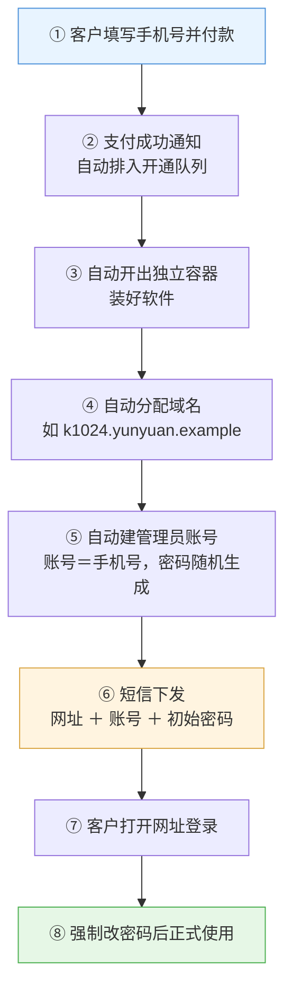
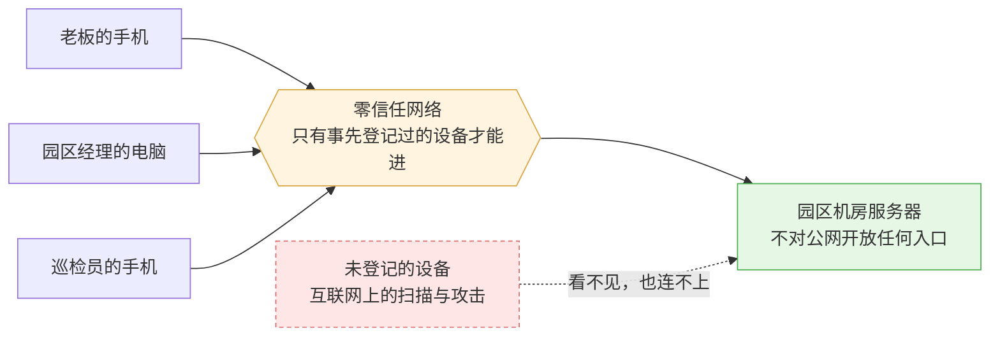
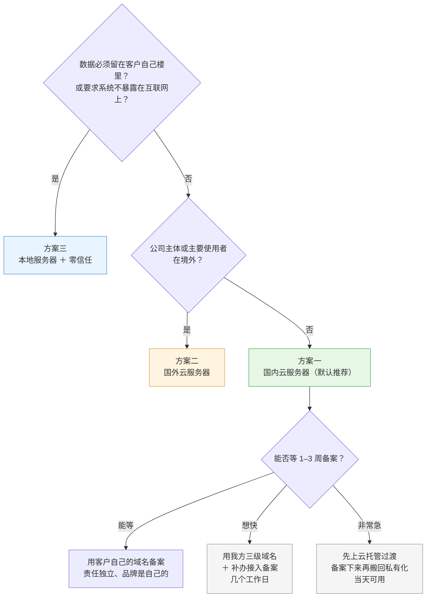
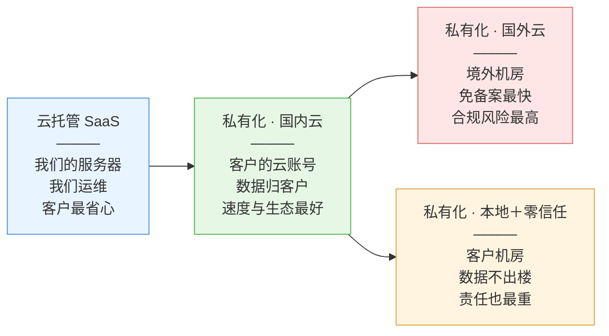

# 云园慧控交付与部署方案

**作者**：周茂森

**读者对象**：面向决策者——公司管理层、销售人员，以及正在选型的客户。**阅读本文不需要技术背景**，文中出现的专业术语均先以日常语言解释。技术人员如需实现细节，另见 [server/ARCHITECTURE.md](../server/ARCHITECTURE.md) 与 [权限模型设计.md](权限模型设计.md)。

**本文回答四个问题**：

1. 本软件有哪几种交付方式？
2. 客户付款之后至可登录使用，中间经历哪些环节？
3. 客户如需将系统部署于自有环境（私有化），有哪三种选择？各自的收益与代价是什么？应如何选择？
4. 同一客户拥有多套系统时，如何避免反复退出登录？

---

## 第零章　术语说明

后文反复出现的术语，此处先以日常语言解释。已熟悉者可跳过本章。

| 术语 | 释义 |
| --- | --- |
| **服务器** | 一台持续运行、不予关机的计算机，软件在其上运行，用户通过网络访问。它可以租用于云厂商机房，也可以是自行购置、放置于本园区的机器 |
| **云服务器** | 向阿里云、腾讯云一类厂商**按月租用**的服务器。机器位于厂商机房，故障由厂商负责维修，客户只需使用 |
| **本地服务器** | 由客户自行购置、放置于本园区机房的服务器。设备归客户所有，故障亦由客户自行处理 |
| **域名** | 网站的地址标识，例如 `yz.furong.org`。用户在浏览器中输入它方能访问系统 |
| **ICP 备案** | 国家规定：在中国大陆的服务器上对外提供网站服务，域名必须先向主管部门实名登记，登记通过后方可对外提供服务。可类比实体店须先办理营业执照并悬挂于店内。**此为法律要求，非技术问题，亦无从规避** |
| **容器** | 在服务器中划分出的独立空间。每个客户占用一个，各自的软件与数据互不相通。可类比同一栋楼中的不同套房——共用楼体，但各有独立门户 |
| **数据卷** | 存放某一客户全部数据之处，相当于该客户的整个档案柜。迁移时将档案柜整体移走即可 |
| **云托管 / SaaS** | 由我方提供服务器并负责运维，客户开通账号即可使用。可类比**租房拎包入住** |
| **私有化部署** | 系统部署于客户自有服务器，数据由客户自行掌管。可类比**自行购房** |
| **零信任网络** | 一种「先认设备、再认人」的接入方式：仅事先登记过的手机与计算机可连入系统，未登记的设备无法打开登录页面。可类比小区门禁——非业主无法进入大门，更无从访问具体某一户 |
| **实时订阅** | 本系统的技术特点：数据一经变更，各终端界面自动同步更新，无须刷新。其代价是需要一条**持续保持的网络通道**，因此网络质量的影响较普通网站更为显著 |

---

## 第一章　四种交付方式总览

本软件按「服务器归属、数据归属」分为四种交付方式。自上而下，客户的掌控程度递增，须承担的责任亦随之递增：

| 方式 | 服务器归属 | 使用域名 | 数据位置 | 运维方 | 类比 |
| --- | --- | --- | --- | --- | --- |
| **云托管（SaaS）** | 我方服务器，每客户一个独立容器 | 我方下发的子域名 | 我方机房 | 我方 | 租房，拎包入住 |
| **私有化 · 国内云** | 客户自行租用的国内云服务器 | 客户或我方的备案域名 | 客户自有云账号 | 双方约定 | 买商品房 |
| **私有化 · 国外云** | 客户自行租用的境外云服务器 | 免备案域名 | 境外机房 | 双方约定 | 境外购房 |
| **私有化 · 本地 + 零信任** | 客户园区机房内的机器，不接入公网 | 内部专用域名 | 完全位于客户场所 | 双方约定 | 自建自用，并设门禁 |

### 云托管采用「每客户一容器」的原因

软件本身具备多客户共用一套系统、以数据标记相互隔离的能力（此为既有设计）。但我方仍选择**每客户独占一个容器**，理由如下四点：

1. **单一客户故障不波及其他客户**——某客户的系统阻塞或需要重启时，其他客户不受影响；
2. **备份与迁移以客户为单位打包**——如需导出某客户的全部数据，将其档案柜整体复制即可，无须从混合存放的数据中逐条筛选；
3. **停服即停容器**——客户欠费或到期时，关闭其容器即可，数据予以保留，续费后即行恢复；
4. **日后转为私有化较为彻底**——客户如需将系统迁移至自有服务器，将档案柜整体迁移即可，账号、数据与历史记录一并保留。

概括而言：**以「物理隔离」实现隔离，较以「软件规则」实现隔离更不易发生事故**。

---

## 第二章　客户付款后的开通流程（云托管）

此为客户操作最简便的一种方式。全过程如下：

其中第②至第⑥步全部由系统自动完成，其间无须任何人工操作。逐步对照如下：

| 步骤 | 系统动作 | 客户所见 |
| --- | --- | --- |
| 1 | 客户在付款页填写手机号并支付 | 支付成功 |
| 2 | 系统收到支付成功通知，自动排入开通队列 | —— |
| 3 | 自动创建新容器并完成软件安装 | —— |
| 4 | 自动分配一个域名，例如 `k1024.yunyuan.example` | —— |
| 5 | 自动创建管理员账号：**账号即第 1 步填写的手机号**，同时生成随机初始密码 | —— |
| 6 | 短信发送「网址 + 账号 + 初始密码」 | **收到一条短信** |
| 7 | 客户打开网址（或在手机 App、小程序中填入网址），以手机号与初始密码登录 | 进入系统 |
| 8 | 系统要求先行修改密码，修改后方可正式使用 | 设置本人密码 |

整个过程**无须人工介入**，客户付款后数分钟内即可收到短信并开始使用。

### 三处有意为之的设计

**初始密码为何随机生成，而非采用「123456」一类统一默认密码？**
采用统一默认密码意味着：任何人只要获知某客户的网址与手机号，即可在该客户修改密码之前登入系统。而新客户自收到短信至首次登录，可能相隔一整日。因此各客户的初始密码互不相同、随机生成，且仅发送至本人手机。

**为何强制首次修改密码？**
初始密码经由短信传递，不宜长期沿用。首次登录必须予以修改，此为成本最低的安全措施。

**开通新客户为何无须人工配置域名？**
我方主域名已配置「泛解析」——即事先约定 `任意名称.我方主域名` 均自动指向我方服务器。因此为新客户分配 `k1024`、`k1025` 一类名称属自动完成，无须任何人修改配置或申请证书。

### 手机小程序的现状说明

目前系统采用**网页优先**方案（手机浏览器可正常使用，iOS 客户端已下线，小程序尚未开发）。日后如需开发微信小程序，有一项平台硬性规定须予知悉：

> 微信要求小程序能访问的网址**必须是已备案的域名**，而且**每个类别最多只能登记 20 个**。

我方客户将达数十至上百家，每家一个子域名，远超此 20 个名额。因此小程序如需开发，仅有两条路径：或令全部客户经由**同一统一入口域名**接入（由该入口按客户身份转发至各自容器），或**小程序仅服务云托管客户**。此项限制亦直接决定：国外云与本地部署两种方案无法支持小程序（详见后文）。

---

## 第三章　方案一：国内云服务器

### 3.1 方案形态

客户于阿里云、腾讯云一类国内厂商租用一台服务器（配置要求不高，2 核 4G 内存即可满足起步需要），由我方完成系统部署，通过一个域名对外访问。服务器租用于客户自有账号之下，发票开具予客户，数据亦归属客户名下。

**客户实际体验**：与云托管基本一致，均为打开网址即可使用。区别在于该机器归客户所有，费用由客户支付，数据的所有权与相应责任亦归客户。

### 3.2 优点

| 优点 | 对客户的意义 |
| --- | --- |
| **国内访问速度最快、最稳定** | 用户在国内，服务器亦在国内，链路无须迂回。本系统属「数据变更即时同步至界面」的实时系统，需要一条持续保持的网络通道，网络质量的影响较普通网站更易被感知。就此而言国内服务器为最优选择 |
| **配套服务价廉且齐备** | 短信发送、图片存储、自动备份、故障告警等能力，国内云厂商均有现成服务，接入即可使用，价格亦较低廉。以系统发送短信通知为例，国内短信的价格与到达率均明显优于国际短信 |
| **合规负担最轻** | 数据全程未出境，不涉及任何数据出境的法律手续。日后客户如需开展等级保护测评一类合规工作，云厂商可直接提供配合材料 |
| **三种私有化方案中唯一可支持小程序者** | 因域名可以备案，故有机会进入微信白名单（或经由统一入口）。其余两种方案不具备此条件 |
| **硬件故障无须客户处理** | 停电、硬盘损坏、机房事故均由云厂商负责。磁盘快照、异地备份等能力在控制台即可启用 |
| **资源不足时可随时扩容** | 园区数量与使用人数增长后，在控制台调高配置即可，无须重新购置机器 |

### 3.3 缺点

| 缺点 | 对客户的意义 |
| --- | --- |
| **ICP 备案需要等待** | 若使用客户自有域名，须以客户公司名义向主管部门登记，**通常需 1–3 周**，并须准备营业执照等材料。**备案通过之前，网站在法律上不得对外开放**——此为国内方案中唯一会延缓交付的环节。**该问题存在替代路径，见 §3.5** |
| **须持续支付租金** | 服务器按月或按年计费。使用年限较长时，累计支出将超过一次性购置机器 |
| **数据仍存放于云厂商机房** | 法律上数据归属客户，但机器在物理上不位于客户场所内。绝大多数客户并不在意此项区别，但确有客户对此有要求 |
| **断网即无法使用** | 园区外网中断时无法访问本系统（本地部署方案在此项上具备优势，见方案三） |
| **客户 IT 须能操作云控制台** | 至少应能登录云控制台并理解告警短信。客户若完全不配备 IT 人员，则须购买我方托管运维服务 |

### 3.4 适用对象

**此为国内客户的默认推荐方案**：公司位于国内、希望数据归属自身名下、具备基本 IT 条件。上线速度问题依下一节处理。

### 3.5 不愿等待备案时：使用我方域名

**此处需先说明一项常被忽略的事实**：ICP 备案以「主域名」为单位登记，**主域名一经备案通过，其下全部子域名即自动合规，无须再行单独备案**。

举例而言：我方将 `yunyuan.example.cn` 主域名备案完成后，即可向客户下发 `kehu.yunyuan.example.cn`（即所谓「三级域名」），客户**无须自行办理备案**。

此办法在两种场景下的成本差异较大：

| 场景 | 服务器归属 | 尚须办理事项 | 上线周期 |
| --- | --- | --- | --- |
| **云托管** | 我方服务器 | **无须办理任何手续**——我方备案本即登记于该机房 | **当日** |
| **私有化 · 国内云** | 客户自有云服务器 | 须以我方名义，在客户所用云厂商处办理一次「新增接入备案」 | **数个工作日**，明显快于重新备案 |

**私有化场景下「新增接入备案」这一步不可省略，此处最易疏漏**：

「域名备案」与「接入备案」是两件事。域名虽已在我方名下备案完成，但服务器移至客户的云厂商机房后，必须在该厂商处补充登记一次。若为图简便而直接将域名解析过去、略去此步，后果如下：该云厂商会定期自动巡检，一旦发现「本厂商机器上运行着未在本厂商登记的域名」，将按规定直接封禁网站访问。

**此种失效方式的棘手之处在于：上线当日一切正常，数周之后网站突然无法访问**，客户往往会认为是我方软件出现故障。因此此步骤必须执行。所幸主体备案已然存在，补办接入通常仅需数个工作日，远短于客户从零开始所需的 1–3 周。

**此项便利存在代价，必须向客户明确告知**：

- **我方作为备案主体，须对该域名上的内容承担责任**。客户若利用本系统从事违规活动，监管部门追责的对象为我方。因此合同中必须明确约定：客户对其经营内容负责，我方在收到监管通知时有权停止服务；
- 域名承载的是我方品牌，注重自身形象的客户会希望更换为自有域名；
- **此项选择并非不可逆**——客户日后自有域名备案通过，仅需修改解析即可切换，数据、账号与历史记录一概不受影响。因此完全可以采用「先以我方域名上线，自有域名后续补办」的方式。

### 3.6 三条上线路径的选择

| 路径 | 上线周期 | 备案主体 | 适用客户 |
| --- | --- | --- | --- |
| 客户使用自有域名并自行备案 | 1–3 周 | 客户 | 上线时间不紧迫，重视自有品牌与责任独立 |
| 使用我方三级域名并补办接入备案 | 数个工作日 | 我方 | 希望尽快投入使用，可接受域名承载我方品牌 |
| 先行部署云托管，备案通过后迁移至私有化 | 当日 | 我方 | 时间最为紧迫，且可接受数据暂存于我方机房一段时间 |

---

## 第四章　方案二：国外云服务器

### 4.1 方案形态

与国内云基本一致，区别仅在于服务器与域名均位于境外（常见为香港、新加坡、日本的机房）。

### 4.2 优点

| 优点 | 对客户的意义 |
| --- | --- |
| **无须备案，当日即可上线** | 境外服务器不受国内备案规定约束，域名购置后即可解析。三种方案中交付最快 |
| **主体位于境外的客户天然适用** | 客户的公司主体、园区或主要使用者若本即位于境外，就近选择机房可获得最佳访问速度 |
| **域名管理更为自由** | 新增子域名、更换域名均由客户自行决定，无须每次履行备案变更流程 |
| **部分地区机器价格更低** | 同等配置下，部分境外机型价格低于国内 |

### 4.3 缺点

| 缺点 | 对客户的意义 |
| --- | --- |
| **数据出境的法律风险（最为关键的一项）** | 系统中存储的员工档案、考勤记录、租户姓名与电话，**均属于「个人信息」**。中国境内公司将此类信息存放于境外服务器，依《个人信息保护法》《数据安全法》必须先行履行出境手续（安全评估、标准合同、认证，三者择一），否则构成违规。**为节省三周备案时间而承担此项风险，代价与收益不相称** |
| **国内访问不稳定，且无从保证** | 自国内访问境外服务器须经跨境线路，速度较慢尚在其次，更为不利的是**速率波动、不可预测**。本系统属长时保持连接的实时系统，线路一旦抖动即可能断开重连。选择香港、新加坡等距离较近的机房可有所缓解，但**任何一方均无法对跨境线路的稳定性作出承诺** |
| **完全无法支持小程序** | 境外域名不具备备案可能，无法进入微信白名单。客户端仅余网页与 App |
| **短信成本高且到达率不确定** | 国际短信单价为国内的数倍，能否送达尚取决于对方运营商。因此初始密码一类通知，建议同时以邮件发送一份 |
| **故障排查困难、响应较慢** | 跨境网络问题的排查本身即较为困难，加之存在时差，托管运维的响应时限须另行约定 |
| **国内配套服务无法直接使用** | 国内的支付、发票、实名认证等服务，在境外机房接入均须迂回处理 |

### 4.4 适用与不适用对象

**适用**：公司主体或主要用户位于境外的客户。

**不适用**：公司与园区均在国内、仅为规避备案的客户——**对此类客户我方不推荐本方案**。其所追求的交付速度，应以云托管或我方三级域名解决（见 §3.5、§3.6），而非以数据出境为代价。此项建议销售人员向客户明确说明：所节省者为三周时间，所换取者为一项长期存续的合规隐患。

---

## 第五章　方案三：本地服务器 + 零信任网络

### 5.1 方案形态

服务器放置于客户自有园区机房内（或由我方将预装完成的机器直接寄送），**该机器不向外网开放任何入口**。所有人员访问系统，均须先经由「零信任网络」接入：

**以小区门禁类比**：该服务器如同小区中的一栋楼，而整个小区的大门并不对外开放。欲进入者（手机、计算机）必须事先在门卫处登记（安装零信任客户端并加入网络）。未登记者无从获知小区所在位置——**外部人员即便扫描整个互联网，亦无法发现本系统的存在**。

技术选型上我方默认采用 Tailscale（我方自有服务器即以此方式运行，具备实际使用经验）；客户若要求「门卫系统」本身亦须由其自行掌控，则改用开源的 Headscale，用法一致。

### 5.2 优点

| 优点 | 对客户的意义 |
| --- | --- |
| **数据完全不离开客户场所** | 服务器位于客户自有机房，数据存放于客户自有硬盘。对于「数据必须由本方掌管」这一诉求，此为唯一彻底的解决方案 |
| **外网完全无法发现本系统** | 不同于普通网站在互联网上具有可被访问的公开地址。**未加入网络的设备无法打开登录页面**——此道防线位于任何密码策略之前，可阻挡绝大部分来自外部的攻击尝试 |
| **无须备案，亦无须购置公网域名** | 内部网络自带域名与证书，浏览器不会产生告警。交付无须等待备案 |
| **长期核算成本可能最低** | 一次性购置机器，此后无月租支出。园区数量较多、系统使用年限较长的客户，数年累计低于租用云服务器 |
| **园区内部访问几乎无延迟** | 在园区内使用时，数据经由内部网络传输，快于经由互联网 |
| **外网中断不影响园区内办公** | 园区宽带故障时，园区内部人员仍可正常使用系统（云方案此时则完全停止服务） |
| **人员离职后权限回收彻底** | 员工离职时，自网络中移除其设备，该员工即无从访问系统入口；再于系统内停用其账号，两重防线同时封闭 |

### 5.3 缺点

| 缺点 | 对客户的意义 |
| --- | --- |
| **硬件故障完全由客户承担责任** | 停电（必须配备后备电源）、硬盘损坏、机房浸水或失火，均无云厂商承担最终保障责任。此类事件概率不高，但一旦发生，恢复速度取决于客户自身备份工作的完备程度 |
| **每台手机与计算机均须先行「登记入网」（日常负担最重的一项）** | 新员工入职须增加一道手续：安装客户端、加入网络。**巡检人员尤其如此——其手机必须先行入网，方能扫描设备二维码填报巡检记录**。人员流动较大的园区，此项手续将持续产生工作量 |
| **无法支持小程序** | 内部域名不具备进入微信白名单的可能 |
| **短信通知可能无法发出** | 该服务器若完全不连接外网，系统即无法发送短信。此种情形下，初始密码改为交付时当面设置 |
| **升级存在滞后** | 完全隔离的客户只能采用「离线升级」：由我方打包新版本，经 U 盘导入。且系统升级必须逐版进行，不可自较早版本一步跳至最新版 |
| **我方远程支援受到限制** | 发生故障时，我方工程师亦须作为一台「登记设备」加入客户网络方能排查。控制权在客户一方——此既是安全性上的优点，亦意味着响应速度慢于云方案 |
| **故障恢复较慢** | 云服务器可自快照于数分钟内重建；本地机器发生硬件故障时，须等待备件并依靠备份恢复 |
| **前期须一次性投入** | 购置机器的费用为一次性预付 |

### 5.4 适用对象

具有明确的数据主权要求或行业合规约束、园区具备机房条件、且 IT 能力可承担硬件责任的客户。

**交付形式推荐采用「一体机」**：由我方将系统预装于一台小型服务器并直接寄送客户，客户接通电源与网线即可使用，从而将客户的技术门槛降至接近于零。客户若坚持使用其已有服务器，则要求其具备基本的 Linux 运维能力。

### 5.5 网络设计要点（面向客户 IT）

- 每个客户一个独立的专用网络，服务器和所有终端设备逐台加入；
- 仅允许「终端访问服务器」这一方向的流量，终端之间相互不可见；
- 员工离职：网络层移除设备并在系统内停用账号，两层均须执行；
- 备份：以本地存储每日快照为主，**强烈建议另行增加一份加密的异地备份**——机房失火、浸水一类事件确有发生可能。

---

## 第六章　三种方案横向对比与选择建议

### 6.1 对比总表

| 对比维度 | 国内云 | 国外云 | 本地 + 零信任 |
| --- | --- | --- | --- |
| **可用周期** | 使用自有域名须等待 1–3 周；**使用我方三级域名仅需数个工作日** | **最快，当日** | 中等（含购置机器与寄送） |
| **国内访问速度** | **最优** | 较差，且不稳定 | **最优**（园区内部） |
| **数据存放位置** | 客户的云账号 | 境外机房 | **客户自有场所内** |
| **法律合规风险** | 低 | **高**（国内客户数据出境） | **最低** |
| **暴露于互联网的入口** | 有（加密访问） | 有（加密访问） | **无** |
| **可否支持小程序** | 可以 | 不可 | 不可 |
| **扫码巡检** | 可直接使用 | 可直接使用 | 可用，但巡检人员手机须先行入网 |
| **短信通知** | 价廉且稳定 | 成本高且到达率不确定 | 外网中断时无法发送 |
| **硬件故障责任方** | 云厂商 | 云厂商 | **客户自行承担** |
| **付费方式** | 按月或按年持续支付 | 按月或按年持续支付 | **以一次性投入为主** |
| **升级时效** | 随我方发版同步 | 随我方发版同步 | 可能存在滞后 |
| **对客户 IT 的要求** | 中等 | 中等 + 时差 | **高** |

### 6.2 选择方法：决策图

### 6.3 决策图的文字说明

**第一问：客户是否要求数据必须存放于自有场所内，或要求系统不得暴露于互联网？**
结论：选择**方案三（本地 + 零信任）**。此为唯一满足该要求的方案，代价是客户须承担硬件责任、每台设备须入网。

**第二问：客户的公司主体或主要使用者是否位于境外？**
结论：选择**方案二（国外云）**。

**第三问：以上情形均不成立（此为绝大多数情况）？**
结论：选择**方案一（国内云）**，此为国内客户的默认答案。

**第四问：客户无法等待备案时如何处理？**
按紧迫程度依次选择：

1. **使用我方三级域名并补办接入备案**（数个工作日，数据仍存放于客户自有云环境）——推荐；
2. **先行部署云托管过渡，备案通过后再迁回私有化**（当日上线，数据先行存放于我方机房一段时间，此后整体迁出）。

**上述两条路径均显著优于「为求速度而将数据置于境外」**。销售人员遇到催促上线的客户时，应先行提供此两项选择，不宜直接推荐国外云方案。

---

### 6.4 四种交付方式的取舍关系

自左至右，客户的掌控程度递增，须自行承担的责任亦随之递增：

绿色标注者为最常推荐的两条路径（云托管、国内云）；红色标注的国外云方案，仅在客户主体本身位于境外时采用。

---

## 第七章　常见问题

**问：本方数据是否会被其他客户看到？**
不会。云托管为每客户分配一个独立容器，相当于各自独立的套房，数据互不相通。私有化方案下，数据本即存放于客户自有服务器。

**问：数据的归属如何界定？**
三种私有化方案中，数据均存放于客户自有服务器，归属与控制权皆属客户。云托管的数据存放于我方机房，但归属仍属客户，客户可随时导出全部数据并迁出。

**问：网络中断时能否继续使用？**
云托管与云服务器方案：不能，须联网访问。本地部署方案：园区内部人员可照常使用，仅园区外人员无法接入。

**问：服务器发生故障时数据是否会丢失？**
云方案有云厂商的快照与备份能力作为保障，恢复较快。本地方案则取决于备份策略——因此我方在交付清单中强制要求执行每日备份，并建议另行增加一份异地备份。**此项对本地部署客户尤为重要，销售人员务必予以说明。**

**问：日后如需更换方案，是否可行？**
可行。数据以整体打包方式迁移，账号与历史记录均不受影响。最常见的路径为「由云托管转为国内云私有化」，我方已将其固化为标准流程。

**问：员工离职后如何处理？**
在系统中停用其账号即可，该员工的历史记录（如已完成的巡检、审批）予以保留，不受影响。本地部署方案下另须自网络中移除其设备。

**问：能否在手机上使用？**
可以。目前经由手机浏览器访问，功能完整，包括扫描二维码执行设备巡检。微信小程序尚未开发，能否开发取决于所选方案（见 §2 末尾与 §6.1）。

**问：总体费用构成如何？**
分为三部分：软件费用（依合同约定）、服务器费用（云方案按月支付予云厂商；本地方案为一次性购置机器）、可选的托管运维费用。云方案前期支出较低而长期累积；本地方案前期支出较高而长期摊薄。具体金额按客户规模另行报价。

**问：备案的性质为何？可否不予办理？**
备案是国家对「在中国大陆服务器上开办网站」的实名登记要求，属法律规定，未予办理即不得对外提供服务。但客户未必须自行办理——可使用我方已完成备案的域名（见 §3.5）。

**问：发生问题时由何方负责？**
购买托管运维服务的客户由我方负责，我方对系统运行承担责任。自主运维的客户，服务器与网络问题由客户 IT 负责，软件问题由我方负责。此项责任边界将写入合同。

---

## 第八章　账号开通方式（各方案通用）

- **首个账号**为系统管理员，账号名即付款或签约时登记的**手机号**，权限为最高级别（园区老板，见 权限模型设计.md）；
- **初始密码随机生成**，经短信发送至本人（完全隔离的本地部署改为交付现场当面设置）；
- **首次登录强制修改密码**（待开发）：首次进入系统时将被要求先行修改初始密码，修改后方可正常使用；
- 其后的员工账号，由园区老板在系统中自行创建并分配权限，无须我方介入。

---

## 第九章　同一客户拥有多套系统的处理

### 9.1 问题

部分客户会同时拥有多套系统：例如两个园区各配置一台私有化服务器，或一套云托管与一套私有化并存。当前的做法是——每切换一套即须退出登录、重新输入网址并重新登录，操作繁琐。

### 9.2 设计方案：经由头像切换

为客户端增加一份「**服务器列表**」：每套系统记录一条（名称、网址、账号、登录凭据），保存于客户端本地。用法与常见即时通讯软件的多账号切换一致——**点击本人头像即可看到已关联的各套系统，点选其一即行切换**，通常无须重新输入密码。

### 9.3 各类客户端的实际差异

| 客户端 | 可否一次点击即完成切换 | 原因 |
| --- | --- | --- |
| **手机 App / 小程序** | **完全可以** | 单个 App 可同时保管多套系统的登录信息 |
| **网页版** | **无法即时切换** | 浏览器存在一项安全规则：A 网址的页面既无法读取亦无法存储 B 网址的登录信息。因此网页版只能实现为「**工作台目录**」——点击头像后显示各套系统的链接，点选后跳转至对应系统，跳转后依靠该系统自行保存的登录状态免密进入 |

### 9.4 分两步实施

1. **第一步（轻量，优先实施）**：客户端本地保存列表并支持经头像切换；网页版实现为跳转目录。**此步骤完全无须改动服务端**；
2. **第二步（远期规划）**：建设统一账号中心，各系统信任同一登录源，一次登录即可通行。此为大型工程（全部已部署系统均须改造），待客户规模确有需要时再行立项。

### 9.5 本地部署客户的特别说明

多园区客户往往每个机房配置一台服务器，属本功能的重度使用者。此处有两点提示：

1. 切换目标为内部网址，**设备必须已加入对应园区的网络**方能连通。因此列表中须标明每套系统所属网络，无法连通时应提示「请先接入 XX 园区网络」，而非笼统提示「连接失败」；
2. 同一时间通常仅能接入一个园区的网络（此为零信任客户端自身的限制），第一步不试图规避该限制，给出清晰的提示引导即可。

---

## 第十章　责任划分

本章内容须落实至合同：

- **私有化部署**：服务器费用、备案主体、数据备份由客户负责（购买托管运维服务的客户除外）；
- **版本升级**：自主运维的客户若长期不予升级，因跨越多个版本一次性升级而失败者，不在支持范围内——系统升级必须逐版进行；
- **时间口径**：系统内部全部时间（考勤归属日期、报表统计日期）按中国时区固定。境外客户若要求改为当地时区，属产品功能改造，须单独立项，不随部署方案一并提供；
- **方案迁移**：云托管转私有化是标准动作，数据整体搬走，不额外收数据迁移费（具体以合同为准）。
