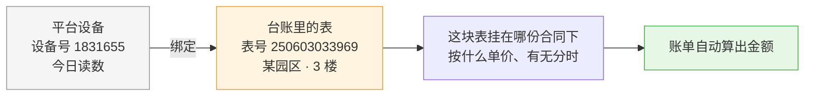

# 云园慧控智能水电表管理功能说明

**作者**：周茂森

**文档定位**：`docs/` 系统设计文档系列第七篇。本篇先讲**这个功能承担什么业务职责、数据流向哪些模块、以及「设备绑定」到底是什么**（第一至六章，不需要技术背景）；技术实现集中于第七章，面向工程师。全部结论出自仓库当前代码。台账侧的水电表见 [园区管理.md](园区管理.md) §3.5。

> **改名说明**：本模块原名「智能抄表」，所属侧边栏分组原名「数据采集」。现已分别更名为**智能水电表管理**与**设备管理**——水电表只是园区众多设备中的一类，摄像头与门禁设备已在同一分组下，见 [设备管理.md](设备管理.md)。**「抄表」一词在本文中保留为行业术语**（抄表日、抄表数、手工抄录），只有指代本模块本身时才换成新名字。
>
> 水电表台账仍留在 `utility_meter`，**没有并进 `device_asset`**：该表附有倍率、分时标志与账单引用，迁移表计即等同于变动账目。设备管理只在总览页把两张表并排数一次（[设备管理.md](设备管理.md) 第四章）。

---

## 第一章　本模块解决的问题

### 1.1 概述

园区里的水表电表都是智能表，每天自动把读数上传到厂商平台。本模块将这些读数取回并呈现，同时**建立平台设备与本系统台账中表计的对应关系**——对应关系建立后，每月编制水电费账单时读数自动填入，无须再派员抄表。

### 1.2 启用本模块之前

园区向租户收取水电费，计算方式如下：

```text
（本月读数 − 上月读数）× 倍率 × 单价 = 金额
```

在此之前的流程为：物业人员逐层人工抄录 → 返回办公室将数字录入账单 → 计算。**三个环节均可能出错**，且当月未必能够发现：

- 抄录错一位数字，账单即多收或少收；
- 漏抄某块表，该户当月即无账单；
- 上月读数须查阅上月记录，查错则整月用量随之出错。

水电费是园区**每月重复发生的固定收入项**，出错的成本按月累积。

### 1.3 启用之后

管理员仅需完成一次性的「设备绑定」（第三章），此后每月编制账单时点击一个按钮，本期与上期读数即自动填入明细行。如需了解某块表当日是否回传数据，打开本页即可查看。

---

## 第二章　使用对象与数据流向

### 2.1 数据链路


**该链路最关键的一环是「设备绑定」**——它是厂商平台与本系统之间唯一的连接。该环节未建立，右侧整条链路即无法启用，读数只能依靠人工。

### 2.2 三类使用者

| 使用者 | 使用时机 | 用途 |
| --- | --- | --- |
| **物业 / 园区经理** | 日常 | 查看当日未回传数据的表计数量（「回传覆盖」低于 100% 即表明存在离线或故障表计）；查询某租户的用量 |
| **财务 / 账单编制人员** | 每月结账 | 在账单页点「从智能水电表带入读数」，本期与上期读数自动填入水电明细 |
| **园区管理员** | 装表或换表后 | 将平台新增设备绑定至台账（第三章），属一次性操作 |

### 2.3 与其他模块的关系

| 模块 | 关系 |
| --- | --- |
| **园区管理**（水电表台账） | 台账里每块表是本系统的资产记录（属于哪个园区、装在哪一层、倍率多少）。绑定即为其补充「对应平台哪台设备」这一项 |
| **账单管理** | 最主要的下游。水电明细的读数来自这里；未建立绑定则无法自动带入 |
| **合同管理** | 单价来自合同（哪块表按什么价收、有没有分时电价）。**本模块只负责读数，不涉及单价** |
| **财务** | 账单确认后生成流水，间接受益 |

---

## 第三章　设备绑定：两套记录的对应

这是本模块最需要阐明的概念，也是页面底部「设备绑定台账」那张表在做的事。

### 3.1 两套记录的由来

系统里同时存在两份关于「表」的记录，来源完全不同：

| | 平台上的设备 | 本系统台账中的表 |
| --- | --- | --- |
| 来源 | 厂商（合众 / YMSINO）的系统 | 本系统录入（园区档案页） |
| 维护方 | 装表时由厂商登记 | 由园区管理员录入 |
| 记录内容 | 设备号、出厂号、倍率、厂商登记的安装位置 | 表号、所属园区、所在厂房与楼层、关联合同 |
| 是否知晓对方 | **否** | **否** |

平台仅知晓「1831655 号设备当日读数」，而不知该设备属于哪个园区的资产、应计入何人的账；本系统台账仅记录「3 楼东侧有一块电表」，而不知其对应平台上的哪一台设备。

### 3.2 绑定即建立对应关系



技术上，绑定仅是向台账记录写入一个字段：该表对应平台的设备号。**仅此一个字段，却是整条自动化链路的开关。**

### 3.3 未建立绑定的后果

不会报错，**但账单中该行始终为空**——每月编制账单须手工填写读数，与未启用本系统无异。

这是本模块最需提示的一点：**未建立绑定不会产生任何警告，只是不发生作用。**页面上「已绑定 3 / 5」徽章即为此设置——用以直观显示尚有多少台设备未接入。

### 3.4 设备绑定台账各列释义

设备绑定台账六列：

| 列 | 含义 | 注意 |
| --- | --- | --- |
| **供应商位置** | 厂商登记的安装位置（如「A栋 · 3楼 · 8303」）与厂商那边的园区名 | 此为**厂商登记的位置**，非本系统台账中的位置 |
| **设备号** | 平台内部编号（如 `1831655`） | **绑定实际使用的即为此项** |
| **出厂号** | 印在表壳上的编号（如 `250603033969`） | 人工抄表对账时识别的即为此项；台账表号默认取自此项 |
| **倍率** | 互感器倍率，读数乘以它才是实际用量 | 由平台带入，无须手工填写 |
| **台账绑定** | 已绑：显示绑到了哪块表（表号 + 园区 + 位置）；未绑：显示「未绑定」 | |
| **操作** | 「导入到园区」（未绑）/「解绑」（已绑） | 仅具备园区管理权限者可见 |

### 3.5 绑定操作

点「导入到园区」，表单里：

- **表号**：默认取出厂号，可修改——出厂号为印制在表壳上的编号，人工抄表对账时识别的即为此项；
- **园区**：必选。此项由填写者指定该表所属园区，并非取自平台；
- **安装位置**：厂房的某一层、宿舍的某一层，或园区公共区域；
- **倍率**：由平台带入，只读；
- **分时计量**：电表默认勾选（尖峰平谷四个时段分别计费）。

确认后台账中即新增一块表，且设备号已完成绑定。

> **须注意：园区与安装位置由填写者录入，系统不会将其与「供应商位置」比对。**厂商登记的位置未必准确（依施工时的信息录入），以本系统台账为准是恰当的——但这同时意味着**填写错误不会被拦截**：完全可能出现供应商位置记为「A栋3楼」、却绑定至另一园区公共区域的情形。装表验收时应当人工核对两列是否指向同一位置。

### 3.6 两套编号的区分

排查问题时最易混淆之处：

- **设备号**（`1831655`）：平台内部主键。**绑定与账单取数均以此项对齐**；
- **出厂号**（`250603033969`）：表壳上的编号。**页面显示、搜索与台账表号均使用此项**。

由此形成如下局面：页面上随处可见出厂号，但真正使读数进入账单的，是几乎不予显示的设备号。**排查「读数无法获取」时，首先应确认所核对的是哪一个编号。**

### 3.7 一台设备只能绑一块表

由服务端强制，且为**整个运营方范围内唯一，而非仅园区内唯一**。原因见代码注释：

> 设备号是供应商侧的身份，同一台设备绑两块表会让同一份读数被两块表各算一次，账单直接出双份。范围要覆盖整个租户，否则跨园区重绑照样漏过。

重复绑定将被拒绝，并提示该设备已绑定至哪块表。

### 3.8 解绑与换表

解绑仅清空设备号一项：**表记录、合同报价与历史账单均不受影响**，仅该表此后须手工抄录。

换表的正确操作为：旧设备解绑 → 新设备绑定至同一台账表。如此合同关系与历史记录均不中断。

### 3.9 绑定操作置于本页的原因

因**平台设备列表位于本页**，可直接点选。在园区档案页手工录入设备号则本末倒置——代码注释对此有明确说明：

> 录入错一位不会报错，只会导致读数始终无法获取。

因此园区档案页中的设备号为**只读**，未绑定时显示一个「去智能水电表管理绑定」的跳转链接。

---

## 第四章　页面使用说明

电表页与水表页结构完全一致，仅数据源不同。

### 4.1 上半部分：读数查看

- **四张统计卡**：设备档案（平台设备总数）、当日回传（当日回传条数）、**回传覆盖**（有读数的设备占比）、累计读数；
- **回传覆盖应每日查看**——低于 100% 即表明存在未回传数据的表计，可能离线或故障；若至月底编制账单时才发现，则为时已晚；
- **左侧建筑树**：园区 → 楼栋 → 楼层 → 设备，点选任一层级即按该层级筛选；搜索支持园区、楼栋、楼层、房号、出厂号、设备号六个字段；
- **右侧读数表**：电表十列（含尖、峰、平、谷四个时段），水表六列。空值显示为 `--` 而非 0——**厂商偶尔回传空串，若按 0 处理将导致账单少收**；
- **日期步进器**：仅可查看指定某一日（原因见 §5.1），不可选择未来日期。

### 4.2 下半部分：设备绑定台账

见第三章。

### 4.3 每月账单编制

不在本页操作。在账单页的水电明细中点击「从智能水电表带入读数」，系统将：

1. 按绑定关系找到每块表对应的设备；
2. 取**本期**与**上期**两个日期的读数（默认「上月同日 → 今天」，与月结账期一致）；
3. **仅填写两个日期均有读数的行**——缺任一即跳过，不作推测；
4. 数值异常（空串、`--`）按缺数据处理，**不填成 0**。

明细行带出后自动获取一次，失败不重试，可手动点击按钮重新获取——此为有意设计，「优于在后台反复请求对方接口」。

---

## 第五章　数据来源与限制

### 5.1 只有「日冻结」，没有实时读数

**日冻结**是抄表行业术语：设备每天在固定时刻自动锁存一份累计读数。三家平台都只提供按自然日查询，因此本模块的最小粒度为「日」，**不提供小时级曲线**。如需查看峰谷曲线或进行用能分析，须平台方先行支持。

### 5.2 读数不在本系统存储

读数**于每次打开页面时实时从平台获取，不写入本系统数据库**。

| | 好处 | 代价 |
| --- | --- | --- |
| 不落库 | 无须维护同步任务；页面始终呈现平台最新数据，不会出现本系统数据与平台不一致的情形 | **平台故障时无法查询任何历史数据**；亦无法基于历史读数进行趋势分析 |

本系统数据库仅存储**一项内容**：设备绑定关系（台账记录中的设备号字段）。

> 将来要做用能分析或月度趋势，必须引入读数落库表 + 定时拉取任务——此为独立工程，并非在本页增加一个按钮即可完成。

### 5.3 两家平台

| 平台 | 负责 | 说明 |
| --- | --- | --- |
| **合众** | 电表 | 生产环境在用。重试、缓存与超时保护完整 |
| **YMSINO** | 水表 | 沿用原系统接入，未做改造。**可靠性弱于合众**（无重试、无数据缓存） |

---

## 第六章　权限说明

- **看本页**：需要「电表管理」或「水表管理」菜单权限。侧边栏「设备管理 → 智能水电表管理」只有一个入口，具备电表权限者进入电表页，否则进入水表页；
- **绑定 / 解绑**：需要**园区管理权限**——绑定实质上是在修改园区资产台账。**可查看本页不等同于可执行绑定**，权限不足时操作列不予显示。

---

## 第七章　技术实现（面向工程师）

### 7.1 采用 HTTP 而非 SpacetimeDB 的原因

此为平台约束，而非设计选择。ARCHITECTURE.md §2.10：

> WASM 沙箱在平台层面无法承担以下职责：监听入站回调、维持长连接（门禁与**水电表设备的 MQTT** 等）、维护跨请求的限流状态；Procedure 只能同步发起出站请求并等待响应。这些是平台硬约束，无法以设计绕过。

因此由 Dioxus fullstack 进程（底层 Axum）承担。调用链：浏览器 → 本系统服务端接口（`/api/smart-meter/catalog`、`/readings`）→ 厂商 API。经服务端中转另解决三个问题：厂商密钥仅存于服务端环境变量，浏览器无法获取；YMSINO 为明文 HTTP，从 HTTPS 页面直连将被混合内容策略拦截；跨域限制亦一并规避。适配器模块整体由 `#[cfg(feature = "server")]` 门控，客户端目标下不参与编译。

### 7.2 代码结构

| 文件 | 职责 |
| --- | --- |
| `services/smart_meter/hezhong.rs` | 合众适配器（832 行），电表 |
| `services/smart_meter/provider.rs` | YMSINO 适配器（566 行），水表 |
| `services/smart_meter/server.rs` | 两个服务端接口，按表类型硬编码分发 |
| `services/smart_meter/types.rs` | 两家共同输出的统一数据结构 |
| `services/smart_meter/common.rs` | 登录凭证校验（结果缓存 60 秒）、日期格式校验 |
| `pages/smart_meter/*.rs` | 页面：总览、设备树、读数表、绑定、日期工具 |

**未做 trait 抽象**——两个适配器各自独立实现，依靠输出同一组结构体实现可替换。

### 7.3 可靠性（两家平台不对称）

| 措施 | 合众 | YMSINO |
| --- | --- | --- |
| 单请求 / 连接超时 | 15 秒 / 6 秒 | 15 秒 / 未设 |
| 整体操作超时 | 20 秒 | 无 |
| 失败重试 | 3 次（可配 1–5），指数退避 300ms 起、上限 5 秒 | 无 |
| 数据缓存 | 设备目录与读数各 300 秒，**上游故障时允许返回过期缓存作为回退** | 无 |
| Token 缓存 | 按平台返回有效期，剩余 ≤120 秒换新 | 固定 24 小时，剩余 ≤600 秒换新 |
| 鉴权失效自愈 | 401/403 自动换 Token 重发一次 | 同左 |

连接池特意缩短闲置存活并强制 HTTP/1.1——注释说明「合众网关偶尔会关闭闲置连接……更接近原 Axios 行为」，此项为迁移过程中发现并修正的问题。

**未实现主动限流**：依靠 300 秒缓存与「自动获取一次、失败不重试」控制请求量。厂商若提出频率要求，此处须补充。

**分页**：单次向厂商取满 1000 条，前端本地每页 20 条。设备数接近千台时须重新设计。

### 7.4 配置

密钥类配置使用 GitHub Secrets，其余使用 Variables，部署时写入 `/opt/yizu/.env`。合众需要接口地址、用户名、登录密钥、项目号、通信类型，外加超时/重试/缓存五个可调参数；YMSINO 需要接口地址、用户名、密码、机构号、平台号、超时。另需 `YIZU_SPACETIMEDB_SERVER_URL`——服务端接口将以调用者凭证反查有效性，防止未登录者直接调用接口。

### 7.5 日期工具

`pages/smart_meter/date.rs` 不依赖任何第三方日期库，用 Howard Hinnant 民用历算法。其中 `previous_month_same_day` 直接关系账单正确性，注释说明了不能以「减 30 天」替代的原因：

> 3 月 31 日减 30 天为 3 月 1 日，仍在本月之内，取得的读数属同一账期。

该模块此后被全仓库作为通用日期工具复用（合同、人事、财务、账单、报销都在用）。

---

## 第八章　已知边界与待办

1. **绑定的位置不校验**：台账里填的园区与安装位置，系统不与「供应商位置」比对。厂商登记的位置未必准确，以本系统台账为准是恰当的，但填写错误不会被拦截——装表验收时应当人工核对两列是否指向同一位置；
2. **未建立绑定不会有任何提示**：仅表现为账单该行始终为空。须依靠页面「已绑定 N / M」自行核查；
3. **读数不落库**：平台故障时无法查询历史，亦无法进行趋势分析。如需实现，须引入落库表与定时拉取任务；
4. **两套编号并存**：以设备号绑定、以出厂号显示，排查时须先确认所核对的是哪一个；
5. **YMSINO 侧可靠性较弱**：无重试、无数据缓存、无整体超时。水表用量较小，问题尚未显现，但此项不对称为已知事实；
6. **YMSINO 电表分支已死**：电表早已全量切给合众，但 `provider.rs` 里的电表路径与 `YIZU_YMSINO_ELECTRIC_PROTOCOL` 配置仍在，属待清理的死代码，勿据以推断电表链路；
7. **一处配置漂移**：部署流水线下发了代码中不存在的 `YIZU_YMSINO_LOGIN_TIMEOUT_SECONDS`，却未下发代码真正读取的水表协议名变量（导致回落到默认值「未确认」）。
