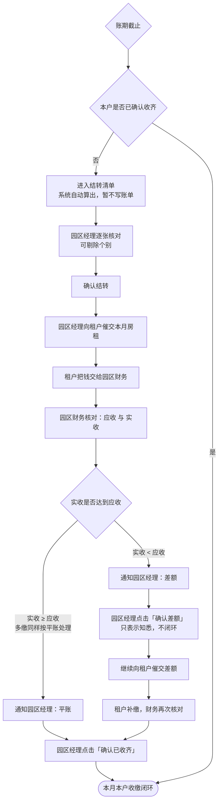
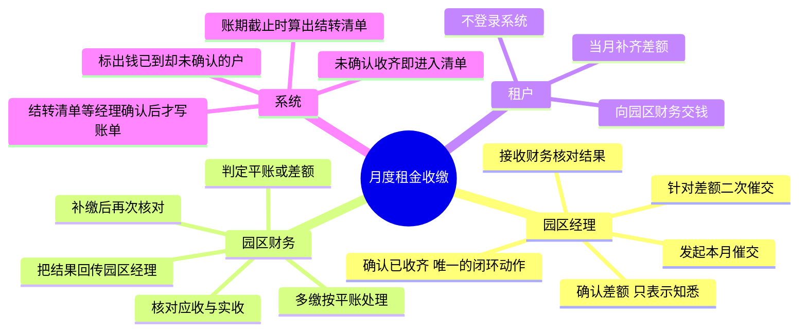

# 云园慧控租金收缴与对账确认流程

**作者**：周茂森

**文档定位**：`docs/` 系统设计文档系列第十篇。§5.3 四步**均已实现**，§2.7 的循环已闭合。本篇只描述一件事：一笔月度房租从园区经理开口催交，到「这个月这一户到底收清没有」被明确认定，中间经过谁、卡在哪、什么时候算结束。账单数据结构见 [园区管理.md](园区管理.md)，催缴的自动化设想见 [AI经营参谋技术方案.md](AI经营参谋技术方案.md) 第一阶段。

---

## 第一章　三个角色与一个待解决的问题

### 1.1 参与者

| 角色 | 在系统里的身份 | 在本流程里干什么 |
| --- | --- | --- |
| **园区经理** | 运营方员工，持有账号 | 发起催交、接收核对结果、做出确认动作 |
| **园区财务** | 运营方员工，持有账号 | 核对应收与实收、判定平账或差额、把结果回传经理 |
| **租户** | **数据行，不登录系统** | 交钱；补不齐时与园区经理协商 |

租户不是系统用户，这一点决定了流程的形状：**所有状态推进都由运营方两个岗位在系统里完成**，租户那一端发生的事（交钱、协商）只以运营方录入的形式进入系统。这与 [权限模型设计.md](权限模型设计.md) 的前提一致。

### 1.2 为什么需要「确认」这个动作

财务算出差额、把结果发给经理，这件事本身不产生任何责任转移——经理可能没看见、看见了没处理、处理了没人知道。**「确认」是把一次通知变成一条有人、有时间的记录**：

- 确认**平账**表示：这一户这个月我知道已经收清了，不用再管；
- 确认**差额**表示：我知道还差钱，**这不代表问题解决了**，它只把责任从财务侧转到经理侧，并开启第二轮催交。

这两个确认语义完全不同，界面上必须是两个不同的按钮文案，不能共用一个「知道了」。

---

## 第二章　主流程图

### 2.1 只有一种确认能闭环

**「确认已收齐」是唯一的闭环动作。**「确认差额」只表示知悉，不结束流程——确认完紧接着是第二轮催交，不是收尾。这是本流程与普通「已读回执」的区别。

### 2.2 默认值是「没收齐」，但结转要人点头

账期截止时，凡是没有「已收齐确认」的户，**系统自动把它算进结转清单**。

默认值定成「没收齐」，理由是：

> **人会记得录入好消息，不会记得录入坏消息。**

若「该户未收齐」须由人主动录入一条记录，则事务繁忙时无人录入，月末查看时全为空白——无从分辨是确已收齐还是无人处理。将默认状态设为「未收齐」之后，**沉默本身即构成一条准确的记录**。

正因如此，原先图里那条「协商 → 顺延」的支线删掉了：协商是线下的事，系统只看有没有确认。

**但清单算出来之后不直接写进下月账单，要园区经理过一遍。**这一步不是多余的仪式，见 §2.3。

### 2.3 为什么结转不能全自动

全自动的版本是：账期一到，没确认的直接结转成下月欠款，不需要任何人操作。它有一个致命的失败模式：

**若经理从未执行过确认——或因遗忘，或因不知有此功能，或因嫌其繁琐——则账期一到，自动结转将如实地把整个园区的账目全部转为欠款，其中包括款项早已收齐者。**

且此类错误**难以被发现**：虚假欠款与真实欠款混杂，须待次月催收时由租户当面指出，再逐张查出并更正。

**自动化不会判断习惯有没有养成，它只会放大现状。**

所以结转清单由系统算、由经理确认后才写入。两种失败模式对比：

| | 全自动 | 结转待确认 |
| --- | --- | --- |
| 无人操作时 | **无端产生大量虚假欠款** | **结转不予发生** |
| 出错后果 | 与真实欠款混杂，事后须逐张查核 | 清单仍然保留，随时可以处理 |
| 能否发现 | 困难 | 「待确认」状态显著可见 |

**错要错在「没做事」那一侧，不能错在「做错事」那一侧。**

成本也降了一个量级：全自动方案下经理要逐张确认 N 次，现在是**每个账期看一屏、点一次**。

### 2.4 这个改动的代价，以及怎么补

结转须经人工确认，即削弱了「沉默 = 未收齐」的效力：**若无人执行批次确认，欠款便不计入次月账单——款项实际仍未收讫，系统却未如此记录。**

三条缓解：

1. **待确认批次不消失、不过期**，一直挂着；
2. **多个账期未确认时按账期堆叠**，并显眼报数：「已有 3 个账期的结转未确认」。这本身就是运营出问题的强信号，而且保住了 §2.6 要的「转了几圈」；
3. **信息没丢，只是暂存**——未确认的批次本身就是一份「我们认为这些没收齐」的记录，只是还没并进账单。

另外，**实收已经 ≥ 应收、却迟迟没有收齐确认的户要单独标出来**。系统知道实收金额，这个矛盾它看得见；不标出来，这类账单会被算进结转清单，等着经理在核对时才发现。

### 2.5 结转确认页相对全自动方案的增益

逐张核对时可以**把某张从本次结转里拿掉**，而且分成两个动作：

| 动作 | 含义 | 后果 |
| --- | --- | --- |
| **剔除并确认收齐** | 用于「此单实已收讫，财务遗漏录入」的情形 | 补充一条收齐确认，账单闭环，此后不再出现 |
| **本次不结转** | 「这张我再查查」 | 只是本期挂起，下期结转清单里还会出现 |

**两个动作不能合并**：经理只是想「先别结转，待查」时，系统不该替他记下一条并不成立的「已收齐」快照——那条快照将来是要拿去对账的。

全自动方案给不了这个修正通道，只能事后补锅。

### 2.6 多缴归入平账

判定条件是「实收 ≥ 应收」，不是「实收 = 应收」。多交的钱在业务上是预付，不构成需要经理处理的异常，所以不单开一条分支。

### 2.7 结转是一个真正的循环

确认结转后，差额并入下一个账期，下个月的催交金额里包含上月欠款。一户可以连续多月停留在这条线上，**因此系统必须能看出某一户已经在这个环里转了几圈**，否则长期欠费会被逐月的记录掩盖过去。§2.4 的按账期堆叠正是为此。

---

## 第三章　角色职责思维导图

---

## 第四章　状态与动作清单

把流程图折算成系统状态，一笔账期在一户身上只可能处于下列之一：

| 状态 | 进入条件 | 谁能推进 | 下一步 |
| --- | --- | --- | --- |
| **待催交** | 账期开始 | 园区经理 | 发起催交 |
| **已催交，待收款** | 经理发起催交 | 园区财务 | 收款并核对 |
| **待确认收齐** | 实收 ≥ 应收 | 园区经理 | 确认后闭环 |
| **待确认差额** | 实收 < 应收 | 园区经理 | 确认后进入二次催交 |
| **差额催交中** | 经理已确认差额 | 园区经理、园区财务 | 补齐后回到「待确认收齐」 |
| **已闭环** | 经理点了「确认已收齐」 | 无 | 终态 |
| **待结转确认** | **账期截止时仍未确认收齐** | 系统自动算入清单 | 经理确认后并入下一账期 |
| **已结转** | 经理确认了本期结转 | 无 | 差额进入下一账期的应收 |

**「待结转确认」是唯一由系统自己写入的状态**，其余每一个都要有人推动。但它**只是把账单算进清单，不改动任何金额**——真正的结转要等经理确认（§2.3）。

结转确认的权限与单张确认一致，都是**园区管理权限**：谁管这个园区，谁对这个园区的账负责到底。

「确认收齐」与「确认差额」是同一类动作、两种语义，落库时都要记录**账期、租户、确认人、确认时间、确认时的差额金额**。

最后一项尤其要紧：**确认差额时的金额必须快照下来**。否则后续补缴改变了实收，就再也说不清经理当初确认的是哪个数——这与账单已有的「自带算式」原则一致（见 `AmountBill` 中容量与单价的快照字段）。

### 4.1 需要单独盯的一种状态

**实收已经 ≥ 应收、却停在「待确认收齐」迟迟不动的户**，不是一个正常状态：钱到了、系统也知道，只差一次点击。

此项不应与普通待办事项混列，须单独呈现（§2.4）。否则它将被计入结转清单，直至经理逐张核对时方被发现——而核对属账期末的批量动作，届时才发现意味着该月内无人知晓此笔款项已然到账。

---

## 第五章　与当前系统的差距

### 5.1 已经实现的

**确认动作与状态机**（`server/spacetimedb/src/reducers/finance/billing/reconciliation.rs`）。状态机按「清单加解释器」实现：状态判定清单 `STATE_RULES` 自上而下第一条命中即当前状态（顺序即优先级——收齐确认压过一切，实收达标压过差额确认）；动作清单 `ACTION_RULES` 声明每个动作允许的状态。加状态或动作只改清单，解释器不动；拒绝文案集中在一个穷举 `match` 里，漏写会被编译器拦下。

- 确认记录只增不删（`bill_collection_confirmation`），应收与实收都是确认时刻的快照；
- 状态不落库，由「账单金额 + 确认记录」现场推导——存下来反而要维护一份会漂移的副本；
- 权限是**园区管理**而不是账单管理：财务录实收、经理认结果；
- 已有确认记录的账单不能删除——它是对账凭据；
- 金额没有变化的重复差额确认被拦下；
- 前端账单页有一份同构镜像用于徽章与按钮判定，两边测试互相咬合，服务端为权威。

**「钱到了却没确认」的提醒**（§2.4、§4.1）：账单页的对账状态列把「待确认收齐」标为危险色，表格上方按页汇总提醒；确认动作经订阅实时回推，点完即变。

**账期结转**（`reducers/finance/billing/carryover.rs`，页面 `/bill/carryover`）：

- `carryover_batch` + `carryover_item` 两张表。批次一个园区一期，同一园区同时只允许一个待确认批次——否则同一张账单进两个批次，确认时重复结转；
- 结算只登记不改金额，已结转过的账单不会重复算入；
- 三种处置（结转 / 本次不结转 / 剔除并确认收齐）按 §2.5 分开，确认时 `collected` 的补一条收齐确认，`skip` 的从批次里删掉、下期重新算入；
- **补收齐确认时取账单此刻的实际金额，不取清单快照**：经理之所以剔除，往往正是因为财务在中间把实收补录进去了，拿旧快照落确认等于记下一个当事人从没看到过的数；
- 单批上限 200 张：清单长至数百张时，逐张核对已名存实亡，其后果较全自动更为不利——因其额外形成了一层「已经过人工查看」的表象；
- 页面按账期堆叠，多期未确认时显眼报数（§2.4）。

**结算的触发**故意留给调用方：第一版由经理在页面上点「结算本期」，将来挂定时任务也是调同一个 Reducer。账单表里没有账期字段，「账期截止」这个时点只能外部给。

### 5.1.1 依托的既有字段

`AmountBill`（`server/spacetimedb/src/tables/finance/billing/amount.rs`）里已经有本流程需要的全部金额口径：

| 字段 | 含义 | 在本流程中的作用 |
| --- | --- | --- |
| `total_fee_cents` | 应收合计 | 判定基准 |
| `receipt_amount_cents` | 实收金额 | 判定依据 |
| `receipt_time` | 收款时间 | 判断是否当月补齐 |

**差额可以直接由 `total_fee_cents − receipt_amount_cents` 得到，不需要新增金额字段。**

### 5.2 尚未实现的

| 缺口 | 说明 |
| --- | --- |
| **账期截止自动触发** | 现在由经理手动点「结算本期」。要自动跑得先定义账期截止时点（账单表里没有账期字段），这是一项配置设计，不是接个定时器的事 |
| **催交事件的可见性** | 服务端已留痕：`amount_bill_collection_sms_log` 记录每次催缴短信（账单、类型、手机号、剩余金额、成败、发送时刻），`my_collection_sms_logs` 亦已开放订阅。缺的是**前端无任何页面展示这批记录**，因此对使用者而言第一个节点仍不可见。另需注意：电话与当面催交本就不经系统，无从留痕 |
| **实收的来源** | `receipt_amount_cents` 由财务在账单表单里手工填写（`src/pages/billing/form.rs`），不是收款流水自动回填，所以「核对」这一步现在完全依赖人 |
| **加列之前产生的结转项缺租户快照** | `carryover_item.tenant_id` 与 `source_project_name` 是随第四步一并追加的列，在此之前结算出的结转项一律取到默认值 `0` / `None`。而选择器按租户筛选，`tenant_id = 0` 的行不会出现在任何账单的「上期结转」里——**结转确认了，却并不进任何下期账单**。项目名有兜底（显示为「账单 #N」），租户没有。此类行须经 Reducer 一次性回填；`spacetime sql` 的 `UPDATE` 写不了 `Option` 列，回填脚本走不通。通则见 [ARCHITECTURE.md](../server/ARCHITECTURE.md) §1.13 |
| **循环次数可见性** | §2.7 提到的「转了几圈」无法统计。原因在结算的取数规则：`carryover_candidates` 排除掉**已进入过任何批次**的账单，故同一张账单至多进入一个批次，计数无从累加。第四步已接上，圈数现在可沿 `consumed_by_bill_id` 这条链回溯（甲账单的结转被乙账单消费、乙又被丙消费），但**尚无任何页面展示这条链** |

### 5.3 落地时的顺序建议

按依赖关系，缺口不宜同时补。

**第一步补确认动作。**它不改动任何已有字段，按 [server/ARCHITECTURE.md](../server/ARCHITECTURE.md) §2.6.1 的表尾追加加默认值即可安全上线，而且单独就能兑现本流程最核心的价值：让「这个月这一户收清没有」有一个明确的、有人负责的答案。

**第二步补「钱到了却没确认」的提醒。**它只是一个筛选条件（实收 ≥ 应收 且 未确认），不需要新表，却能立刻挡住 §2.4 说的那类假欠款。

**第三步是账期结算与结转确认。**已完成。

此步骤原本要求「待确认动作经历一个完整账期，证实经理确会执行」方可实施——因为全自动结转一旦建立在尚未养成的操作习惯之上，将使整个园区的账目转为虚假欠款。**改为结转待确认之后，该前置条件即行消失**：无人确认则结转不发生，最坏结果为账目未予结转，而非无端产生大量欠款。

> 前置条件之所以能去掉，不是因为习惯养成了，而是因为**失败模式被换到了安全的一侧**。这比等一个月更可靠——等来的证据只能说明「上个月有人点」，换不来「以后一直有人点」。

**第四步是把结转额并入下期账单**，也就是把 §2.7 那个循环真正闭上。已完成。

账单表新增 `carryover_fee_cents` 与 `carryover_item` 两列，与滞纳金、电损同属并列费用项——**单独成项，不并进租金**：账单是给租户看的凭据，本期新发生多少、上期欠了多少必须分得开，并进租金之后租户只看到一个变大的数字，催缴时说不清。

`AmountBillInput` 随之增加 `consumed_carryover_item_ids`。**参数加在账单入参里而非另起一个 Reducer，是这一步唯一的技术要点**：如此「账单落库」与「结转项标记已消费」处在同一个事务，账单存成功而标记失败这种中间态不存在——分两次调用时，第二次失败会让同一笔差额下期被再结转一次，越滚越大。

守住的不变式只有一条：**账单填写的结转额，必须等于所勾选结转项的差额之和**（`check_carryover_consumption`）。账单上写着结转 ¥2000、却勾了合计 ¥3000 的项，差出来的 ¥1000 会随结转项一起被标记为已消费，从此不出现在任何清单里，也没有任何账单在收它——**钱不会报错，只会不见**。

三条配套规则：

- **准入**（`take_consumable_items`）：批次已确认、处置为结转、未被其他账单占用、来源账单属同一租户。编辑既有账单时，已被它自己占用的项算合法，否则改一次账单就会把自己并入的结转弄丢；
- **释放**：账单删除时把它消费的结转项置回未消费（`release_consumption`）。不释放的话那笔差额永久消失——账单没了，结转项却还标着「已并入」；编辑时取消勾选同理，由 `settle_consumption` 一并处理；
- **钳位**：结转额取自 `carryover_amount_cents`，带 `.max(0)`。多缴的账单同样可能进清单（实收超应收时状态是「待确认收齐」，并非已闭环），裸减法会得到负数，把别的结转项冲掉一块。

前端在账单表单里列出该租户可并入的结转，按账期升序——先欠的先还，与催缴时的说法一致。勾选额计入「本月收费金额」，不计的话对账时应收少了这一块，上期欠的钱永远收不齐。
