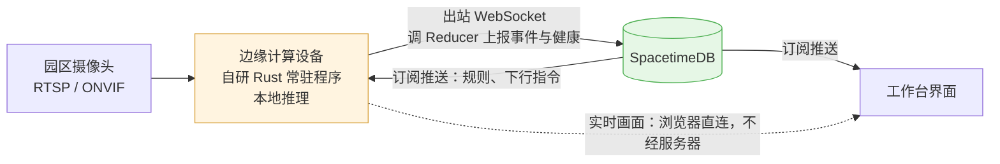

# 云园慧控边缘计算设备与摄像头接入方案

**作者**：周茂森

**文档定位**：`docs/` 系统设计文档系列第十二篇。本篇回答摄像头怎么接进系统：**在客户园区现有的一台 Windows 电脑上装一个我们自研的常驻程序**，由它主动连上我们的服务器。第一至二章讲为什么是这个形状（不需要技术背景），第三章起是身份、状态与事件的设计，第九章是实施进度。台账侧见 [设备管理.md](设备管理.md)，平台约束见 [server/ARCHITECTURE.md](../server/ARCHITECTURE.md) §2.10。

**服务端已实现，边缘设备侧的程序尚未开始**（见第九章）。

已确定的四条前提：

1. **没有专用硬件**——就是客户园区里那台普通 Windows 电脑，装上程序它就是边缘计算设备。我们不采购、不寄送、不返修任何硬件；
2. **程序自研**，Rust 常驻程序，作为 Windows 服务运行；
3. **视频流不经过我们的服务器**；
4. **AI 识别在这台电脑上完成，只回传结构化事件**。

文中「边缘设备」一律指**那台装了我们程序的客户电脑**，不是任何一件我们提供的硬件。

---

## 第一章　为什么是边缘部署，不是调厂商云平台

水电表走的是「我们的服务器去调厂商云平台接口」（合众、YMSINO）。摄像头**不能照搬**这个形状，三个理由。

### 1.1 方向反了就走不通

园区网络基本都在 NAT 和防火墙后面。要让公网上的服务器主动连进园区里的摄像头，只有两条路：客户拉固定 IP、做端口映射，或者上 VPN。

**这两条在交付上都是灾难**——每接一个园区就要和对方的网管扯一次，而园区的网管往往就是物业电工。

边缘设备往外拨号没有这个问题：出站 443 是任何网络都放行的。**客户的网络不需要做任何改造。**

### 1.2 它解决了「在线率」

[设备管理.md](设备管理.md) §5.2 中的那项妥协——总览页只能显示「接入率」而非「在线率」，因无法获取实时状态——其根源在于缺少状态来源。

边缘设备有心跳，在线状态就是心跳的副产品，**不再取决于某个厂商云平台肯不肯开接口**。这一项落地后，总览那一列就能换成真正的在线率。

### 1.3 它和「服务器不承担 AI」这条硬约束一致

[AI经营参谋技术方案.md](AI经营参谋技术方案.md) 开篇立的约束是：我方服务器最多放一个向量数据库，不承担任何 AI 计算。

识别放在边缘设备上做，正好落在这条线的正确一侧，而且比「视频传到云上再分析」多两个好处：

- **视频根本不出园区**。隐私上好交代得多——租客的画面留在租客自己的厂区里；
- **带宽成本几乎为零**。一路 1080P 摄像头常态码流 2–4 Mbps，一个园区几十路就是百兆级的持续上行。传事件只有几百字节一条。

---

## 第二章　链路与落点：边缘设备就是一个 SpacetimeDB 客户端

### 2.1 不需要自建网关

第一版方案设想的是「边缘设备 → WebSocket → 我们的 Axum → Reducer」，理由是 `ARCHITECTURE.md` §2.10 说 WASM 沙箱不能维持长连接。

但那条约束说的是**模块自己不能主动向外维持连接**，而非「外部程序不能接入」——客户端经 WebSocket 连接 SpacetimeDB 本即该平台的标准形态，浏览器一向如此。而**边缘设备是我方自研的 Rust 程序，完全可以直接以 `spacetimedb-sdk` 作为客户端**。

§2.10 点名的「门禁与水电表设备的 MQTT」之所以需要网关，是因为那些是**别人的**设备，只会说自己的协议。我们自己写的边缘设备不受这个限制。

这一步省掉的不只是一层转发：

| | 经 Axum 网关 | 边缘设备直连 |
| --- | --- | --- |
| 在线状态 | 自己设计心跳 + 超时判定 + 内存状态 | **连接生死即状态**，平台自带 |
| 下行指令 | 自己设计协议与重发 | **订阅**，插一行边缘设备就看到 |
| 规则下发 | 同上 | 同上 |
| 身份与权限 | 另造一套边缘设备令牌 | 复用 Identity 与 `ctx.sender()` |
| `main.rs` | 要从 `dioxus::launch` 改成 `dioxus::serve` 并自挂 router | **不动** |
| 部署组件 | 两个 | 两个 |

**授权依据仍然是 `ctx.sender()`**，不违反 §1.7 那条「不允许任何例外」——注册码只是一次性的绑定凭据，与用户首次登录换取身份绑定是同一个道理，绑定之后就再也不参与授权判断。

### 2.2 唯一还需要 HTTP 的地方：快照图

事件里的快照图是二进制，不该塞进 Reducer 参数。

这一块走现有的 R2 通道，但**不能把 R2 密钥放到客户的电脑上**。做法是由边缘设备向我方申请一个短时效的预签名上传地址，再直接 PUT 至 R2——此为一个极小的 HTTP 端点，而非一整套网关。

**第一版事件先不带图**，把这一项放到第二阶段，先让整条链路跑起来。

### 2.3 远程看画面：信令走我们，媒体不走

「视频不经过我们的服务器」有个必须回答的追问：**老板不在园区的时候怎么看画面？**

园区内网里前端直连边缘设备当然没问题，但老板多半在外地，而边缘设备在 NAT 后面——这正是第一章说「反方向走不通」的同一堵墙。

标准解法是 WebRTC，并且把它拆成两件事：

| | 走哪 | 量级 |
| --- | --- | --- |
| **信令**（协商谁连谁、编解码参数） | 经数据库中转（插一行，对方订阅到） | 几 KB，一次 |
| **媒体**（画面本身） | 浏览器 ↔ 边缘设备直连（P2P 打洞） | 几 Mbps，持续 |

这样「媒体不经过我们的服务器」这条仍然成立，同时外网也能看。**信令连独立通道都不需要**——边缘设备和浏览器都已经连着同一个数据库，插一行对方就收到。

**要如实交代的一点**：P2P 打洞不是百分之百成功，双方网络都是对称 NAT 时会打不通，行业经验大致有一到两成。这时要么退回「只能内网看」，要么架 TURN 中继——**而中继就是我们出带宽**，等于把第 1.3 节省下来的成本又拿回一部分。

建议第一版**只做打洞、不架 TURN**，打不通就明确提示「当前网络环境下只能在园区内查看」。等真实失败率量出来了再决定要不要投中继，而不是先按最坏情况建设施。

---

## 第三章　边缘设备的身份：它不是人

边缘设备要有身份才能上报，但**它不该走 `CenterUser` 那套**。用户身份链条（[server/ARCHITECTURE.md](../server/ARCHITECTURE.md) §1.7）承载的是角色、权限码、园区授权——这些对一台机器毫无意义，强行套用只会产生一批「机器账号」，日后清理权限时无人能够判定哪些可以删除。

### 3.1 一张独立的边缘设备表

新增 `edge_gateway`：一行一台边缘设备，属于一个园区，带自己的密钥与状态。它与 `CenterUser` 没有任何关系。

### 3.2 注册码换身份绑定，不预置长期凭据

**程序里不能烧长期凭据**——装机的人能把它读出来，一台边缘设备的凭据泄露等于整个园区的数据通道被人接管。

流程是：

1. 后台建档时生成一个**一次性注册码**，24 小时有效。字符集去掉了 `0/O`、`1/I/L` 这些手输容易认错的字符——这个码要由装机人员看着屏幕在另一台机器上敲，认错一个字符就是一次白跑；
2. 边缘设备首次上电，以匿名身份连上数据库，调 `activate_edge_gateway(注册码)`；
3. Reducer 把 `ctx.sender()` 写进 `edge_gateway_identity`，注册码当场作废。**此后这台机器的 Identity 就是它的长期身份**；
4. 后台可以随时重发注册码或注销边缘设备——两个动作都会**同时解绑旧身份**。

**长期凭据在我方完全不予存储**：它是 SpacetimeDB 的 Identity 私钥，由边缘设备本地持有，我方仅存储一条绑定关系。未予存储者即无泄露之可能，较「存储哈希」更为彻底。

注册码则是明文存的，这是有意的：它短、一次性、有有效期，作用只是让人手输一次。

> **重发注册码必须同时解绑**，若仅下发新码而不解除原绑定，原机器仍持有效身份，依然可以写入数据库。在「计算机归客户所有」这一前提下，此非理论风险。

---

## 第四章　在线状态：连接生死就是状态

边缘设备直连数据库之后，**这一章原本那套心跳设计整个消失了**。

### 4.1 原来要解决什么问题

经网关的方案里，在线状态得靠心跳维护，而心跳直接落库会出事：一个园区一台边缘设备、30 秒一次，一天 2880 次写入，十个园区 28800 次。写入量本身不是问题，**问题在订阅**——每次写库都会推给所有客户端、跑一遍刷新、界面重渲染。结果是所有打开设备页的人，界面每 30 秒抖一下，而这期间根本没有任何事情发生。

要绕开它，就得把「精确心跳」放内存、「在线与否」放库、再写一个超时判定的后台任务，还要接受进程重启丢状态。

### 4.2 直连之后不需要绕

`client_connected` 与 `client_disconnected` 两个生命周期钩子由平台在**连接真正建立和真正断开时**各触发一次。这正是「状态翻转」本身，不是对它的推断。

所以实现只有一件事：钩子里查一下这个 Identity 是不是某台设备，是就把 `is_online` 翻过来。

- **写入次数 = 真实的上下线次数**，一天几次，不是几万次；
- **没有超时窗口**，断线即刻可知，不用等 90 秒；
- **没有后台任务**，也就没有「进程重启丢状态」这个代价；
- 翻转前先比一次现值，**状态没变就不写**——重连风暴时不会连带刷屏。

「在线多久了 / 离线多久了」由 `status_changed_at` 现算。不存精确心跳时间，那个值除了把 §4.1 的问题原样搬回来之外没有用处。

### 4.3 健康上报沿用同一个原则

机器健康状况（磁盘、负载、摄像头断连）无法以连接状态表达，仍须由边缘设备主动上报。但写库口径完全一致：**边缘设备在本地持续采样，仅在跨越阈值时调用一次 Reducer；Reducer 内再行比对，等级与详情均无变化即直接返回，不写入数据库。**

两道闸门叠起来的效果是：正常运行时这张表几乎不动，界面也就不会无故重渲染。即便将来边缘设备实现有误、改成每分钟上报一次，服务端这一道也会把它挡在库外。

---

## 第五章　事件：只收有意义的

### 5.1 事件从哪来

边缘设备本地推理产出结构化事件：类型、发生时间、哪一路摄像头、置信度、一张快照图。视频片段留在边缘设备本地，事件里只带一个可回看的本地地址。

快照图走现有 R2 通道（`services/storage`），与工资凭证、设备照片同一套。

### 5.2 事件表只增不删

与巡检记录同构（[变压器台账与扫码巡检.md](变压器台账与扫码巡检.md)）：不提供更新与删除 Reducer，填错了补一条更正记录。

### 5.3 过滤要放在边缘设备上，不是放在服务端

一个园区几十路摄像头，如果把原始识别结果全传上来，一天几千条起步，一个月就能把事件表撑成整库最大的表——而其中绝大多数没人会看。

**规则在后台配，下发给边缘设备；边缘设备只上报命中规则的事件。** 这样：

- 传输量与库容量都由规则控制，不由摄像头数量决定；
- 改规则不用改代码，也不用上门；
- 边缘设备断网时仍然按最后一次收到的规则工作。

### 5.4 保留期必须一开始就定

事件是流水，不是台账。第一版就要有保留期（建议 90 天）和清理任务，否则「先跑起来再说」的结果是一年后被迫在生产库上做删除。

---

## 第六章　断网：边缘部署的核心价值所在

园区断网、我们的服务器维护、机房割接——这些都会发生。

- **边缘设备本地缓存事件**，重连后按顺序补传；
- **服务端按事件自带的发生时间落库，不按接收时间**。否则补传上来的一批事件会全部挤在恢复的那一刻，时间线彻底失真；
- **补传要幂等**：每条事件带设备侧生成的唯一 id，重复上报直接丢弃。网络抖动时重传是常态，不做幂等就会出现重复告警；
- **缓存有上限**，写满后丢最旧的，并在恢复后上报一条「期间丢弃了 N 条」——比悄悄丢掉强。

断网期间**监控与识别照常运行**，仅我方无法查看。此为边缘方案相对云端方案最为实际的优势，值得写入面向客户的说明。

---

## 第七章　与设备台账怎么衔接

`device_asset`（[设备管理.md](设备管理.md) 第四章）记的是「哪里有什么设备」，这部分不变。要补的是「这台摄像头挂在哪台边缘设备的哪一路」。

原先设计的 `external_device_id` 语义是「厂商平台上的设备号」，边缘模型下它表达不了「边缘设备 + 通道」这个二元组。**在表尾追加两列**（§2.6.1 的安全迁移口径）：

| 字段 | 说明 |
| --- | --- |
| `gateway_id` | 挂在哪台边缘设备；`0` 表示还没接入 |
| `channel_no` | 边缘设备上的第几路 |

`external_device_id` 保留原义不动——水电表那条链路还在用它，两种接入方式将来会长期并存。

一台边缘设备管哪几路摄像头，由后台配置下发；台账里填的 `gateway_id` + `channel_no` 与边缘设备实际上报的通道**要对账**，对不上要在界面上标出来，而不是静默显示成在线。装错线是现场施工最常见的错误。

---

## 第八章　部署形态：一台 Windows 电脑

边缘设备不是专用硬件，就是园区里一台普通 Windows 电脑。

这个选择省掉了整条硬件供应链——不用选型、不用备货、不用发快递、不用管返修。**交付动作从「寄一台设备过去」变成「装一个程序」**，这在多园区铺开时是数量级的差别。

其代价在于：Windows 桌面计算机并非为「长期不关机的无人值守设备」而设计。以下各项并非可有可无的优化，**每一项都会实际导致摄像头断连**。

### 8.1 必须装成 Windows 服务，不能是桌面程序

桌面程序要求有人登录、窗口不得关闭、注销即退出。园区的该台计算机终将被人注销、关闭窗口，或径直被当作办公用机使用。

装成服务（`SERVICE_AUTO_START`）之后：开机自启、不需要任何人登录、关不掉、崩溃后由 SCM 自动拉起。这是唯一能长期活着的形态。

### 8.2 必须阻止睡眠与休眠

**此项最易出错。**Windows 默认电源计划会在闲置一段时间后令机器进入睡眠——无人操作的边缘设备几乎必然触发该条件。机器一经睡眠，全部摄像头连接随之断开，我方观察到的现象是「边缘设备离线」，而至现场查看时计算机状态正常。

程序运行期间要持续声明「系统必须保持唤醒」（`SetThreadExecutionState` 带 `ES_SYSTEM_REQUIRED | ES_CONTINUOUS`）。**不要靠改电源计划**——那是全局设置，客户或 IT 策略随时会改回去，而且改了没人知道。程序自己声明的诉求只要程序在跑就一直有效。

### 8.3 必须扛得住 Windows Update 自动重启

Windows 会在自己觉得合适的时候装更新并重启，这件事无法根除，只能承受：

- 服务设为自启，重启后自己回来；
- **事件缓存必须落盘**，不能只在内存里（第六章）——一次自动重启就会吃掉内存里所有未上传的事件；
- 重启造成的离线会被判成一次状态翻转（第四章），界面上如实显示，不做掩饰。

### 8.4 自升级要绕开文件锁

Windows 上**正在运行的 exe 不能被覆盖**，Linux 那套「直接写新文件」在这里行不通。

套路是：新版下到临时文件 → 停服务 → 把旧 exe 改名 → 新文件改成正式名 → 起服务 → 起不来就把旧的改回去。这一段得单独写，而且必须先在断电、磁盘满、下载中断这几种情况下试过再铺开。

**不能设计成要上门升级**——一旦部署到几十个园区，上门就是不可承受的成本。

### 8.5 推理：DirectML 反而是 Windows 的优势

| 现场情况 | 推理后端 |
| --- | --- |
| 有独立显卡（NVIDIA） | ONNX Runtime + CUDA / TensorRT，路数最多 |
| 只有核显 | ONNX Runtime + **DirectML** |
| 什么都没有 | ONNX Runtime CPU，降帧率跑 |

**DirectML 是这个方案里少见的、Windows 比 Linux 更省事的地方**：它吃任何 DirectX 12 显卡，Intel 核显、AMD 核显、NVIDIA 独显一视同仁，不用为每种硬件各配一套驱动和运行时。Linux 上要达到同样的覆盖面，得同时伺候 CUDA、ROCm 和各家 NPU 的 SDK。

编译目标固定为 `x86_64-pc-windows-msvc`，不再有交叉编译目标待定的问题。

### 8.6 一台电脑能带几路，必须实测

这个数字取决于机器配置、模型大小和抽帧频率，**拍不出来，只能测**。可以确定的是它跨度极大：纯 CPU 的办公机可能只够 3–5 路低频抽帧，带独显的机器几十路没问题。

因此安装程序须在现场执行一次**自检**：探测是否存在可用显卡、运行一次基准测试、给出「本机建议接入路数」的结论，而非由装机人员凭经验接满、继而在现场出现卡顿。

### 8.7 配置项

服务器域名 + 注册码，两项，装机人员现场手输。其余全部由后台下发。

---

## 第九章　实施进度

### 9.1 服务端已完成

| 项 | 位置 |
| --- | --- |
| `edge_gateway` + `edge_gateway_identity` 两张表 | `server/spacetimedb/src/tables/device/gateway.rs` |
| 建档、改档、重发注册码（含解绑）、注销 | `server/spacetimedb/src/reducers/device/gateway.rs` |
| 注册码换身份绑定（`activate_edge_gateway`） | 同上 |
| 健康上报（无变化不写库） | 同上 |
| 在线状态随连接生死翻转 | `server/spacetimedb/src/lifecycle.rs` |
| 园区注销时随园区注销并解绑身份 | `reducers/rental/park/deletion.rs` |
| `device_asset` 追加 `gateway_id` / `channel_no` | `tables/device/asset.rs`（表尾追加，§2.6.1 安全迁移） |
| `my_edge_gateways` 视图 | `views/device/assets.rs` |
| 边缘计算设备管理页（建档、看死活、看健康、重发码、注销） | `src/pages/device/gateway.rs`，路由 `/device/gateway` |

**到这一步为止不需要边缘设备存在**：后台可以建档、拿到注册码，页面会如实显示「尚未装机」。

### 9.2 设备侧还没写

边缘设备本身是一个独立的 Rust 程序（Windows 服务），还没开始。它要做的第一件事只有两个动作：连上数据库、调一次 `activate_edge_gateway`。**这两个动作跑通，摄像头就从「一条静态台账」变成「知道它此刻死活」**，是从 0 到 1 的那一步。

此后按依赖顺序往上加：

1. 健康采样与上报（第四章 §4.3）——电脑是客户的，这一项优先级高于识别；
2. RTSP 接入与本地推理；
3. 事件上报与事件表（第五章）；
4. 断网缓存与幂等补传（第六章）；
5. 通道对账（第七章）；
6. 规则下发与下行指令——两者均为**订阅**，边缘设备仅订阅与自身相关的若干行即可，无须新增协议。

---

## 第十章　尚未确定

1. **一台机器能带几路**（§8.6）——跨度极大（纯 CPU 三五路、带独显几十路），只能实测，安装程序要现场自检给结论；
2. **识别能力清单**——人脸、车牌、越界、滞留、离岗，各自的业务价值与误报代价不同，要先定第一版做哪几种；
3. **事件与门禁记录的关系**——车牌识别事件与现有「车辆出入管理」是同一件事的两个来源，合并口径要单独想清楚，不然会出现同一次进场两条记录；
4. **多园区、多边缘设备条件下的连接规模**——单个 Axum 进程可稳定维持的长连接数量，以及超出后的应对方式，须以压测数据为依据，不可凭估计判断；
5. **P2P 打洞的真实失败率**（§2.3）——决定要不要投 TURN 中继。第一版先不架，用真实数据说话；
6. **该计算机的管理归属**——属客户资产还是由我方提供？被作为办公用机使用、被安装其他软件、被杀毒软件拦截、硬盘写满，此类情形在「客户自有计算机」与「我方交付的专用机」两种归属下，责任边界完全不同。此为商务问题而非技术问题，但它决定是否须实现「机器健康自检并上报」这一部分。
